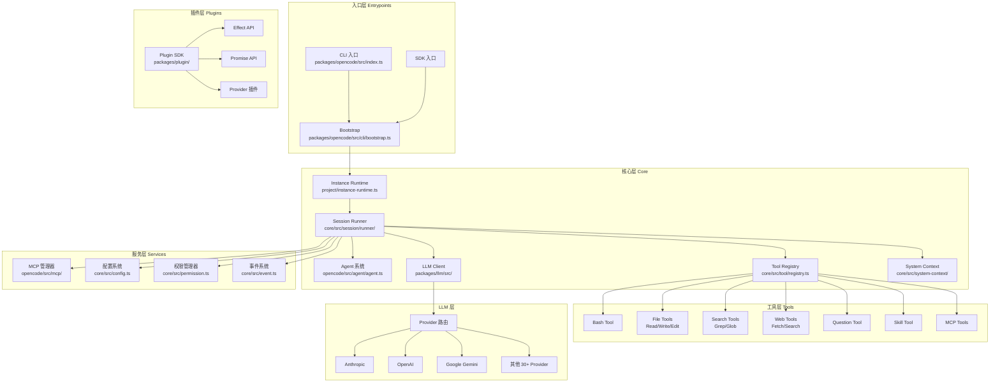
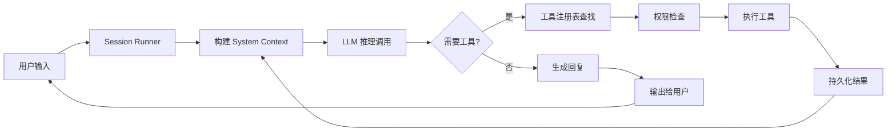

# Opencode From Scratch

> 基于 Opencode 源码深度剖析，带你从零掌握 AI 编程助手的核心设计

---

## 本书简介

**Opencode** 是一个生产级的 AI 编程助手，能够理解自然语言指令、自主操作代码库、执行终端命令、读写文件、搜索网络，并与开发者协作完成软件工程任务。

本教程以 **Opencode** 的真实源码为蓝本，系统性地拆解一个生产级 Coding Agent 的完整架构。与同类教程不同，Opencode 基于 **Effect-TS** 构建，采用了函数式、类型安全、可组合的架构设计，代表了当前 AI 编程工具最前沿的技术栈。

每一章都配有：

- **Mermaid 架构图** —— 直观理解系统设计
- **关键源码分析** —— 直接来自 Opencode 的真实代码
- **设计决策解读** —— 理解为什么这样设计
- **动手实践指引** —— 第 13 章提供完整可运行的最小实现

---

## 目录

| 章节 | 标题 | 内容概要 | 难度 |
|------|------|---------|------|
| [第 1 章](ch01-introduction/README.md) | **认识 Opencode** | 什么是 Coding Agent、核心能力、整体架构俯瞰、项目速览 | ⭐ |
| [第 2 章](ch02-project-skeleton/README.md) | **项目骨架与入口设计** | Monorepo 结构、CLI 入口、Bootstrap 流程、启动全景 | ⭐⭐ |
| [第 3 章](ch03-effect-foundation/README.md) | **Effect-TS 基础** | 为什么选择 Effect-TS、Service 模式、Layer 依赖注入、Schema 系统 | ⭐⭐⭐ |
| [第 4 章](ch04-agent-system/README.md) | **Agent 系统** | Agent 定义与配置、内置 Agent（build/plan/explore）、Agent 选择、权限预设 | ⭐⭐⭐ |
| [第 5 章](ch05-session-runner/README.md) | **会话运行器（Agent 核心循环）** | Session Runner 架构、LLM 调用编排、工具执行、事件发布、上下文压缩 | ⭐⭐⭐ |
| [第 6 章](ch06-tool-system/README.md) | **工具系统** | Tool 定义（Schema 驱动）、注册表模式、内置工具、许可检查、执行生命周期 | ⭐⭐⭐ |
| [第 7 章](ch07-llm-integration/README.md) | **LLM 集成** | Provider 抽象层、协议实现（Anthropic/OpenAI/Google）、路由系统、流式处理 | ⭐⭐⭐ |
| [第 8 章](ch08-plugin-system/README.md) | **插件系统** | Plugin SDK v2、Effect 和 Promise 双 API、生命周期钩子、Provider 插件 | ⭐⭐⭐ |
| [第 9 章](ch09-permission-security/README.md) | **权限与安全** | 权限规则系统、策略合并、工具级权限控制、安全设计模式 | ⭐⭐ |
| [第 10 章](ch10-system-context/README.md) | **系统上下文** | SystemContext 设计哲学、Source 抽象、基线/增量渲染、指令注入 | ⭐⭐⭐ |
| [第 11 章](ch11-mcp-integration/README.md) | **MCP 集成** | Model Context Protocol 集成、客户端管理、工具注册、OAuth 认证 | ⭐⭐ |
| [第 12 章](ch12-config-session/README.md) | **配置与会话管理** | 配置系统（JSONC/Env）、会话生命周期、事件系统、持久化、快照 | ⭐⭐ |
| [第 13 章](ch13-minimal-opencode/README.md) | **从零搭建最小 Opencode** | 完整可运行代码 + 扩展方向 | ⭐⭐⭐ |
| [附录](appendix-concepts/README.md) | **核心概念速查表** | 关键概念一页速查 | ⭐ |

---

## 整体架构俯瞰

## 核心 Agent 循环

## 学习路径

- **初学者**：第 1 → 3 → 4 → 5 → 6 → 13 章（掌握核心概念 + 动手实践）
- **进阶者**：按顺序通读全部 13 章
- **实践者**：先看第 13 章跑通最小 Agent，再回头深入各章

## 前置知识

- 基本的 **TypeScript** 语法（类型、异步、泛型）
- 对 **LLM** 的基本了解（什么是 API call、什么是 tool use）
- 对 **Effect-TS** 的基本了解（可选，第 3 章会详细介绍）