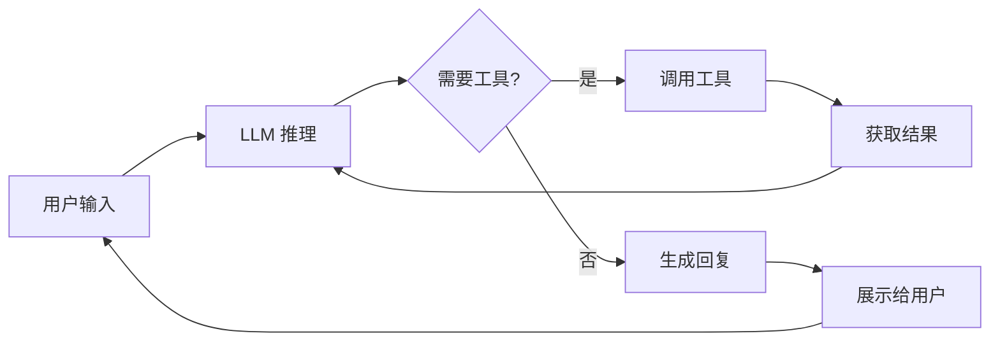
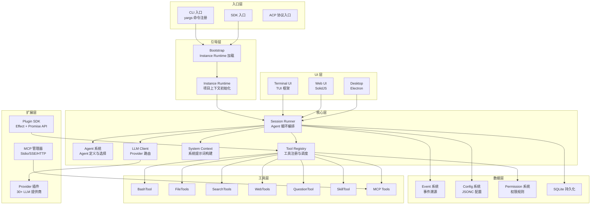
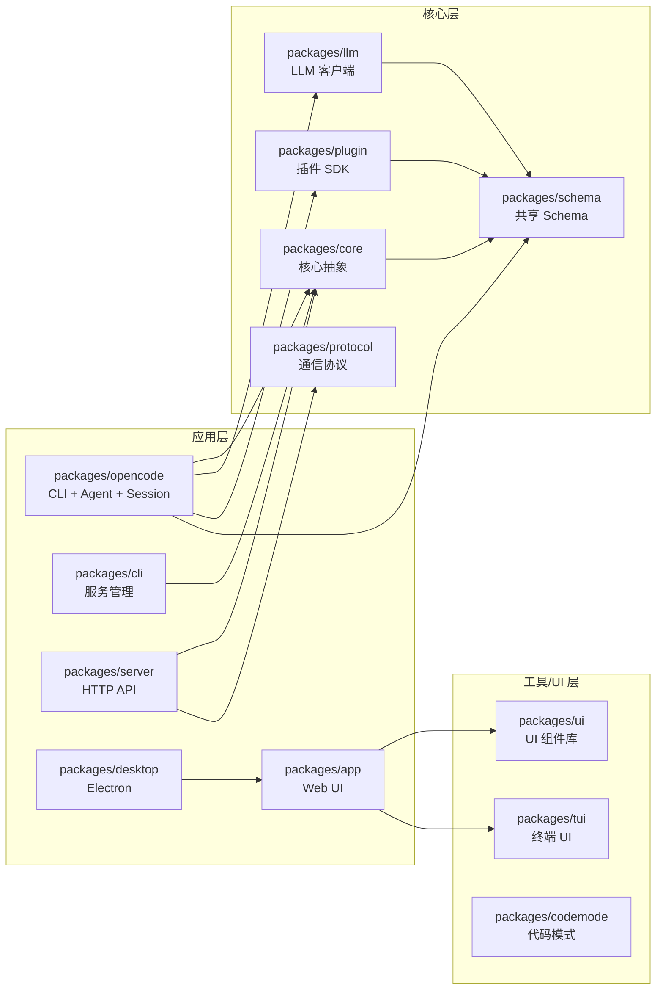

# 第 1 章：认识 Opencode

## 1.1 什么是 Coding Agent？

**Coding Agent**（编程智能体）是一个能够理解自然语言指令、自主操作代码库、执行终端命令、读写文件、搜索网络、并与开发者协作完成软件工程任务的 AI 系统。它不同于简单的代码补全工具——Coding Agent 拥有完整的"感知-思考-行动"循环。



## 1.2 核心能力

Opencode 是一个生产级的 Coding Agent 实现，具有以下核心能力：

| 能力 | 说明 | 关键组件 |
|------|------|---------|
| **对话理解** | 理解多轮自然语言对话 | Session Runner、LLM 集成 |
| **代码读写** | 读取、创建、编辑文件 | ReadTool, WriteTool, EditTool |
| **命令执行** | 运行 shell 命令、脚本 | BashTool |
| **代码搜索** | 全文搜索、文件匹配 | GrepTool, GlobTool |
| **网络访问** | 网页抓取、网络搜索 | WebFetchTool, WebSearchTool |
| **版本控制** | Git 操作、Diff 查看 | Git 集成、ApplyPatchTool |
| **技能扩展** | 领域特定指令集 | Skill 系统 |
| **MCP 集成** | 第三方工具协议 | MCP 客户端（packages/mcp/）|
| **插件系统** | 通过插件 SDK 扩展一切 | Plugin SDK v2 |
| **多 Provider** | 支持 30+ LLM 提供商 | Provider 路由系统 |
| **权限控制** | 细粒度的工具权限管理 | Permission 规则系统 |
| **快照回滚** | 文件系统快照与撤销 | Snapshot 系统 |

## 1.3 整体架构

Opencode 是一个基于 **Bun** 构建的 TypeScript 单体仓库（Monorepo），采用 **Effect-TS** 作为函数式编程基础。其架构分为多个层次：



### 包依赖关系



## 1.4 核心概念

| 概念 | 定义 | 关键源码位置 |
|------|------|-------------|
| **Agent** | 带权限和提示词的 AI 角色定义 | `packages/opencode/src/agent/agent.ts` |
| **Session** | 一次完整的对话会话 | `packages/core/src/session/schema.ts` |
| **Session Runner** | Agent 核心循环的执行引擎 | `packages/core/src/session/runner/llm.ts` |
| **Tool** | Agent 可调用的原子操作 | `packages/core/src/tool/tool.ts` |
| **Tool Registry** | 工具注册与调度中心 | `packages/core/src/tool/registry.ts` |
| **Provider** | LLM 提供商抽象 | `packages/llm/src/provider.ts` |
| **LLM Client** | 统一的 LLM 请求/响应客户端 | `packages/llm/src/llm.ts` |
| **Plugin** | 可扩展的插件系统 | `packages/plugin/src/v2/effect/plugin.ts` |
| **System Context** | 系统提示词构建框架 | `packages/core/src/system-context/index.ts` |
| **Permission** | 工具权限规则 | `packages/core/src/permission.ts` |
| **MCP** | Model Context Protocol 协议 | `packages/opencode/src/mcp/index.ts` |
| **Effect** | 函数式效果系统（整个项目的基础） | `packages/core/src/effect/` |

## 1.5 Opencode 的独特之处

与 Claude Code 和 OpenClaw 等同类项目相比，Opencode 有以下关键差异：

### Effect-TS 驱动

Opencode 是**完全基于 Effect-TS 构建**的。整个项目从入口到最底层的工具执行，都使用 Effect 的 `Effect<A, E, R>` 三元组来描述计算。这意味着：

- 所有副作用都是类型安全的
- 依赖注入通过 `Context.Tag` 和 `Layer` 系统自动管理
- 错误处理是显式的，不会出现未捕获的异常
- 并发和资源管理通过 `Fiber`、`Scope` 等原语表达

### 事件溯源架构

Opencode 使用**事件溯源**（Event Sourcing）来持久化会话状态。每一次 LLM 调用、工具执行、用户输入都被记录为不可变的事件。这使得：

- 会话状态可以完全从事件流重建
- 支持快照、回滚和重放
- 多个消费者可以独立处理事件流

### Schema 驱动的工具系统

每个工具都通过 **Effect-TS Schema** 定义输入和输出类型，编译时和运行时双重验证。工具定义即契约，LLM 看到的工具描述由 Schema 自动生成。

### 位置感知架构

Opencode 支持**多工作区**（Multi-workspace），通过 `Location` 抽象将服务实例与项目目录绑定。每个项目目录有自己的服务实例，互不干扰。

## 1.6 项目结构速览

```
opencode/
├── packages/                    # 所有包
│   ├── opencode/                # 主入口 + CLI + Agent + Session
│   │   ├── src/index.ts         # CLI 入口（yargs 命令注册）
│   │   ├── src/cli/             # CLI 命令实现
│   │   ├── src/agent/           # Agent 系统
│   │   ├── src/session/         # 会话管理（V2）
│   │   ├── src/tool/            # 应用级工具
│   │   ├── src/mcp/             # MCP 集成
│   │   ├── src/project/         # 项目实例管理
│   │   └── src/permission/      # 权限评估
│   ├── core/                    # 核心抽象
│   │   ├── src/tool/            # 工具定义 + 注册表 + 内置工具
│   │   ├── src/session/         # 会话 Schema + Runner + 事件
│   │   ├── src/system-context/  # 系统上下文框架
│   │   ├── src/plugin/          # Provider 插件
│   │   ├── src/effect/          # Effect 工具层
│   │   └── src/config/          # 配置系统
│   ├── llm/                     # LLM 客户端
│   │   ├── src/llm.ts           # 公共 API
│   │   ├── src/provider.ts      # Provider 抽象
│   │   ├── src/protocols/       # 协议实现
│   │   └── src/route/           # 路由系统
│   ├── plugin/                  # 插件 SDK
│   │   ├── src/v2/effect/       # Effect 版 API
│   │   └── src/v2/promise/      # Promise 版 API
│   ├── schema/                  # 共享 Schema
│   ├── protocol/                # HTTP/WebSocket 协议
│   ├── server/                  # HTTP 服务器
│   ├── cli/                     # 服务管理 CLI
│   ├── tui/                     # 终端 UI
│   ├── ui/                      # UI 组件库
│   ├── app/                     # Web 应用（SolidJS）
│   └── desktop/                 # Electron 桌面应用
├── .opencode/                   # 默认配置和工具
├── package.json                 # Bun workspace
├── turbo.json                   # Turbo 构建配置
└── sst.config.ts                # SST 部署配置
```

## 1.7 小结

Opencode 是一个功能丰富、架构先进的 AI 编程助手。它的设计体现了以下特点：

- **Effect-TS** 全栈函数式编程，类型安全贯穿始终
- **事件溯源** 架构，状态可追溯、可回放
- **Schema 驱动** 的工具定义，编译时和运行时双重验证
- **多 Provider 支持**，覆盖 30+ LLM 提供商
- **插件化架构**，通过 Plugin SDK 扩展一切
- **位置感知**，支持多工作区独立运行

在下一章中，我们将深入分析 Opencode 的项目骨架和入口点设计，了解 CLI 的启动流程和 Instance Runtime 的初始化过程。