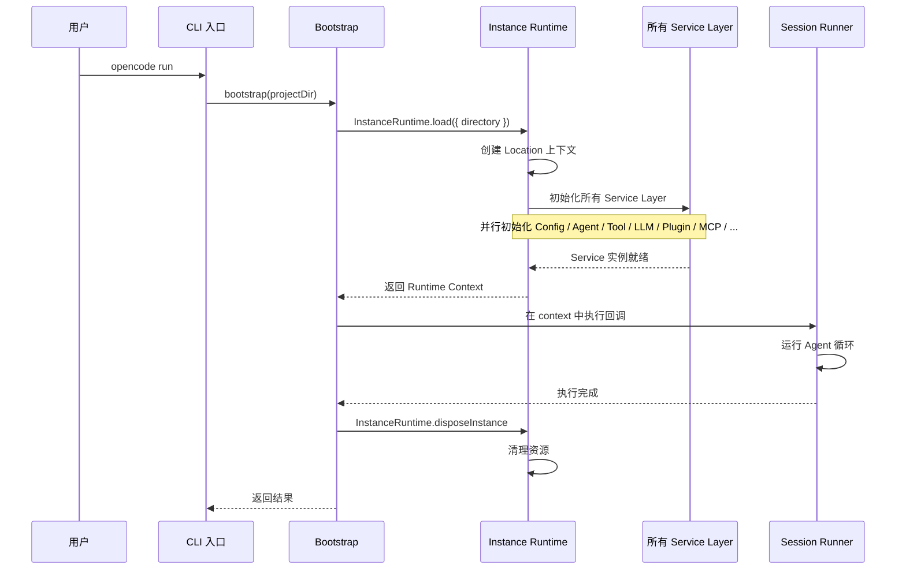
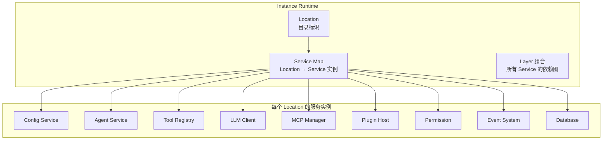
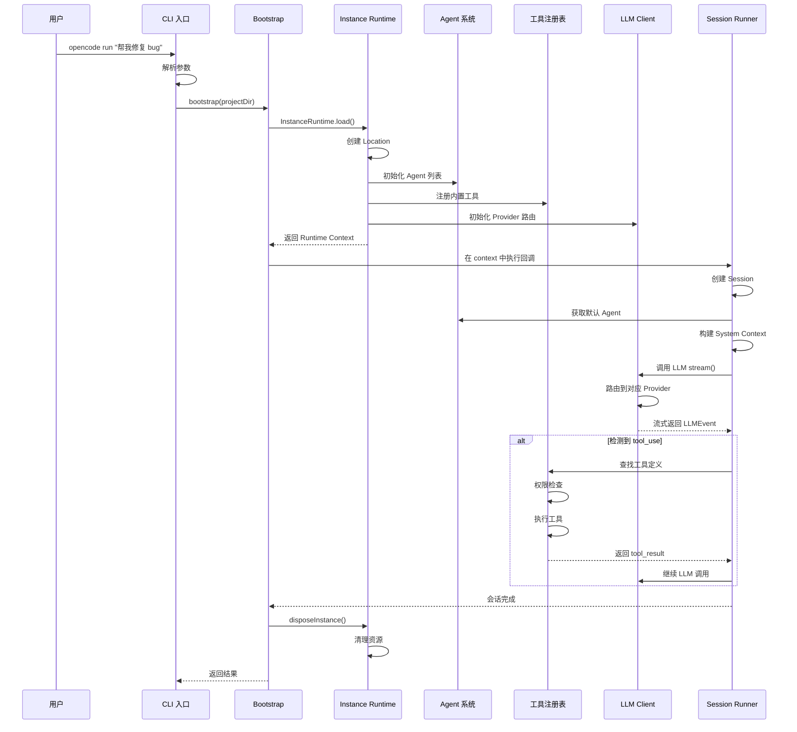

# 第 2 章：项目骨架与入口设计

> **上一章**我们了解了 Opencode 的核心能力、整体架构和技术栈选型。本章将走进项目内部，分析它的 Monorepo 结构、CLI 入口和启动流程。

## 2.1 入口设计哲学

Opencode 的入口设计需要解决几个关键问题：

1. **快速启动**：用户希望尽快看到响应，需要快速加载核心模块
2. **多种命令**：支持 run、debug、mcp、agent 等多种子命令
3. **模块化初始化**：按需加载依赖，避免启动时加载所有模块
4. **位置感知**：每个项目目录需要独立的运行时实例

## 2.2 CLI 入口

Opencode 使用 **yargs** 框架构建 CLI 入口。所有命令都在 `packages/opencode/src/index.ts` 中注册：

```typescript
// packages/opencode/src/index.ts — CLI 入口
const cli = yargs(args)
  .parserConfiguration({ "populate--": true })
  .scriptName("opencode")
  .wrap(100)
  .help("help", "show help")
  .alias("help", "h")
  .version("version", "show version number", InstallationVersion)
  .alias("version", "v")
  .option("print-logs", { describe: "print logs to stderr", type: "boolean" })
  .option("log-level", {
    describe: "log level",
    type: "string",
    choices: ["DEBUG", "INFO", "WARN", "ERROR"],
  })
  .option("pure", {
    describe: "run without external plugins",
    type: "boolean",
  })
  .middleware(async (opts) => {
    if (opts.printLogs) process.env.OPENCODE_PRINT_LOGS = "1"
    if (opts.logLevel) process.env.OPENCODE_LOG_LEVEL = opts.logLevel
    if (opts.pure) process.env.OPENCODE_PURE = "1"
    Heap.start()
    process.env.AGENT = "1"
    process.env.OPENCODE = "1"
    process.env.OPENCODE_PID = String(process.pid)
  })
  .command(RunCommand)        // 核心运行命令
  .command(GenerateCommand)   // 生成代码
  .command(DebugCommand)      // 调试命令
  .command(McpCommand)        // MCP 管理
  .command(AgentCommand)      // Agent 管理
  .command(ProvidersCommand)  // Provider 管理
  .command(ModelsCommand)     // 模型管理
  .command(ServeCommand)      // 服务模式
  .command(WebCommand)        // Web 模式
  .command(UpgradeCommand)    // 升级
  .command(UninstallCommand)  // 卸载
  .command(GithubCommand)     // GitHub 集成
  .command(PrCommand)         // PR 管理
  .command(SessionCommand)    // 会话管理
  .command(PluginCommand)     // 插件管理
  // ... 更多命令
  .strict()
```

**设计要点**：

- 使用 `yargs` 框架，支持丰富的 CLI 交互（自动补全、帮助文本等）
- `middleware` 在命令执行前设置环境变量，统一初始化
- `Heap.start()` 启动内存分析
- 所有命令都是独立的模块，通过 `yargs.command()` 注册
- 全局 `--pure` 模式可以禁用外部插件，用于调试和纯净模式

## 2.3 Bootstrap 流程

当用户运行 `opencode run` 时，核心的启动流程由 Bootstrap 完成：

```typescript
// packages/opencode/src/cli/bootstrap.ts
export async function bootstrap<T>(directory: string, cb: () => Promise<T>) {
  const ctx = await InstanceRuntime.load({ directory })
  try {
    return await context.provide(ctx, cb)
  } finally {
    await InstanceRuntime.disposeInstance(ctx)
  }
}
```

这个看似简单的函数背后，是 Opencode 整个依赖注入系统的入口：



### InstanceRuntime.load 做了什么？

```typescript
// 简化示意
export async function load(input: { directory: string }) {
  // 1. 创建 Location（标识当前项目目录）
  const location = Location.make(input.directory)

  // 2. 构建所有 Service 的 Layer 依赖图
  const layer = Layer.mergeAll(
    Config.node.layer,
    Agent.node.layer,
    ToolRegistry.node.layer,
    LLMClient.node.layer,
    PluginHost.node.layer,
    // ... 几十个 Service 的 Layer
  )

  // 3. 运行 Layer 初始化所有 Service
  const runtime = await Effect.runPromise(Layer.build(layer))

  // 4. 返回封装好的 Runtime Context
  return { location, runtime, directory }
}
```

## 2.4 Instance Runtime 架构

Instance Runtime 是 Opencode 的核心管理单元，它管理着**每个项目目录**的独立服务实例：



### LocationServiceMap

Location 是 Opencode 位置感知架构的核心：

```typescript
// packages/core/src/location.ts
// Location 标识一个工作区（项目目录 + 工作区 ID）
export class Location extends Context.Service<Location, Interface>()("@opencode/Location")

// LocationServiceMap 维护 Location → Service 的映射
// 每个 Location 拥有独立的 Service 实例
export class LocationServiceMap extends Context.Service<
  LocationServiceMap,
  Interface
>()("@opencode/LocationServiceMap")
```

这意味着在同一个 Opencode 进程中，可以同时为多个项目目录运行独立的 Agent 会话，每个会话拥有自己的配置、工具注册表和 MCP 连接。

## 2.5 启动流程全景



## 2.6 关键设计决策

### 为什么选择 yargs 而不是 Commander？

Opencode 使用 **yargs** 而不是更常见的 Commander 作为 CLI 框架，主要原因是：

- **类型安全**：yargs 提供了更好的 TypeScript 类型推断
- **自动补全**：内置 shell 补全生成支持
- **中间件**：支持全局中间件机制，方便统一处理环境变量
- **严格模式**：`.strict()` 确保命令参数严格匹配

### 为什么使用 Instance Runtime 而非全局单例？

传统的 Node.js 应用通常使用全局单例模式。Opencode 采用 Instance Runtime 的原因：

- **多项目支持**：同时处理多个项目目录，每个项目有独立的配置和工具
- **隔离性**：不同项目的插件、MCP 连接、权限配置互不干扰
- **生命周期管理**：可以精确控制每个实例的创建和销毁
- **测试友好**：每个测试用例可以创建独立的 Runtime 实例

### 为什么使用 Layer 而非构造函数注入？

Opencode 的依赖注入基于 Effect-TS 的 Layer 系统，而非传统的构造函数注入：

- **声明式依赖图**：Layer 系统自动解析依赖关系，无需手动管理注入顺序
- **延迟初始化**：Service 只在被使用时才初始化
- **作用域管理**：支持全局 Scope 和 Location Scope 的区分
- **可组合性**：多个 Layer 可以自由组合，形成不同的运行时配置

## 2.7 小结

本章介绍了 Opencode 的入口设计和启动流程：

- **CLI 入口** 基于 yargs 框架，注册了 20+ 子命令
- **Bootstrap** 是启动流程的核心入口，加载 Instance Runtime
- **Instance Runtime** 管理每个项目目录的独立服务实例
- **Location** 抽象实现了位置感知架构
- **Layer** 系统提供了声明式的依赖注入

下一章将深入讲解 Opencode 的根基——Effect-TS 基础，它是理解整个项目架构的关键。