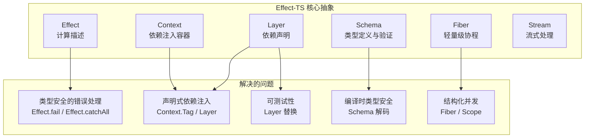

# 第 3 章：Effect-TS 基础

## 3.1 为什么选择 Effect-TS？

Opencode 项目最核心的技术决策之一就是**完全基于 Effect-TS 构建**。Effect-TS 是一个 TypeScript 的函数式编程库，提供了类型安全、可组合的方式来处理副作用、错误、依赖注入和并发。

传统的 Node.js 应用在处理 Agent 循环时会面临以下问题：

- **错误处理混乱**：`try/catch` 难以追踪错误的来源和类型
- **依赖管理困难**：全局单例、构造函数注入、手动管理生命周期
- **并发控制复杂**：回调地狱、Promise 链、资源泄漏
- **可测试性差**：需要 mock 整个模块，难以隔离测试

Effect-TS 通过几个核心抽象解决了这些问题：



## 3.2 Effect 核心概念

### Effect<A, E, R>

`Effect` 是 Effect-TS 中最核心的类型。它不是一个执行结果，而是一个**计算描述**：

```typescript
// Effect 的类型签名
Effect<A, E, R>
//  A  - 成功时的返回值类型
//  E  - 失败时的错误类型
//  R  - 执行时需要的环境（依赖）类型
```

关键理解：**Effect 是一个描述，而不是一个执行**。就像 Promise 是"一个即将到来的值"，Effect 是"一个需要环境 R 才能执行的、可能失败的计算"。

### 创建 Effect

```typescript
import { Effect } from "effect"

// 成功
const success = Effect.succeed(42)           // Effect<number, never, never>

// 失败
const failure = Effect.fail("出错了")        // Effect<never, string, never>

// 从同步代码创建
const sync = Effect.sync(() => Math.random()) // Effect<number, never, never>

// 从异步代码创建
const async = Effect.promise(() => fetch(url)) // Effect<Response, never, never>

// 从可能抛出异常的代码创建
const tryCatch = Effect.try({
  try: () => JSON.parse(input),
  catch: (error) => new ParseError(String(error)),
}) // Effect<unknown, ParseError, never>
```

### 组合 Effect

```typescript
// 顺序执行
const program = Effect.gen(function* () {
  const a = yield* success        // 42
  const b = yield* Effect.succeed(10)
  return a + b                     // 52
})

// 并行执行
const parallel = Effect.all([
  fetchUser(id),
  fetchPosts(id),
], { concurrency: "unbounded" })

// 条件分支
const conditional = Effect.if(random > 0.5, {
  onTrue: () => Effect.succeed("正面"),
  onFalse: () => Effect.succeed("反面"),
})
```

### 错误处理

```typescript
// 捕获特定错误
const withCatch = program.pipe(
  Effect.catchTag("ParseError", (error) =>
    Effect.succeed("使用了默认值")),
)

// 捕获所有错误
const safe = program.pipe(
  Effect.catchAll((error) =>
    Effect.succeed("发生了错误，使用默认值")),
)

// 重试
const retried = program.pipe(
  Effect.retry({
    times: 3,
    delay: (attempt) => Duration.millis(1000 * attempt),
  }),
)
```

## 3.3 Service 模式

Opencode 中所有模块都使用 Effect-TS 的 **Service 模式** 来定义。这是整个项目的依赖注入基础。

### 定义 Service

```typescript
import { Context, Effect } from "effect"

// 1. 定义 Service 接口
interface MyServiceInterface {
  readonly doSomething: (input: string) => Effect.Effect<number>
  readonly getStatus: () => Effect.Effect<string>
}

// 2. 创建 Service Tag（唯一标识符，用于依赖注入）
class MyService extends Context.Service<
  MyService,           // 自身类型
  MyServiceInterface   // 接口类型
>()("@opencode/MyService") {}
// 等价于：
// class MyService extends Context.Tag("@opencode/MyService")<
//   MyService,
//   MyServiceInterface
// >() {}

// 3. 实现 Service
const layer = Layer.effect(
  MyService,
  Effect.gen(function* () {
    const config = yield* Config.Service  // 自动注入依赖
    return MyService.of({
      doSomething: (input) => Effect.succeed(input.length),
      getStatus: () => Effect.succeed("running"),
    })
  }),
)
```

### 使用 Service

```typescript
// 通过 Service Tag 获取依赖
const program = Effect.gen(function* () {
  const myService = yield* MyService
  const result = yield* myService.doSomething("hello")
  return result
})

// 需要在 Layer 环境中执行
const runnable = program.pipe(Effect.provide(layer))
const result = await Effect.runPromise(runnable)
```

### 为什么 Opencode 选择这种模式？

传统的依赖注入通常使用构造函数参数：

```typescript
class MyService {
  constructor(private config: Config) {}
}
```

但这种模式有几个问题：
- **无法表达依赖的可选性**：要么有要么没有
- **循环依赖难以检测**：运行时才可能发现
- **测试替换困难**：需要修改构造函数调用

Effect-TS 的 Service 模式通过 `Context.Tag` 解决了这些问题：
- 依赖是**按需解析**的，只有使用时才初始化
- 依赖关系是**声明式**的，通过 `Layer` 组合自动解析
- 测试时可以通过 `Layer.provide` 轻松替换为 mock

## 3.4 Layer 依赖注入

Layer 是 Effect-TS 中声明依赖关系的核心机制。

### 基本用法

```typescript
// 定义 Service
class Database extends Context.Service<Database, { query: (sql: string) => Effect.Effect<unknown> }>()(
  "@opencode/Database"
)

class Logger extends Context.Service<Logger, { log: (msg: string) => Effect.Effect<void> }>()(
  "@opencode/Logger"
)

// 定义 Layer（依赖关系）
const LoggerLayer = Layer.effect(
  Logger,
  Effect.sync(() => Logger.of({ log: (msg) => Effect.sync(() => console.log(msg)) }))
)

const DatabaseLayer = Layer.effect(
  Database,
  Effect.gen(function* () {
    const logger = yield* Logger  // Database 依赖 Logger
    return Database.of({
      query: (sql) => {
        logger.log(`Executing: ${sql}`)
        return Effect.succeed([])
      },
    })
  }),
)

// 组合 Layer
const AppLayer = Layer.mergeAll(
  LoggerLayer,
  DatabaseLayer,
)

// 提供依赖
const program = Effect.gen(function* () {
  const db = yield* Database
  return yield* db.query("SELECT 1")
})

const runnable = program.pipe(Effect.provide(AppLayer))
```

### Opencode 中的 LayerNode 模式

Opencode 对 Layer 进行了封装，引入了 `LayerNode` 模式：

```typescript
// packages/core/src/effect/layer-node.ts
export const node = LayerNode.make({
  service: Service,           // 服务 Tag
  layer: layer,               // 实际 Layer
  deps: [                     // 依赖的其他 Service 的 node
    Config.node,
    Agent.node,
    Plugin.node,
    Provider.node,
  ],
})
```

这种模式的好处：
- **可组合性**：每个 Service 的 `node` 包含了依赖信息，可以自动组合
- **作用域管理**：支持全局 Scope 和 Location Scope
- **延迟初始化**：只在需要时才初始化 Service

## 3.5 Schema 系统

Effect-TS 的 Schema 是 Opencode 中**所有数据定义的基础**。它提供了编译时类型和运行时验证的双重保障。

### 定义 Schema

```typescript
import { Schema } from "effect"

// 基础类型
const StringSchema = Schema.String
const NumberSchema = Schema.Number
const BooleanSchema = Schema.Boolean

// 复合类型
const UserSchema = Schema.Struct({
  id: Schema.String,
  name: Schema.String,
  age: Schema.Number,
  email: Schema.optional(Schema.String),
})

// 联合类型
const StatusSchema = Schema.Literals(["active", "inactive", "banned"])

// 自定义验证
const EmailSchema = Schema.String.pipe(
  Schema.pattern(/^[^\s@]+@[^\s@]+\.[^\s@]+$/),
  Schema.brand("Email"),
)

// Recursive Schema 标注
const Info = Schema.Struct({
  name: Schema.String,
  mode: Schema.Literals(["subagent", "primary", "all"]),
  hidden: Schema.optional(Schema.Boolean),
  permission: PermissionV1.Ruleset,
  model: Schema.optional(
    Schema.Struct({
      modelID: ModelV2.ID,
      providerID: ProviderV2.ID,
    }),
  ),
}).annotate({ identifier: "Agent" })
```

### Schema 的自动衍生

Schema 定义后，会自动衍生出多种类型和操作：

```typescript
// 自动推断 TypeScript 类型
type User = Schema.Schema.Type<typeof UserSchema>

// 编码/解码
const user = Schema.decodeSync(UserSchema)({
  id: "1",
  name: "Alice",
  age: 30,
})  // 运行时验证，失败则抛出异常

// JSON Schema 导出
const jsonSchema = Schema.toJsonSchema(UserSchema)
// 用于生成 LLM 工具描述
```

### 在 Opencode 中的应用

Opencode 中几乎所有数据都通过 Schema 定义：

- **配置**：`Config.Info` 是一个完整的 Schema 结构
- **工具输入/输出**：每个工具都通过 Schema 定义参数和返回值
- **事件**：所有 Session 事件都是 Schema 类型
- **消息**：会话消息通过 Schema 定义多种类型

## 3.6 其他重要概念

### Fiber（协程）

Fiber 是 Effect-TS 的轻量级协程，类似于 Go 的 goroutine：

```typescript
// 启动 Fiber
const fiber = yield* Effect.fork(program)

// 等待 Fiber 完成
const result = yield* Fiber.join(fiber)

// 中断 Fiber
yield* Fiber.interrupt(fiber)

// FiberSet 管理多个 Fiber
const fibers = yield* FiberSet.make()
yield* FiberSet.run(fibers, task1)
yield* FiberSet.run(fibers, task2)
yield* FiberSet.join(fibers)  // 等待所有 Fiber 完成
```

### Stream（流）

Stream 是 Effect-TS 的响应式流，用于处理异步数据序列：

```typescript
import { Stream } from "effect"

// 创建 Stream
const stream = Stream.fromIterable([1, 2, 3])

// 转换 Stream
const doubled = stream.pipe(
  Stream.map((n) => n * 2),
  Stream.filter((n) => n > 2),
)

// 消费 Stream
const result = yield* Stream.runCollect(doubled)

// 无穷 Stream
const events = Stream.fromAsyncIterable(createEventSource())
```

### Scope（作用域）

Scope 用于管理资源的生命周期：

```typescript
// 自动资源管理
const program = Effect.gen(function* () {
  const file = yield* openFile("data.txt")  // 自动跟踪资源
  // 使用文件...
  // 作用域结束时自动关闭
})

// 在 Scope 中执行
yield* program.pipe(Effect.scoped)
```

## 3.7 Opencode 中的 Effect 模式实战

### 工具执行的 Effect 链

```typescript
// packages/core/src/tool/tool.ts
// 工具执行的核心 Effect 链
const settle = (call, context) =>
  Schema.decodeUnknownEffect(config.input)(call.input).pipe(
    // 解码输入 → 可能失败
    Effect.mapError((error) => new ToolFailure({ message: `Invalid tool input: ${error.message}` })),
    Effect.flatMap((input) =>
      config.execute(input, context).pipe(
        // 执行工具 → 可能失败
        Effect.flatMap((output) =>
          Schema.encodeEffect(config.output)(output).pipe(
            // 编码输出 → 可能失败
            Effect.map((encoded) => ({
              structured: encoded,
              content: [{ type: "text", text: JSON.stringify(encoded) }],
            })),
          ),
        ),
      ),
    ),
  )
```

### Service 组合

```typescript
// packages/core/src/session/runner/llm.ts
// Session Runner 的 Layer 依赖声明
const layer = Layer.effect(
  Service,
  Effect.gen(function* () {
    const events = yield* EventV2.Service       // 事件系统
    const llm = yield* LLMClient.Service         // LLM 客户端
    const agents = yield* AgentV2.Service        // Agent 系统
    const tools = yield* ToolRegistry.Service    // 工具注册表
    const models = yield* SessionRunnerModel.Service  // 模型解析
    const store = yield* SessionStore.Service    // 会话存储
    const location = yield* Location.Service     // 位置
    const systemContext = yield* SystemContextRegistry.Service  // 系统上下文
    const skillGuidance = yield* SkillGuidance.Service         // 技能指导
    const referenceGuidance = yield* ReferenceGuidance.Service // 引用指导
    const config = yield* Config.Service         // 配置
    // ... 十几个 Service 一起组合
  }),
)
```

## 3.8 小结

Effect-TS 是 Opencode 的基石，本章介绍了核心概念：

- **Effect\<A, E, R\>**：类型安全的计算描述，而非执行结果
- **Service 模式**：通过 `Context.Tag` 定义可注入的服务
- **Layer 系统**：声明式依赖注入，自动解析依赖关系图
- **Schema 系统**：编译时和运行时双重验证的类型定义
- **Fiber/Stream/Scope**：结构化并发和资源管理原语

理解 Effect-TS 是理解 Opencode 架构的关键。下一章将介绍 Agent 系统，看看 Opencode 如何定义和管理 AI 角色。