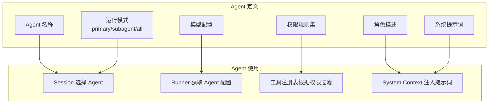
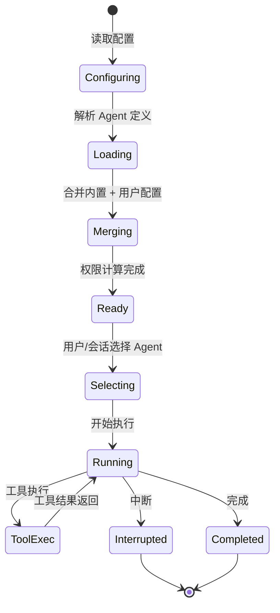

# 第 4 章：Agent 系统

## 4.1 Agent 是什么？

在 Opencode 中，**Agent** 是一个带权限和提示词配置的 AI 角色定义。每个 Agent 定义了：

- 它是什么（角色描述）
- 它能做什么（权限规则）
- 它如何思考（系统提示词）
- 它使用什么模型（模型配置）



## 4.2 Agent 类型定义

Agent 的信息通过 Effect-TS Schema 严格定义：

```typescript
// packages/opencode/src/agent/agent.ts
export const Info = Schema.Struct({
  name: Schema.String,                                    // Agent 名称
  description: Schema.optional(Schema.String),            // 角色描述
  mode: Schema.Literals(["subagent", "primary", "all"]),  // 运行模式
  native: Schema.optional(Schema.Boolean),                // 是否为内置 Agent
  hidden: Schema.optional(Schema.Boolean),                // 是否隐藏
  topP: Schema.optional(Schema.Finite),                   // 采样参数
  temperature: Schema.optional(Schema.Finite),            // 温度参数
  color: Schema.optional(Schema.String),                  // UI 颜色标识
  permission: PermissionV1.Ruleset,                       // 权限规则
  model: Schema.optional(                                 // 模型配置
    Schema.Struct({
      modelID: ModelV2.ID,
      providerID: ProviderV2.ID,
    }),
  ),
  variant: Schema.optional(Schema.String),                // 模型变体
  prompt: Schema.optional(Schema.String),                 // 系统提示词
  options: Schema.Record(Schema.String, Schema.Unknown),  // 额外选项
  steps: Schema.optional(Schema.Finite),                  // 最大步骤数
}).annotate({ identifier: "Agent" })
```

### 运行模式（Mode）

每个 Agent 有一个 `mode` 属性，决定了它的使用场景：

| 模式 | 说明 | 示例 |
|------|------|------|
| `primary` | 主 Agent，用户直接交互 | build（默认）、plan |
| `subagent` | 子 Agent，由其他 Agent 调用 | explore、general |
| `all` | 两者皆可 | 用户自定义 Agent |

## 4.3 内置 Agent

Opencode 内置了多个预定义的 Agent，每个都有不同的能力和权限配置：

### Build Agent（默认主 Agent）

```typescript
build: {
  name: "build",
  description: "The default agent. Executes tools based on configured permissions.",
  mode: "primary",
  native: true,
  permission: Permission.merge(
    defaults,
    Permission.fromConfig({
      question: "allow",      // 允许向用户提问
      plan_enter: "allow",     // 允许进入计划模式
    }),
    user,
  ),
}
```

Build Agent 是默认的主 Agent。它具有完整的工具权限，可以执行文件读写、命令执行、网络访问等所有操作。

### Plan Agent（计划模式）

```typescript
plan: {
  name: "plan",
  description: "Plan mode. Disallows all edit tools.",
  mode: "primary",
  native: true,
  permission: Permission.merge(
    defaults,
    Permission.fromConfig({
      question: "allow",
      plan_exit: "allow",          // 允许退出计划模式
      task: { general: "deny" },   // 禁止执行任务
      edit: {
        "*": "deny",               // 禁止编辑文件
        [".opencode/plans/*.md"]: "allow",  // 只允许写计划文件
      },
    }),
    user,
  ),
}
```

Plan Agent 的核心特点是**禁止编辑工具**，只能读取和搜索。它用于在修改代码之前先制定计划。

### Explore Agent（探索子 Agent）

```typescript
explore: {
  name: "explore",
  mode: "subagent",
  native: true,
  prompt: PROMPT_EXPLORE,
  permission: Permission.merge(
    defaults,
    Permission.fromConfig({
      "*": "deny",
      grep: "allow",         // 允许搜索
      glob: "allow",         // 允许文件模式匹配
      list: "allow",         // 允许列出文件
      bash: "allow",         // 允许执行命令
      webfetch: "allow",     // 允许抓取网页
      websearch: "allow",    // 允许搜索网络
      read: "allow",         // 允许读取文件
      external_directory: readonlyExternalDirectory,
    }),
    user,
  ),
}
```

Explore Agent 是一个**快速探索**子 Agent，专门用于代码搜索和调研。它被限制了写权限，但有完整的读权限。

### 其他内置 Agent

| Agent | 模式 | 用途 |
|-------|------|------|
| **general** | subagent | 通用子 Agent，用于并行执行多步骤任务 |
| **compaction** | primary (hidden) | 上下文压缩专用 Agent |
| **title** | primary (hidden) | 对话标题生成 Agent |
| **summary** | primary (hidden) | 对话摘要生成 Agent |

## 4.4 Agent 服务接口

Agent 系统通过 `Agent.Service` 提供统一的访问接口：

```typescript
// packages/opencode/src/agent/agent.ts
export interface Interface {
  readonly get: (agent: string) => Effect.Effect<Info>
  readonly list: () => Effect.Effect<Info[]>
  readonly defaultInfo: () => Effect.Effect<Info>
  readonly defaultAgent: () => Effect.Effect<string>
  readonly generate: (input: {
    description: string
    model?: { providerID: ProviderV2.ID; modelID: ModelV2.ID }
  }) => Effect.Effect<GeneratedAgent>
}

export class Service extends Context.Service<Service, Interface>()("@opencode/Agent") {}
```

### Agent 选择优先级

当用户运行 `opencode run` 时，Agent 的选择逻辑如下：

1. 如果会话有指定的 Agent，使用指定的 Agent
2. 如果配置中有 `default_agent`，使用配置的默认 Agent
3. 否则使用第一个可见的 primary Agent（通常是 build）

```typescript
const defaultInfo = Effect.fnUntraced(function* () {
  const c = yield* config.get()
  if (c.default_agent) {
    const agent = agents[c.default_agent]
    if (!agent) throw new Error(`default agent "${c.default_agent}" not found`)
    if (agent.mode === "subagent") throw new Error(`default agent "${c.default_agent}" is a subagent`)
    if (agent.hidden === true) throw new Error(`default agent "${c.default_agent}" is hidden`)
    return agent
  }
  const visible = Object.values(agents).find((a) => a.mode !== "subagent" && a.hidden !== true)
  if (!visible) throw new Error("no primary visible agent found")
  return visible
})
```

## 4.5 用户自定义 Agent

用户可以通过配置文件自定义 Agent，或覆盖内置 Agent 的配置：

```jsonc
// .opencode/opencode.jsonc
{
  "agents": {
    // 自定义新 Agent
    "my-custom-agent": {
      "name": "my-custom-agent",
      "description": "My custom agent for specific tasks",
      "mode": "all",
      "model": "anthropic:claude-sonnet-4-20250514",
      "prompt": "You are a specialized agent that...",
      "permission": {
        "*": "deny",
        "read": "allow",
        "grep": "allow"
      }
    },
    // 覆盖内置 Agent 配置
    "build": {
      "model": "openai:gpt-4o",
      "temperature": 0.7
    }
  }
}
```

### 配置合并逻辑

```typescript
// 遍历用户配置中的 agent 定义
for (const [key, value] of Object.entries(cfg.agent ?? {})) {
  if (value.disable) {
    delete agents[key]  // 禁用内置 Agent
    continue
  }
  let item = agents[key]
  if (!item) {
    // 创建新的自定义 Agent
    item = agents[key] = {
      name: key,
      mode: "all",
      permission: Permission.merge(defaults, user),
      options: {},
      native: false,
    }
  }
  // 合并配置到现有 Agent
  item.model = value.model ?? item.model
  item.prompt = value.prompt ?? item.prompt
  item.description = value.description ?? item.description
  item.permission = Permission.merge(item.permission, Permission.fromConfig(value.permission ?? {}))
  // ...
}
```

## 4.6 Agent 生成

Opencode 还支持通过 AI 自动生成 Agent 定义：

```typescript
generate: Effect.fn("Agent.generate")(function* (input) {
  const model = input.model ?? (yield* provider.defaultModel())
  const system = [PROMPT_GENERATE]  // 生成 Agent 的提示词模板

  // 调用 LLM 生成结构化输出
  const result = yield* Effect.promise(() =>
    generateObject({
      model: language,
      messages: [{
        role: "user",
        content: `Create an agent configuration based on this request: "${input.description}"`,
      }],
      schema: GeneratedAgent,  // 期望的输出 Schema
    })
  )

  return result.object
})
```

## 4.7 Agent 与权限系统

Agent 的权限配置是最核心的设计之一。每个 Agent 都有一组权限规则，决定了它可以执行哪些工具：

```mermaid
graph TB
    subgraph "权限合并"
        Defaults[默认权限<br/>全局 allow + 特殊 ask]
        User[用户配置权限<br/>opencode.jsonc]
        Agent[Agent 特定权限<br/>内置定义]
    end

    subgraph "合并结果"
        Merged[最终权限集<br/>Permission.merge(Defaults, Agent, User)]
    end

    Defaults --> Merged
    Agent --> Merged
    User --> Merged

    subgraph "权限检查"
        Tool[工具调用] --> Permission[Permission 检查]
        Permission -->|allow| Execute[执行]
        Permission -->|ask| Ask[询问用户]
        Permission -->|deny| Block[拒绝]
    end
```

权限的合并顺序是：**默认权限 → Agent 内置权限 → 用户配置权限**，后面的规则覆盖前面的规则。

## 4.8 Agent 生命周期



## 4.9 小结

本章介绍了 Opencode 的 Agent 系统：

- **Agent 定义** 包含名称、描述、提示词、权限和模型配置
- **内置 Agent** 包括 build（默认主 Agent）、plan（计划模式）、explore（探索子 Agent）等
- **运行模式** 分为 primary、subagent 和 all
- **用户自定义** Agent 可以通过配置文件扩展或覆盖内置 Agent
- **Agent 生成** 支持通过 AI 自动生成 Agent 定义
- **权限系统** 是 Agent 的核心安全机制

下一章将深入讲解 Agent 核心循环的实现——Session Runner，这是整个 Opencode 的执行引擎。