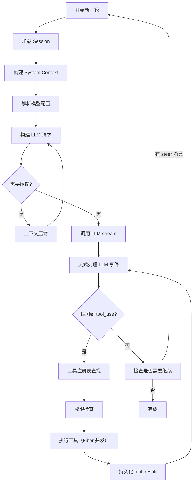
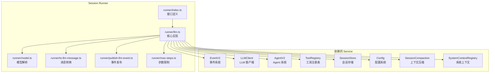
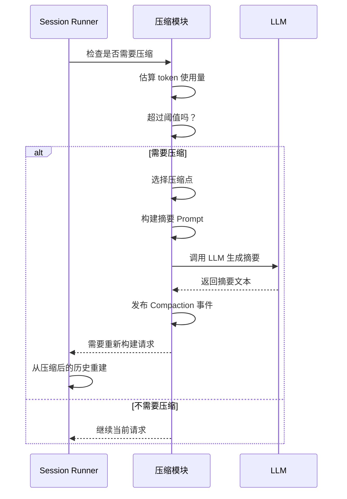
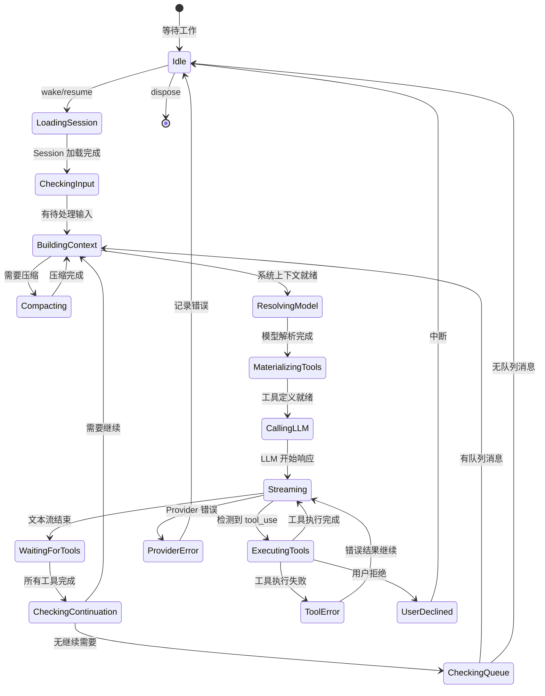

# 第 5 章：会话运行器（Agent 核心循环）

> **上一章**我们了解了 Agent 的定义和配置——它是"角色卡"，但角色卡本身不会行动。本章将介绍 Session Runner，它是让 Agent "活起来"的执行引擎，负责编排 LLM 调用、工具执行和上下文管理的完整循环。

## 5.1 核心循环概述

Session Runner 是 Opencode 的**心脏**——它是 Agent 核心循环的执行引擎。它负责编排一次完整的 LLM 交互：从构建系统上下文、调用 LLM、执行工具，到持久化事件和继续下一轮。



## 5.2 Session Runner 架构

Session Runner 位于 `packages/core/src/session/runner/` 目录下，是 Opencode 中最复杂的模块之一：



### 接口定义

```typescript
// packages/core/src/session/runner/index.ts
export interface Interface {
  readonly run: (input: {
    readonly sessionID: SessionSchema.ID
    readonly force: boolean
  }) => Effect.Effect<void, RunError>
}

export class Service extends Context.Service<Service, Interface>()("@opencode/v2/SessionRunner") {}
```

## 5.3 核心执行流程

### Run 主循环

```typescript
// packages/core/src/session/runner/llm.ts
const run = Effect.fn("SessionRunner.run")(function* (input) {
  // 1. 检查是否有待处理的 steer/queue 消息
  const hasSteer = yield* SessionInput.hasPending(db, input.sessionID, "steer")
  const hasQueue = hasSteer ? false : yield* SessionInput.hasPending(db, input.sessionID, "queue")
  if (!input.force && !hasSteer && !hasQueue) return

  // 2. 标记中断的工具调用
  yield* failInterruptedTools(input.sessionID)

  // 3. 主循环
  let promotion = hasSteer ? "steer" : hasQueue ? "queue" : undefined
  let shouldRun = input.force || hasSteer || hasQueue
  while (shouldRun) {
    let needsContinuation = true
    let step = 1
    while (needsContinuation) {
      // 执行一轮 provider 调用
      const result = yield* runTurn(input.sessionID, promotion, step)
      needsContinuation = result.needsContinuation
      step = result.step + 1
      promotion = "steer"
      // 检查是否有新的 steer 消息
      if (!needsContinuation) {
        needsContinuation = yield* SessionInput.hasPending(db, input.sessionID, "steer")
      }
    }
    // 检查是否有队列消息
    shouldRun = yield* SessionInput.hasPending(db, input.sessionID, "queue")
    promotion = shouldRun ? "queue" : undefined
  }
})
```

### 单轮 Provider 调用

`runTurn` 是一次完整的 LLM 调用 + 工具执行回合：

```typescript
const runTurnAttempt = Effect.fn("SessionRunner.runTurn")(function* (
  sessionID, promotion, step, recoverOverflow?
) {
  // 1. 加载 Session
  const session = yield* getSession(sessionID)

  // 2. 选择 Agent
  const agent = yield* agents.select(session.agent)

  // 3. 初始化 System Context
  const initialized = yield* SessionContextEpoch.initialize(
    db, loadSystemContext(agent), session.id,
  )

  // 4. 创建 FiberSet 管理工具执行的 Fiber
  const toolFibers = yield* FiberSet.make()

  // 5. 处理 promote（提升 steer/queue 消息到会话历史）
  if (promotion === "steer") {
    yield* SessionInput.promoteSteers(db, events, session.id, cutoff)
  }

  // 6. 构建系统提示词
  const system = initialized ?? (yield* SessionContextEpoch.prepare(...))

  // 7. 解析模型
  const model = yield* models.resolve(session)

  // 8. 获取会话历史
  const entries = yield* SessionHistory.entriesForRunner(db, session.id, baseline)
  const context = entries.map((entry) => entry.message)

  // 9. 检查是否达到最大步数
  const isLastStep = agent.info?.steps !== undefined && currentStep >= agent.info.steps

  // 10. 物化工具定义（根据权限过滤）
  const toolMaterialization = isLastStep ? undefined : yield* tools.materialize(agent.info?.permissions)

  // 11. 构建 LLM 请求
  const request = LLM.request({
    model,
    system: [agent.info?.system, system.baseline].map(SystemPart.make),
    messages: [...toLLMMessages(context, model), ...(isLastStep ? [MAX_STEPS_PROMPT] : [])],
    tools: toolMaterialization?.definitions ?? [],
    toolChoice: isLastStep ? "none" : undefined,
  })

  // 12. 检查是否需要上下文压缩
  if (yield* compaction.compactIfNeeded(...)) {
    return yield* Effect.die(continueAfterCompaction(currentStep))
  }

  // 13. 调用 LLM 并处理流式输出
  const providerStream = llm.stream(request).pipe(
    Stream.runForEach((event) => {
      // 持久化每个 LLM 事件
      yield* publish(event)
      // 处理 tool_use
      if (event.type === "tool-call" && !event.providerExecuted) {
        needsContinuation = true
        // 通过 Fiber 并发执行工具
        yield* FiberSet.run(toolFibers,
          toolMaterialization.settle({ sessionID, agent, call: event })
        )
      }
    }),
  )

  // 14. 等待所有工具执行完成
  const settled = yield* awaitToolFibers(toolFibers)

  // 15. 记录 Step 结束事件
  const stepSettlement = publisher.stepSettlement()
  if (stepSettlement) {
    yield* events.publish(SessionEvent.Step.Ended, { ... })
  }

  return { needsContinuation, step: currentStep }
})
```

## 5.4 消息转换

从 Session 内部的消息格式到 LLM 可理解的消息格式的转换：

```typescript
// packages/core/src/session/runner/to-llm-message.ts
// Session 消息类型 → LLM 消息类型
type SessionMessage = User | Assistant | System | Synthetic | Shell | Compaction
type LLMMessage = Message  // 标准 LLM 消息格式

// 转换逻辑
export function toLLMMessages(
  messages: SessionMessage[],
  model: Model,
): Message[] {
  return messages.flatMap((msg) => {
    switch (msg.type) {
      case "user":
        return Message.user(msg.text, msg.files)
      case "assistant":
        return Message.assistant(msg.content)
      case "system":
        return Message.system(msg.text)
      case "synthetic":
        return Message.user(msg.text)  // 合成消息作为用户消息处理
      case "shell":
        return Message.user(`[Shell]: ${msg.command}\n${msg.output}`)
      case "compaction":
        return []  // 压缩事件不发送给 LLM
    }
  })
}
```

## 5.5 LLM 事件发布

Session Runner 的一个重要职责是**将 LLM 事件持久化到事件流**。`createLLMEventPublisher` 负责将 LLM 的流式输出转换为 Session 事件：

```typescript
// packages/core/src/session/runner/publish-llm-event.ts
// LLM 事件类型
type LLMEvent =
  | { type: "text-delta"; delta: string }
  | { type: "reasoning-delta"; delta: string }
  | { type: "tool-call"; id: string; name: string; input: unknown }
  | { type: "tool-result"; id: string; result: ToolResult }
  | { type: "provider-error"; error: ProviderError }
  | { type: "finish"; finish: FinishReason }

// 转换为 Session 事件
const publisher = createLLMEventPublisher(events, {
  sessionID: session.id,
  agent: agent.id,
  model: { id, providerID },
})

// 每个 LLM 事件都被持久化
yield* publish(event)
```

## 5.6 上下文压缩

当对话上下文超出模型上下文窗口时，Session Runner 会自动触发上下文压缩：

```typescript
// packages/core/src/session/compaction.ts
const compactIfNeeded = Effect.fn("SessionCompaction.compactIfNeeded")(function* (input) {
  if (!config.auto) return false

  const context = input.model.route.defaults.limits?.context
  if (context === undefined) return false

  // 估算当前请求的 token 数
  const estimated = estimate({ system, messages, tools })

  // 如果超过阈值（context - buffer），触发压缩
  if (estimated <= context - Math.max(output, config.buffer)) return false

  // 执行压缩
  return yield* compactAfterOverflow(input)
})
```

### 压缩流程



压缩后的摘要格式：

```
## Objective
- [用户目标的简要描述]

## Important Details
- [约束/偏好、决策原因、重要事实]

## Work State
### Completed
- [已完成的工作]

### Active
- [正在进行的工作]

### Blocked
- [阻塞项]

## Next Move
1. [下一步行动]

## Relevant Files
- [相关文件]
```

## 5.7 工具执行编排

当 LLM 返回多个 `tool_use` 时，Session Runner 通过 FiberSet 并发执行：

```typescript
// 工具执行的 Fiber 管理
const toolFibers = yield* FiberSet.make<void, ToolOutputStore.Error>()

// 对于每个 tool_use 事件
if (event.type === "tool-call" && event.providerExecuted === false) {
  needsContinuation = true

  // 通过 Fiber 并发执行
  yield* Effect.uninterruptibleMask((restore) =>
    restore(
      toolMaterialization.settle({
        sessionID: session.id,
        agent: agent.id,
        assistantMessageID,
        call: event,
      })
    ).pipe(FiberSet.run(toolFibers))
  )
}

// 等待所有工具执行完成
const settled = yield* awaitToolFibers(toolFibers)
```

## 5.8 错误处理与中断

Session Runner 的容错设计：

```typescript
// 用户拒绝（DeclinedError）
const isUserDeclined = (cause) =>
  cause.reasons.some(
    (reason) =>
      Cause.isDieReason(reason) &&
      (reason.defect instanceof PermissionV2.DeclinedError ||
       reason.defect instanceof QuestionV2.RejectedError),
  )

// 工具执行中断
if (settled._tag === "Failure" && isUserDeclined(settled.cause)) {
  yield* FiberSet.clear(toolFibers)
  yield* withPublication(publisher.failUnsettledTools("Tool execution interrupted"))
  return yield* Effect.interrupt
}

// Provider 错误
if (stream._tag === "Failure" && Cause.hasInterrupts(stream.cause)) {
  yield* FiberSet.clear(toolFibers)
  yield* withPublication(publisher.failUnsettledTools("Tool execution interrupted"))
}
```

## 5.9 完整执行状态机



## 5.10 小结

Session Runner 是 Opencode 最核心的模块，它实现了完整的 Agent 循环：

- **主循环**：`run()` 方法驱动整个执行流程，处理 steer/queue 消息
- **单轮调用**：`runTurn()` 执行一次完整的 LLM 调用 + 工具执行
- **消息转换**：内部消息格式转换为 LLM 可理解的格式
- **事件发布**：每个 LLM 事件都被持久化到事件流
- **上下文压缩**：自动管理上下文窗口，防止溢出
- **并发执行**：通过 FiberSet 并发执行多个工具调用
- **容错处理**：用户拒绝、Provider 错误、工具执行失败等场景

下一章将深入讲解工具系统，看看 Opencode 如何定义、注册和执行工具。