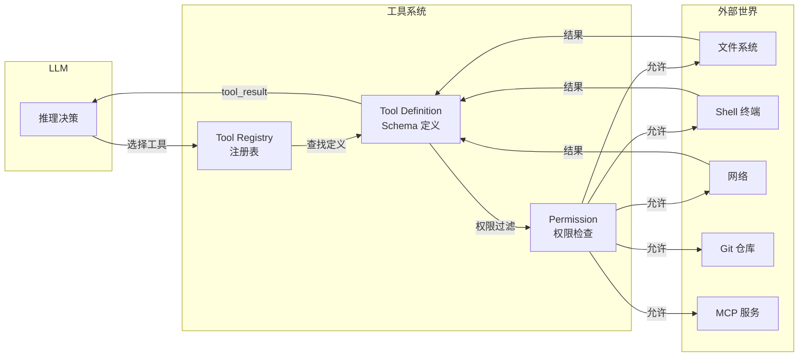
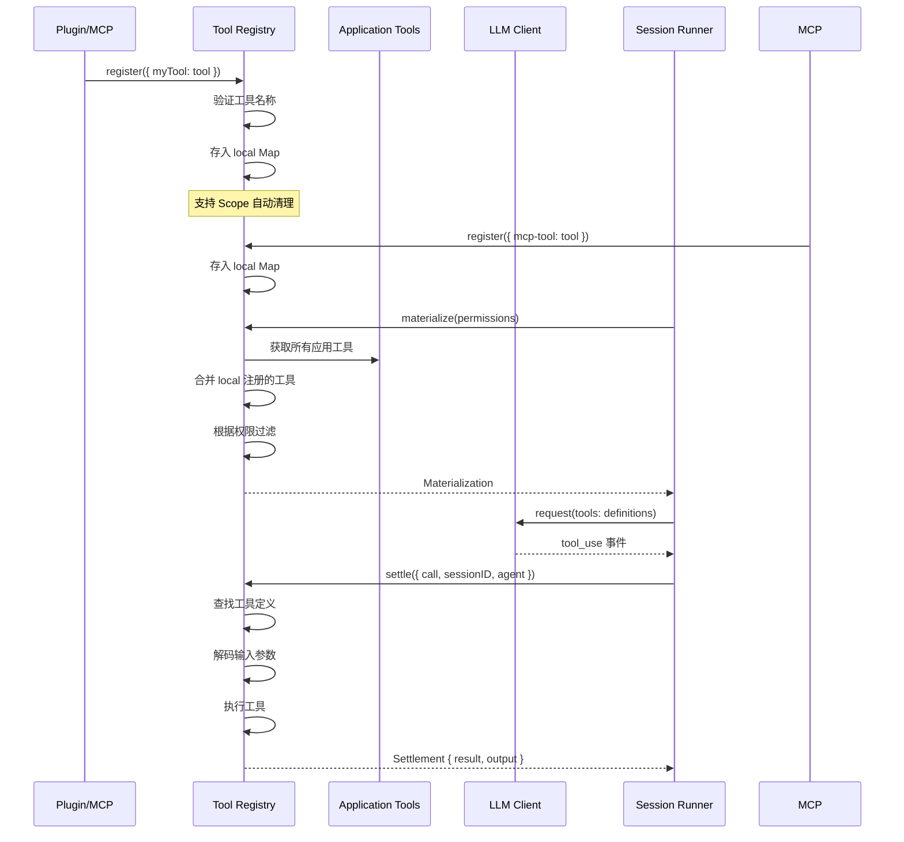
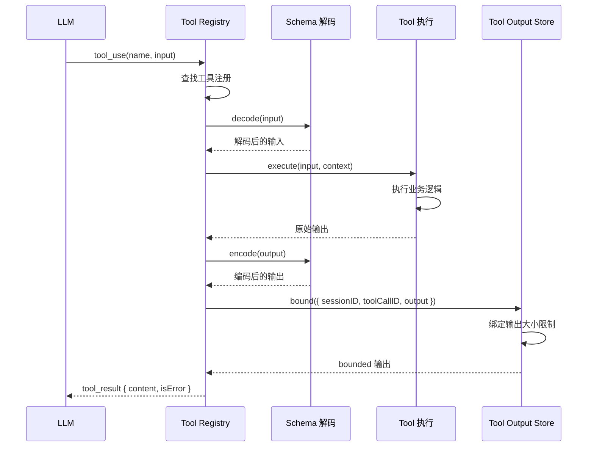

# 第 6 章：工具系统

## 6.1 工具系统的核心地位

工具系统是 Opencode 与外部世界交互的桥梁。每个工具定义了一个原子操作，LLM 通过选择调用不同工具来完成复杂任务。



## 6.2 Tool 定义（Schema 驱动）

Opencode 的工具定义是**完全 Schema 驱动**的。每个工具通过 `Tool.make` 创建，输入和输出类型都通过 Effect-TS Schema 定义：

```typescript
// packages/core/src/tool/tool.ts — 核心 Tool 定义 API
export function make<
  Input extends SchemaType<any>,
  Output extends SchemaType<any>,
  Structured extends SchemaType<any> = Output,
>(config: Config<Input, Output, Structured>): Definition<Input, Structured> {
  const tool = Object.freeze({}) as Definition<Input, Structured>
  runtimes.set(tool, {
    definition: (name) => {
      // 从 Schema 自动生成 LLM 可理解的工具描述
      return new ToolDefinition({
        name,
        description: config.description,
        inputSchema: toJsonSchema(config.input),
        outputSchema: toJsonSchema(config.structured ?? config.output),
      })
    },
    settle: (call, context) =>
      // 1. 解码输入（运行时验证）
      Schema.decodeUnknownEffect(config.input)(call.input).pipe(
        Effect.mapError((error) => new ToolFailure({ message: `Invalid tool input: ${error.message}` })),
        Effect.flatMap((input) =>
          // 2. 执行工具
          config.execute(input, context).pipe(
            Effect.flatMap((output) =>
              // 3. 编码输出
              Schema.encodeEffect(config.output)(output).pipe(
                Effect.map((output) => ({ structured: output, content: [...] })),
              ),
            ),
          ),
        ),
      ),
  })
  return tool
}
```

### Config 参数

```typescript
type Config<Input, Output, Structured> = {
  readonly description: string           // 工具描述（LLM 看到）
  readonly input: Input                  // 输入 Schema
  readonly output: Output                // 输出 Schema
  readonly structured?: Structured       // 结构化输出 Schema（可选）
  readonly toStructuredOutput?: (input) => Structured  // 输出转换
  readonly execute: (                   // 执行函数
    input: Schema.Schema.Type<Input>,
    context: Context,
  ) => Effect.Effect<Schema.Schema.Type<Output>, ToolFailure>
  readonly toModelOutput?: (input) => Content[]  // 输出格式化
}
```

## 6.3 内置工具

Opencode 内置了大量工具，通过 `BuiltInTools.node` 统一注册：

```typescript
// packages/core/src/tool/builtins.ts
export const node = makeLocationNode({
  name: "built-in-tools",
  layer: Layer.empty,
  deps: [
    ApplyPatchTool.node,    // 应用补丁
    BashTool.node,          // Shell 命令执行
    EditTool.node,          // 文件编辑
    GlobTool.node,          // 文件模式匹配
    GrepTool.node,          // 内容搜索
    QuestionTool.node,      // 询问用户
    ReadTool.node,          // 文件读取
    SkillTool.node,         // 技能调用
    TodoWriteTool.node,     // 任务管理
    WebFetchTool.node,      // 网页抓取
    WebSearchTool.node,     // 网络搜索
    WriteTool.node,         // 文件写入
  ],
})
```

### 核心工具详解

#### ReadTool — 文件读取

```typescript
// packages/core/src/tool/read.ts
export const ReadTool = Tool.make({
  description: "Read the contents of a file",
  input: Schema.Struct({
    path: Schema.String,        // 文件路径
    offset: Schema.optional(Schema.Number),  // 起始行
    limit: Schema.optional(Schema.Number),   // 最大行数
  }),
  output: Schema.Struct({
    content: Schema.String,     // 文件内容
    totalLines: Schema.Number,  // 总行数
  }),
  execute: (input, context) =>
    Effect.gen(function* () {
      const content = yield* fs.readFile(input.path)
      return { content, totalLines: content.split("\n").length }
    }),
})
```

#### BashTool — Shell 命令执行

```typescript
// packages/core/src/tool/bash.ts
export const BashTool = Tool.make({
  description: "Execute a shell command",
  input: Schema.Struct({
    command: Schema.String,     // 要执行的命令
    timeout: Schema.optional(Schema.Number),  // 超时时间
  }),
  output: Schema.Struct({
    stdout: Schema.String,      // 标准输出
    stderr: Schema.String,      // 标准错误
    exitCode: Schema.Number,    // 退出码
  }),
  execute: (input, context) =>
    Effect.gen(function* () {
      const result = yield* shell.execute(input.command, {
        timeout: input.timeout ?? 30000,
      })
      return result
    }),
})
```

## 6.4 Tool Registry（工具注册表）

Tool Registry 是工具系统的核心管理中心，负责工具的**注册、物化和调度**：

```typescript
// packages/core/src/tool/registry.ts
export interface Interface {
  readonly materialize: (
    permissions?: PermissionV2.Ruleset,
  ) => Effect.Effect<Materialization>

  readonly register: (
    tools: Readonly<Record<string, AnyTool>>,
  ) => Effect.Effect<void, RegistrationError, Scope.Scope>
}

export interface Materialization {
  readonly definitions: ReadonlyArray<ToolDefinition>  // 给 LLM 看的工具定义
  readonly settle: (input: ExecuteInput) => Effect.Effect<Settlement>  // 执行函数
}
```

### 工具注册流程



### 物化（Materialization）过程

`materialize()` 是工具注册表的核心操作，它根据 Agent 的权限配置过滤工具，生成 LLM 可理解的工具定义和可执行函数：

```typescript
materialize: Effect.fn("ToolRegistry.materialize")(function* (permissions = []) {
  // 1. 合并所有注册的工具
  const registrations = new Map(applications.entries())
  for (const [name, entries] of local) {
    const registration = entries.at(-1)?.registration
    if (registration) registrations.set(name, registration)
  }

  // 2. 根据权限过滤
  for (const [name, registration] of registrations) {
    if (whollyDisabled(permission(registration.tool, name), permissions)) {
      registrations.delete(name)
    }
  }

  // 3. 生成 LLM 定义和执行函数
  return {
    definitions: Array.from(registrations, ([name, registration]) =>
      definition(name, registration.tool)  // 生成 ToolDefinition
    ),
    settle: (input) => {
      const registration = registrations.get(input.call.name)
      if (registration) return settleWith(input, registration.identity)
      return Effect.succeed({ result: { type: "error", value: `Unknown tool: ${input.call.name}` } })
    },
  }
})
```

## 6.5 工具执行生命周期



### 工具执行上下文

工具执行时接收一个 `Context` 对象，包含执行环境信息：

```typescript
// packages/core/src/tool/tool.ts
export interface Context {
  readonly sessionID: SessionSchema.ID      // 当前会话 ID
  readonly agent: AgentV2.ID                // 当前 Agent ID
  readonly assistantMessageID: SessionMessage.ID  // 关联的 assistant 消息 ID
  readonly toolCallID: string               // 工具调用 ID
}
```

## 6.6 Tool Output Store

工具输出可能很大，Tool Output Store 负责管理输出的大小限制：

```typescript
// 工具输出绑定
const bounded = yield* resources.bound({
  sessionID: input.sessionID,
  toolCallID: input.call.id,
  output,
})

// 输出类型
export interface ToolOutput {
  readonly content: ReadonlyArray<Content>  // 文本/文件内容
  readonly size: number                      // 大小
}

// 转换为 LLM 可理解的 tool_result
const result = ToolOutput.toResultValue(bounded.output)
```

## 6.7 应用级工具

除了核心包中的基础工具，`packages/opencode/src/tool/` 还定义了应用级工具，它们具有更丰富的业务逻辑：

```typescript
// packages/opencode/src/tool/
tool/
├── tool.ts          // 应用级 Tool 定义
├── registry.ts      // 应用级工具注册
├── schema.ts        // 工具 Schema
├── read.ts          // 增强的文件读取
├── write.ts         // 文件写入
├── edit.ts          // 文件编辑
├── shell.ts         // shell 执行
├── grep.ts          // 内容搜索
├── glob.ts          // 文件匹配
├── question.ts      // 询问用户
├── plan.ts          // 计划相关
├── todo.ts          // 任务管理
├── task.ts          // 子任务执行
├── skill.ts         // 技能调用
├── code-mode.ts     // 代码模式
├── lsp.ts           // LSP 集成
├── apply_patch.ts   // 应用补丁
├── truncate.ts      // 输出截断
├── websearch.ts     // 网络搜索
├── webfetch.ts      // 网页抓取
├── mcp-websearch.ts // MCP 网络搜索
├── json-schema.ts   // JSON Schema 工具
├── invalid.ts       // 无效工具处理
└── external-directory.ts // 外部目录访问
```

## 6.8 工具注册的动态性

工具注册不仅限于内置工具。Opencode 支持在运行时动态注册工具：

```typescript
// 插件注册工具
const plugin = define({
  id: "my-plugin",
  effect: (context) =>
    Effect.gen(function* () {
      yield* context.tools.register({
        "my-custom-tool": Tool.make({
          description: "My custom tool",
          input: Schema.String,
          output: Schema.String,
          execute: (input) => Effect.succeed(`Hello, ${input}!`),
        }),
      })
    }),
})

// MCP 注册工具
// MCP 连接建立后，工具自动注册到 Registry
```

## 6.9 权限与工具的集成

工具的权限检查在 `materialize()` 阶段完成。每个工具可以关联一个权限名称：

```typescript
// 为工具关联权限
export const withPermission = <Input, Output>(
  tool: Definition<Input, Output>,
  permission: string,
) => {
  const decorated = Object.freeze({}) as Definition<Input, Output>
  runtimes.set(decorated, { ...runtimeOf(tool), permission })
  return decorated
}

// 获取工具权限
export const permission = (tool: AnyTool, name: string) =>
  runtimeOf(tool).permission ?? name

// 在 materialize 时过滤
function whollyDisabled(action: string, rules: PermissionV2.Ruleset) {
  const rule = rules.findLast((rule) => Wildcard.match(action, rule.action))
  return rule?.resource === "*" && rule.effect === "deny"
}
```

## 6.10 小结

本章介绍了 Opencode 的工具系统：

- **Schema 驱动**：每个工具通过 Effect-TS Schema 定义输入和输出
- **Tool Registry**：中心化管理工具的注册、物化和调度
- **Materialization**：根据权限过滤工具，生成 LLM 可理解的工具定义
- **内置工具**：包括文件读写、Shell 执行、搜索、网络等 12+ 种工具
- **动态注册**：插件和 MCP 可以在运行时注册新工具
- **权限集成**：工具与权限系统紧密集成，细粒度控制

下一章将深入讲解 LLM 集成，看看 Opencode 如何支持 30+ LLM 提供商。