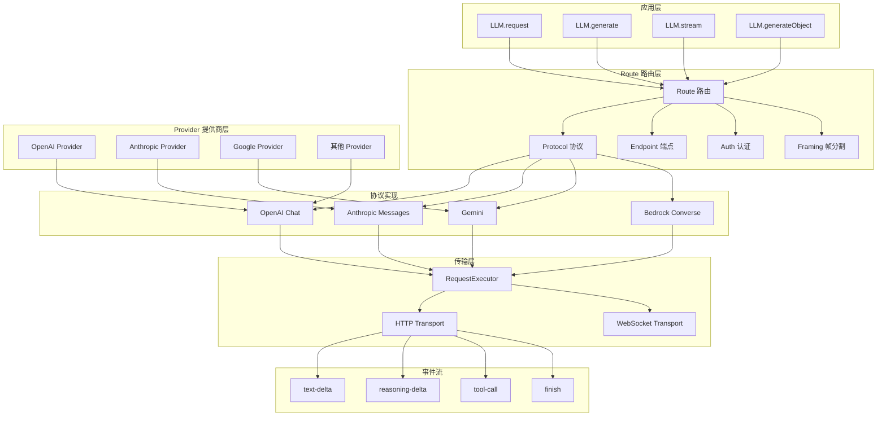
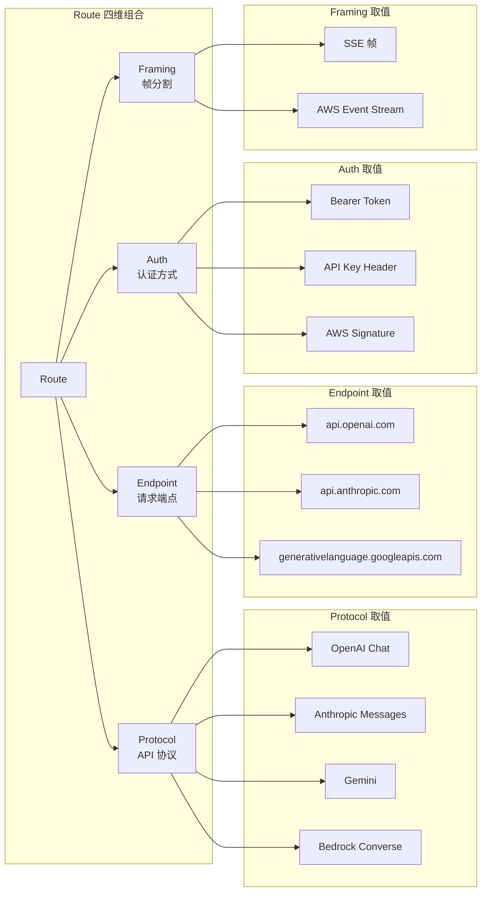
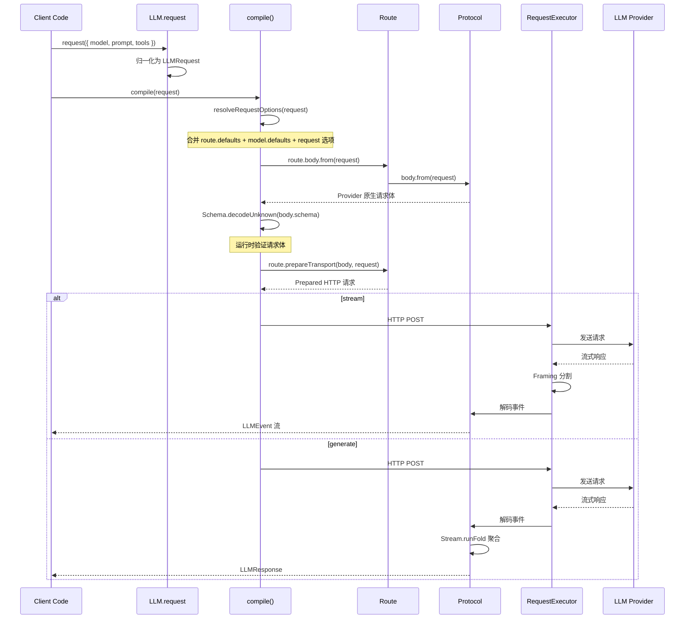

# 第 7 章：LLM 集成

> **上一章**我们深入了工具系统，了解了 Tool 如何通过 Schema 定义、注册和执行。本章将向上游看——LLM 集成层，它是工具的"消费者"，也是 Agent 智能的来源。Opencode 如何支持 30+ LLM 提供商同时保持代码复用？答案就在这里。

## 7.1 LLM 集成架构总览

Opencode 的 LLM 集成层是一个高度模块化的系统，设计目标是**支持 30+ LLM 提供商**，同时保持代码复用率最大化。核心思想是：将"与 LLM 通信"这个任务拆解为 4 个正交维度，让每个维度可以独立配置和复用。



## 7.2 Provider 抽象层

Provider 是 LLM 集成中最外层的抽象。它本质上是一个**轻量定义**，包含一个 provider ID 和一个 model 工厂函数，每个 Provider 可以暴露多个 API 路由（如 OpenAI 同时提供 Chat Completions 和 Responses API 两条路由）。

```typescript
// packages/llm/src/provider.ts — Provider 定义
export interface Definition<Factory extends AnyModelFactory = ModelFactory> {
  readonly id: ProviderID
  readonly model: Factory
  readonly apis?: Record<string, AnyModelFactory>
}

export const make = <DefinitionType extends DefinitionShape>(
  definition: NoExtraFields<DefinitionType, DefinitionShape>,
) => definition
```

Provider 的 `make` 函数使用 `NoExtraFields` 类型约束，确保定义中不包含多余字段——这是一种编译时安全措施。

### Provider 配置模式

每个 Provider 都遵循"先配置，后选模型"的模式：

```typescript
// packages/llm/src/providers/openai.ts — OpenAI Provider 示例
export const configure = (input: Config = {}) => {
  const responsesRoute = configuredRoute(OpenAIResponses.route, input)
  const chatRoute = configuredRoute(OpenAIChat.route, input)
  const modelDefaults = defaults(input)

  const responses = (id: string | ModelID) =>
    responsesRoute.with(withOpenAIOptions(id, modelDefaults, { textVerbosity: true })).model({ id })
  const chat = (id: string | ModelID) =>
    chatRoute.with(withOpenAIOptions(id, modelDefaults)).model({ id })

  return {
    id,
    model: responses,
    responses,
    chat,
    configure,
  }
}

export const provider = configure()
export const model = provider.model
```

这种模式的好处是：用户可以在配置阶段注入 API Key、自定义 Base URL、查询参数等，然后通过 `model("gpt-4o")` 选择具体模型。每个 Provider 文件都导出 `configure` 函数和默认的 `provider` 实例。

## 7.3 Route 系统（核心）

Route 是 LLM 集成的**核心抽象**。它组合了 4 个正交维度：



### Route 定义

```typescript
// packages/llm/src/route/client.ts — Route 接口
export interface Route<Body, Prepared = unknown> {
  readonly id: string
  readonly provider?: ProviderID
  readonly protocol: ProtocolID
  readonly endpoint: Endpoint<Body>
  readonly auth: AuthDef
  readonly transport: Transport<Body, Prepared, unknown>
  readonly defaults: RouteDefaults
  readonly body: RouteBody<Body>

  // 克隆 Route 并应用补丁（不可变更新）
  readonly with: (patch: RoutePatch<Body, Prepared>) => Route<Body, Prepared>

  // 从 Route 构造 Model 对象
  readonly model: (input: RouteMappedModelInput) => Model

  // 准备传输（编译请求体 → 准备 HTTP 请求）
  readonly prepareTransport: (body: Body, request: LLMRequest) => Effect.Effect<Prepared, LLMError>

  // 流式执行已准备的请求
  readonly streamPrepared: (
    prepared: Prepared, request: LLMRequest, runtime: TransportRuntime,
  ) => Stream.Stream<LLMEvent, LLMError>
}
```

### Route 的构建

Route 通过 `Route.make` 创建，这是将 4 个维度组合在一起的工厂函数：

```typescript
// packages/llm/src/route/client.ts — Route 构造函数
export function make<Body, Frame, Event, State>(
  input: MakeInput<Body, Frame, Event, State>,
): Route<Body, HttpTransport.HttpPrepared<Frame>>

// MakeInput 的定义
export interface MakeInput<Body, Frame, Event, State> {
  readonly id: string
  readonly provider?: string | ProviderID
  readonly protocol: Protocol<Body, Frame, Event, State>  // 协议
  readonly endpoint: Endpoint<Body>                        // 端点
  readonly auth?: AuthDef                                  // 认证
  readonly framing: Framing<Frame>                         // 帧分割
  readonly headers?: (input: { readonly request: LLMRequest }) => Record<string, string>
  readonly defaults?: RouteDefaultsInput
}
```

### Route 的不可变更新

`route.with()` 方法实现了 Route 的不可变更新。当 Provider 配置需要修改路由时（如设置 API Key、自定义 Base URL），它克隆 Route 并应用补丁：

```typescript
// Route.make 内部构建的 with 方法
with: (patch: RoutePatch<Body, Prepared>) => {
  const { id, provider, auth, transport, endpoint, ...defaults } = patch
  return build({
    ...routeInput,
    id: id ?? routeInput.id,
    provider: provider ?? routeInput.provider,
    auth: auth ?? routeInput.auth,
    endpoint: endpoint ? Endpoint.merge(routeInput.endpoint, endpoint) : routeInput.endpoint,
    transport: transport ?? routeInput.transport,
    defaults: mergeRouteDefaults(route.defaults, defaults),
  })
},
```

## 7.4 Protocol 协议层

Protocol 是 Route 的"语义核心"——它定义了"这个 API 长什么样"：如何将通用的 `LLMRequest` 转换为 provider 原生请求体，以及如何将流式响应解码为通用 `LLMEvent`。

```typescript
// packages/llm/src/route/protocol.ts — Protocol 接口
export interface Protocol<Body, Frame, Event, State> {
  readonly id: ProtocolID
  readonly body: ProtocolBody<Body>
  readonly stream: ProtocolStream<Frame, Event, State>
}

export interface ProtocolBody<Body> {
  readonly schema: Schema.Codec<Body, unknown>
  readonly from: (request: LLMRequest) => Effect.Effect<Body, LLMError>
}

export interface ProtocolStream<Frame, Event, State> {
  readonly event: Schema.Codec<Event, Frame>
  readonly initial: (request: LLMRequest) => State
  readonly step: (state: State, event: Event) => Effect.Effect<readonly [State, ReadonlyArray<LLMEvent>], LLMError>
  readonly terminal?: (event: Event) => boolean
  readonly onHalt?: (state: State) => ReadonlyArray<LLMEvent>
}
```

Protocol 的四个类型参数描述了完整的数据流管道：

- **Body** — provider 原生请求体，由 `body.from` 从 `LLMRequest` 构建
- **Frame** — 帧分割后的一个数据单元（SSE 的 JSON data 字符串，或 AWS 的二进制帧）
- **Event** — 解码后的 provider 原生事件
- **State** — 流式解析器的状态，通过 `stream.step` 逐步推进

### 一个完整的协议实现：OpenAI Chat

以 OpenAI Chat 协议为例，它包含三个部分：

**1. 请求体 Schema 定义**

```typescript
// packages/llm/src/protocols/openai-chat.ts
const OpenAIChatBody = Schema.Struct({
  model: Schema.String,
  messages: Schema.Array(OpenAIChatMessage),
  tools: optionalArray(OpenAIChatTool),
  tool_choice: Schema.optional(OpenAIChatToolChoice),
  stream: Schema.Literal(true),
  max_tokens: Schema.optional(Schema.Number),
  temperature: Schema.optional(Schema.Number),
  // ... 更多字段
})
```

**2. 请求体构建（Lowering）**

```typescript
const fromRequest = Effect.fn("OpenAIChat.fromRequest")(function* (request: LLMRequest) {
  return {
    model: request.model.id,
    messages: yield* lowerMessages(request),      // 将通用消息转为 OpenAI 格式
    tools: request.tools.length === 0 ? undefined
      : request.tools.map((tool) => lowerTool(tool, ...)),
    tool_choice: request.toolChoice ? yield* lowerToolChoice(request.toolChoice) : undefined,
    stream: true as const,
    stream_options: { include_usage: true },
    max_tokens: generation?.maxTokens,
    temperature: generation?.temperature,
    // ...
  }
})
```

**3. 流式事件解析（状态机）**

```typescript
const step = (state: ParserState, event: OpenAIChatEvent) =>
  Effect.gen(function* () {
    const events: LLMEvent[] = []
    const usage = mapUsage(event.usage) ?? state.usage
    const choice = event.choices[0]
    const finishReason = choice?.finish_reason
      ? mapFinishReason(choice.finish_reason) : state.finishReason
    const delta = choice?.delta
    const toolDeltas = delta?.tool_calls ?? []

    // 处理 reasoning 内容
    if (delta?.reasoning_content)
      lifecycle = Lifecycle.reasoningDelta(lifecycle, events, ...)

    // 处理文本 delta
    if (delta?.content)
      lifecycle = Lifecycle.textDelta(lifecycle, events, ...)

    // 处理工具调用 delta（OpenAI 流式工具调用分多个 chunk）
    for (const tool of toolDeltas) {
      const result = ToolStream.appendOrStart(ADAPTER, tools, ...)
      // ...
    }

    return [{ tools, usage, finishReason, lifecycle }, events] as const
  })
```

### 协议复用

Protocol 的设计让多个 Provider 可以共享同一个协议实现。例如，DeepSeek、TogetherAI、Cerebras、Fireworks 等都复用 `OpenAIChat.protocol`，只需提供不同的 `Endpoint` 和 `Auth`：

```typescript
// packages/llm/src/providers/openai-compatible.ts
// 所有兼容 OpenAI API 的提供商共享同一个协议
export const configure = (input: Config) => {
  // 复用 OpenAIChat.protocol，只改 endpoint 和 auth
  const route = OpenAIChat.route.with({
    auth: auth(input),
    endpoint: { baseURL: input.baseURL },
  })
  // ...
}
```

## 7.5 LLMClient 服务

LLMClient 是核心服务接口，暴露三个方法，涵盖了从"编译不发送"到"流式调用"到"非流式聚合"的完整使用场景：

```typescript
// packages/llm/src/route/client.ts — LLMClient 接口
export interface Interface {
  /** 编译请求但不发送。返回 Provider 原生请求体。 */
  readonly prepare: <Body = unknown>(request: LLMRequest) => Effect.Effect<PreparedRequestOf<Body>, LLMError>

  /** 流式调用 LLM，返回 LLMEvent 流 */
  readonly stream: StreamMethod  // (request: LLMRequest) => Stream.Stream<LLMEvent, LLMError>

  /** 非流式调用，内部聚合 stream 的完整响应 */
  readonly generate: GenerateMethod  // (request: LLMRequest) => Effect.Effect<LLMResponse, LLMError>
}
```

### 三个方法的实现

```typescript
// prepare — 编译但不发送
const prepareWith = Effect.fn("LLMClient.prepare")(function* (request: LLMRequest) {
  const compiled = yield* compile(request)
  return new PreparedRequest({
    id: compiled.request.id ?? "request",
    route: compiled.route.id,
    protocol: compiled.route.protocol,
    model: compiled.request.model,
    body: compiled.body,
    metadata: { transport: compiled.route.transport.id },
  })
})

// stream — 流式调用
const streamRequestWith = (runtime: TransportRuntime) => (request: LLMRequest) =>
  Stream.unwrap(
    Effect.gen(function* () {
      const compiled = yield* compile(request)
      return compiled.route.streamPrepared(compiled.prepared, compiled.request, runtime)
    }),
  )

// generate — 非流式（内部聚合 stream）
const generateWith = (stream: Interface["stream"]) =>
  Effect.fn("LLM.generate")(function* (request: LLMRequest) {
    const state = yield* stream(request).pipe(Stream.runFold(LLMResponse.empty, LLMResponse.reduce))
    const response = LLMResponse.complete(state)
    if (response) return response
    return yield* ProviderShared.eventError(...)
  })
```

## 7.6 LLM 请求构建

`LLM.request` 是用户与 LLM 集成的入口函数。它接受一个灵活的 `RequestInput`，归一化为标准的 `LLMRequest` 对象：

```typescript
// packages/llm/src/llm.ts — 请求构建
export const request = (input: RequestInput) => {
  const {
    system: requestSystem,
    prompt,
    messages,
    tools,
    toolChoice: requestToolChoice,
    generation: requestGeneration,
    providerOptions: requestProviderOptions,
    http: requestHttp,
    ...rest
  } = input

  return new LLMRequest({
    ...rest,
    system: SystemPart.content(requestSystem),
    messages: [
      ...(messages?.map(Message.make) ?? []),
      ...(prompt === undefined ? [] : [Message.user(prompt)]),
    ],
    tools: tools?.map(ToolDefinition.make) ?? [],
    toolChoice: requestToolChoice ? ToolChoice.make(requestToolChoice) : undefined,
    generation: requestGeneration === undefined ? undefined : GenerationOptions.make(requestGeneration),
    providerOptions: requestProviderOptions,
    http: requestHttp === undefined ? undefined : HttpOptions.make(requestHttp),
  })
}
```

`RequestInput` 的设计非常灵活，支持多种输入方式：

```typescript
export type RequestInput = Omit<ConstructorParameters<typeof LLMRequest>[0],
  "system" | "messages" | "tools" | "toolChoice" | "generation" | "http" | "providerOptions"
> & {
  readonly system?: string | SystemPart | ReadonlyArray<SystemPart>
  readonly prompt?: string | ContentPart | ReadonlyArray<ContentPart>
  readonly messages?: ReadonlyArray<Message | MessageInput>
  readonly tools?: ReadonlyArray<ToolDefinition.Input>
  readonly toolChoice?: ToolChoiceInput
  readonly generation?: GenerationOptions.Input
  readonly providerOptions?: ConstructorParameters<typeof LLMRequest>[0]["providerOptions"]
  readonly http?: HttpOptions.Input
}
```

这意味着用户可以传入纯字符串作为 `prompt`，也可以传入结构化的 `Message` 数组，系统会自动归一化。

## 7.7 编译与执行流程

`compile` 是 LLM 集成中最重要的**边界**：它将通用的 `LLMRequest` 转为经过验证的 provider 原生请求体，之后就可以交给传输层执行。



### compile 的实现

```typescript
// packages/llm/src/route/client.ts — compile 函数
const compile = Effect.fn("LLM.compile")(function* (request: LLMRequest) {
  // 1. 解析请求选项（合并 route defaults + model defaults + 请求级选项）
  const resolved = applyCachePolicy(resolveRequestOptions(request))
  const route = resolved.model.route

  // 2. 构建 provider 原生请求体
  const body = yield* route.body
    .from(resolved)
    .pipe(Effect.flatMap(
      ProviderShared.validateWith(Schema.decodeUnknownEffect(route.body.schema))
    ))

  // 3. 准备传输（编码、签名、构造 HTTP 请求）
  const prepared = yield* route.prepareTransport(body, resolved)

  return { request: resolved, route, body, prepared }
})
```

### 请求选项解析

`resolveRequestOptions` 负责将三层配置合并为一个层级：

```typescript
const resolveRequestOptions = (request: LLMRequest) => {
  const routeDefaults = request.model.route.defaults
  const modelDefaults = request.model.defaults
  const generation = mergeGenerationOptions(
    routeDefaults.generation, modelDefaults?.generation, request.generation
  )
  return LLMRequest.update(request, {
    generation: generation ?? new GenerationOptions({}),
    providerOptions: mergeProviderOptions(
      routeDefaults.providerOptions, modelDefaults?.providerOptions, request.providerOptions,
    ),
    http: mergeHttpOptions(routeDefaults.http, modelDefaults?.http, request.http),
  })
}
```

优先级从低到高：**Route defaults → Model defaults → Request options**，后面的覆盖前面的。

## 7.8 通用 generateObject

LLM 提供了一个通用的 `generateObject` 方法，通过**强制 tool call** 从任意模型获取结构化输出。这种方法的好处是：不依赖 provider 特定的 JSON mode 实现，在所有协议上行为一致。

```typescript
// packages/llm/src/llm.ts — generateObject
const GENERATE_OBJECT_TOOL_NAME = "generate_object"

const runGenerateObject = Effect.fn("LLM.generateObject")(function* (
  options: GenerateObjectBase,
  tool: ReturnType<typeof makeTool>,
) {
  // 1. 构建请求，强制 tool call
  const baseRequest = request(options)
  const generateRequest = LLMRequest.update(baseRequest, {
    tools: toDefinitions({ [GENERATE_OBJECT_TOOL_NAME]: tool }),
    toolChoice: ToolChoice.named(GENERATE_OBJECT_TOOL_NAME),
  })

  // 2. 调用 LLM
  const response = yield* LLMClient.generate(generateRequest)

  // 3. 提取工具调用结果
  const call = response.toolCalls.find(
    (event) => LLMEvent.is.toolCall(event)
      && event.name === GENERATE_OBJECT_TOOL_NAME,
  )
  if (!call)
    return yield* new LLMError({ ... })

  // 4. 解码为 Schema 类型
  const object = yield* tool._decode(call.input).pipe(
    Effect.mapError(/* 解码失败转 LLMError */),
  )
  return new GenerateObjectResponse(object, response)
})
```

两种输入模式：

```typescript
// 1. Schema 模式 — 类型安全，自动解码
export function generateObject<S extends ToolSchema<any>>(
  options: GenerateObjectOptions<S>,
): Effect.Effect<GenerateObjectResponse<Schema.Schema.Type<S>>, LLMError>

// 2. JSON Schema 模式 — 运行时动态 Schema
export function generateObject(
  options: GenerateObjectDynamicOptions,
): Effect.Effect<GenerateObjectResponse<unknown>, LLMError>
```

## 7.9 协议实现一览

Opencode 目前支持以下协议实现：

| 协议 | 文件 | 提供商 |
|------|------|--------|
| OpenAI Chat | `protocols/openai-chat.ts` | OpenAI, DeepSeek, TogetherAI, Cerebras, Fireworks 等 |
| OpenAI Responses | `protocols/openai-responses.ts` | OpenAI Responses API |
| OpenAI Compatible Chat | `protocols/openai-compatible-chat.ts` | 兼容 OpenAI 的第三方服务 |
| Anthropic Messages | `protocols/anthropic-messages.ts` | Anthropic Claude |
| Gemini | `protocols/gemini.ts` | Google Gemini |
| Bedrock Converse | `protocols/bedrock-converse.ts` | AWS Bedrock |

对应的 Provider 配置：

| Provider | 文件 | 使用的协议 |
|----------|------|-----------|
| OpenAI | `providers/openai.ts` | OpenAI Chat + OpenAI Responses |
| Anthropic | `providers/anthropic.ts` | Anthropic Messages |
| Google | `providers/google.ts` | Gemini |
| Amazon Bedrock | `providers/amazon-bedrock.ts` | Bedrock Converse |
| Azure | `providers/azure.ts` | OpenAI Chat |
| Cloudflare | `providers/cloudflare.ts` | OpenAI Chat |
| OpenRouter | `providers/openrouter.ts` | OpenAI Chat |
| XAI | `providers/xai.ts` | OpenAI Chat |
| GitHub Copilot | `providers/github-copilot.ts` | OpenAI Chat |
| OpenAI Compatible | `providers/openai-compatible.ts` | OpenAI Chat |

## 7.10 Layer 集成与依赖注入

Opencode 使用 Effect-TS 的 Layer 系统进行依赖注入。LLM 的 `LLMClient` 服务依赖于 `RequestExecutor`（HTTP 执行器），可选地依赖 `WebSocketExecutor`：

```typescript
// packages/llm/src/route/client.ts — Layer 定义
export const layer: Layer.Layer<Service, never, RequestExecutor.Service> = Layer.effect(
  Service,
  Effect.gen(function* () {
    const stream = streamRequestWith({
      http: yield* RequestExecutor.Service,
      webSocket: Option.getOrUndefined(yield* Effect.serviceOption(WebSocketExecutor.Service)),
    })
    return Service.of({
      prepare: prepareWith as Interface["prepare"],
      stream,
      generate: generateWith(stream),
    })
  }),
)
```

### RequestExecutor

`RequestExecutor` 是 HTTP 请求的底层执行器，负责：

- 发送 HTTP 请求
- 处理重试（429/503/504/529 自动重试，最多 2 次）
- 错误分类（认证错误、限流、内容策略、超时等）
- 敏感信息脱敏（Authorization header、API key 等自动替换为 `<redacted>`）
- 速率限制信息解析

```typescript
// packages/llm/src/route/executor.ts
const retryableStatus = (status: number) =>
  status === 429 || status === 503 || status === 504 || status === 529

const retryStatusFailures = <A, R>(
  effect: Effect.Effect<A, LLMError, R>,
  retries = MAX_RETRIES,  // 最多重试 2 次
  attempt = 0,
): Effect.Effect<A, LLMError, R> =>
  Effect.catchTag(effect, "LLM.Error", (error) => {
    if (!error.retryable || retries <= 0) return Effect.fail(error)
    return retryDelay(error, attempt).pipe(
      Effect.flatMap((delay) => Effect.sleep(delay)),
      Effect.flatMap(() => retryStatusFailures(effect, retries - 1, attempt + 1)),
    )
  })
```

### 错误分类

RequestExecutor 根据 HTTP 状态码和响应体内容，将错误细分为多种类型：

```typescript
const statusReason = (input) => {
  // 内容策略违规（content_filter）
  if (/content[-_\s]?policy|content_filter|safety/i.test(body))
    return new ContentPolicyReason({ ... })
  // 认证失败（401）
  if (input.status === 401)
    return new AuthenticationReason({ kind: "invalid", ... })
  // 权限不足（403）
  if (input.status === 403)
    return new AuthenticationReason({ kind: "insufficient-permissions", ... })
  // 配额不足 vs 速率限制（429）
  if (input.status === 429) {
    if (/insufficient[-_\s]?quota/i.test(body))
      return new QuotaExceededReason({ ... })
    return new RateLimitReason({ ... })
  }
  // 无效请求（400/404/409/413/422）
  if (input.status === 400 || input.status === 404 || ...)
    return new InvalidRequestReason({ ... })
  // 服务端错误（500+）
  if (input.status >= 500 || retryableStatus(input.status))
    return new ProviderInternalReason({ ... })
  return new UnknownProviderReason({ ... })
}
```

## 7.11 事件流模型

LLM 集成层定义了统一的流式事件模型，屏蔽了不同 provider 的差异：

```typescript
// 事件类型（联合类型）
type LLMEvent =
  | { type: "step-start"; index: number }           // 新步骤开始
  | { type: "text-start"; id: string }               // 文本块开始
  | { type: "text-delta"; id: string; text: string } // 文本增量
  | { type: "text-end"; id: string }                 // 文本块结束
  | { type: "reasoning-start"; id: string }          // 推理开始
  | { type: "reasoning-delta"; id: string; text: string } // 推理增量
  | { type: "reasoning-end"; id: string }            // 推理结束
  | { type: "tool-input-start"; id: string; name: string } // 工具输入开始
  | { type: "tool-input-delta"; id: string; text: string }  // 工具输入增量
  | { type: "tool-input-end"; id: string; name: string }    // 工具输入结束
  | { type: "tool-call"; id: string; name: string; input: unknown } // 完整工具调用
  | { type: "tool-result"; id: string; name: string; result: ToolResultValue } // 工具结果
  | { type: "finish"; reason: FinishReason; usage?: Usage } // 完成信号
```

这个统一事件模型使得下游消费者（如会话管理、UI 渲染）可以独立于具体 provider 工作。

## 7.12 小结

本章介绍了 Opencode 的 LLM 集成层：

- **四维 Route 组合**：Protocol（协议语义）+ Endpoint（请求端点）+ Auth（认证方式）+ Framing（帧分割），每个维度独立可配置、可复用
- **Provider 抽象**：轻量定义，支持"先配置，后选模型"的模式
- **Protocol 协议解耦**：将 provider 原生 API 的差异封装在 Protocol 中，DeepSeek、TogetherAI 等共享 OpenAI Chat 协议
- **编译边界**：`compile` 将通用 `LLMRequest` 转为经过验证的 provider 原生请求体
- **统一事件流**：所有 provider 的事件流归一化为 `LLMEvent` 联合类型
- **generateObject**：通过强制 tool call 实现通用的结构化输出，不依赖 provider 特定功能
- **Layer 依赖注入**：使用 Effect-TS Layer 管理服务依赖
- **错误分类**：HTTP 错误按状态码和响应体细分为 8+ 种具体错误类型
- **支持 30+ 提供商**：通过协议复用和 Provider 配置，覆盖主流 LLM 服务

下一章将深入讲解插件系统，看看 Opencode 如何通过 Plugin SDK 让第三方开发者注入自定义 Agent、Provider 和工具。