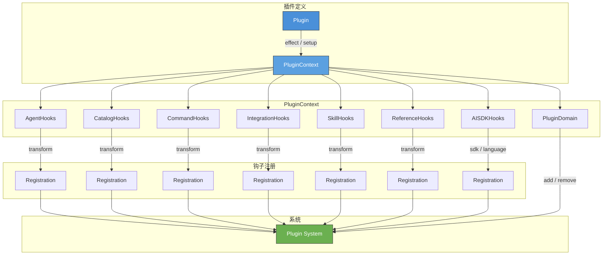
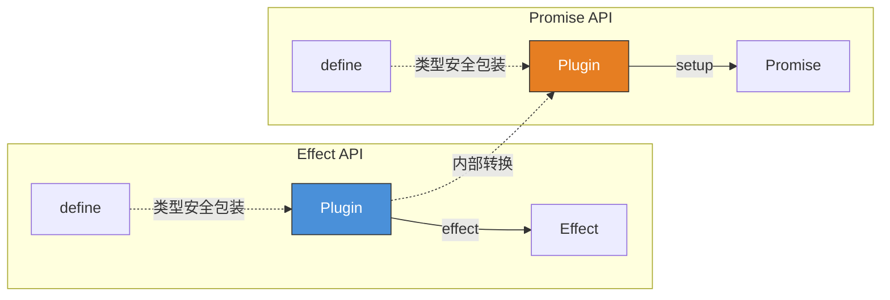
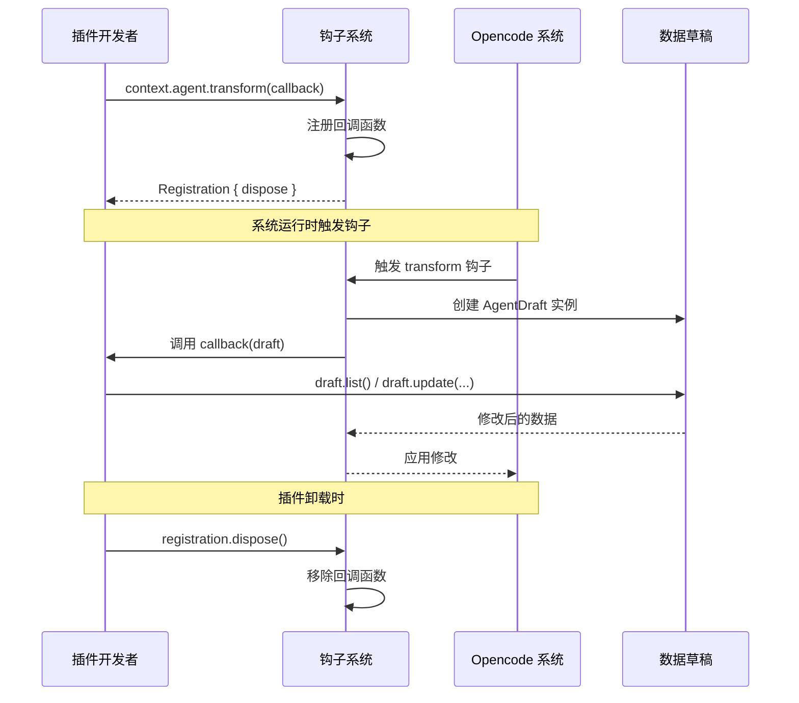
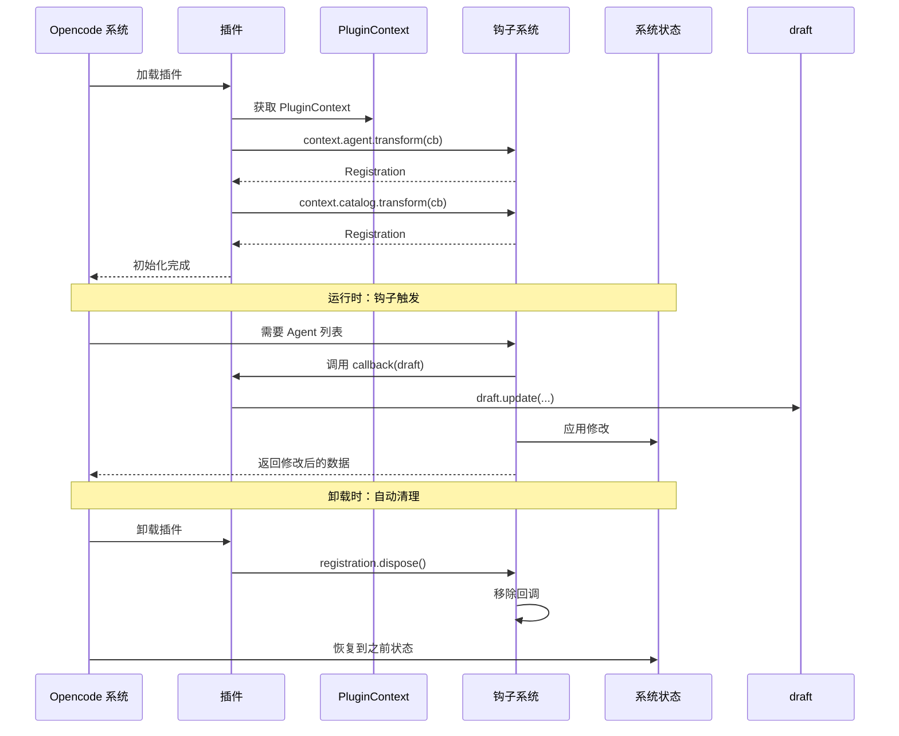

# 第 8 章：插件系统

## 8.1 插件系统的设计动机

Opencode 是一个高度可扩展的 AI 编程助手。除了内置的工具和功能，它还需要一个**标准化机制**让第三方开发者能够注入自定义行为。插件系统就是为此而生。

插件系统要解决的核心问题包括：

- **自定义 Agent**：注册新的 Agent 配置，覆盖默认行为
- **自定义 Provider/Model**：添加新的 LLM 提供商或模型
- **自定义 Slash 命令**：注册 `/command` 快捷操作
- **集成第三方服务**：通过 OAuth 等方式认证并连接外部服务
- **技能注册**：注入新的技能（Skill）
- **引用管理**：自定义上下文引用的来源和处理方式

所有这些能力都通过统一的**插件接口**暴露给开发者，而无需修改 Opencode 核心代码。

## 8.2 插件系统架构



插件的核心流程很简单：

1. 开发者定义一个 `Plugin` 对象，包含 `id` 和初始化逻辑（`effect` 或 `setup`）
2. 初始化逻辑接收一个 `PluginContext`，通过它访问各种**钩子（Hooks）**
3. 钩子函数接收一个**草稿（Draft）**对象，开发者可以读取、修改它
4. 钩子返回一个 `Registration`，包含 `dispose` 方法，插件卸载时清理

## 8.3 双 API 设计

Opencode 插件系统的一大特色是**双 API 设计**：同时支持 **Effect API** 和 **Promise API**。这是为了适应不同的使用场景和开发者偏好。

### Effect API

Effect API 基于 [Effect-TS](https://effect.website/) 函数式编程库，提供类型安全的组合式编程模型：

```typescript
// packages/plugin/src/v2/effect/plugin.ts
import type { Effect, Scope } from "effect"
import type { PluginContext } from "./context.js"

export interface Plugin<R = Scope.Scope> {
  readonly id: string
  readonly effect: (context: PluginContext) => Effect.Effect<void, never, R>
}

export function define<R = Scope.Scope>(plugin: Plugin<R>) {
  return plugin
}
```

Effect API 的 `Plugin` 是泛型类型 `Plugin<R>`，其中 `R` 表示 Effect 运行所需的资源类型，默认为 `Scope.Scope`。`define` 函数是一个类型安全的包装器，它只是原样返回传入的 `Plugin` 对象（运行时无开销）。

### Promise API

Promise API 面向更广泛的 JavaScript 开发者，使用熟悉的 `async/await` 风格：

```typescript
// packages/plugin/src/v2/promise/plugin.ts
import type { PluginContext } from "./context.js"

export interface Plugin {
  readonly id: string
  readonly setup: (context: PluginContext) => Promise<void> | void
}

export function define(plugin: Plugin) {
  return plugin
}
```

Promise API 的 `Plugin` 没有泛型参数，`setup` 返回 `Promise<void> | void`，既支持同步也支持异步初始化。

### 两个 API 的关系



两个 API 的 `PluginContext` 接口完全一致，区别仅在于初始化方式（`effect` vs `setup`）和返回值类型（`Effect` vs `Promise`）。Effect API 适合需要细粒度资源管理和组合的场景，Promise API 适合快速上手。

## 8.4 PluginContext — 插件的万能接口

`PluginContext` 是插件与 Opencode 系统交互的唯一入口，它聚合了所有可用的钩子和能力：

```typescript
// packages/plugin/src/v2/effect/context.ts
export interface PluginContext {
  readonly options: PluginOptions
  readonly agent: AgentHooks & Reload
  readonly aisdk: AISDKHooks
  readonly catalog: CatalogHooks & Reload
  readonly command: CommandHooks & Reload
  readonly integration: IntegrationHooks & Reload
  readonly plugin: PluginDomain
  readonly reference: ReferenceHooks & Reload
  readonly skill: SkillHooks & Reload
}
```

每个字段的含义：

| 字段 | 类型 | 用途 |
|------|------|------|
| `options` | `PluginOptions` | 插件配置项，只读的 `Record<string, any>` |
| `agent` | `AgentHooks & Reload` | Agent 的增删改查钩子，支持重载 |
| `aisdk` | `AISDKHooks` | AI SDK 的钩子，用于自定义 LLM 适配 |
| `catalog` | `CatalogHooks & Reload` | Provider/Model 目录的增删改查钩子 |
| `command` | `CommandHooks & Reload` | Slash 命令的钩子 |
| `integration` | `IntegrationHooks & Reload` | 第三方集成的钩子 |
| `plugin` | `PluginDomain` | 插件管理域，支持动态添加/移除插件 |
| `reference` | `ReferenceHooks & Reload` | 引用管理的钩子 |
| `skill` | `SkillHooks & Reload` | 技能注册的钩子 |

注意 `agent`、`catalog`、`command`、`integration`、`reference`、`skill` 都带有 `& Reload`，这意味着它们除了提供钩子注册方法之外，还额外提供一个 `reload()` 方法，用于在修改后触发系统重载。

## 8.5 钩子系统（Hooks）— 插件系统的核心抽象

钩子是插件系统最核心的抽象。它定义了一个通用模式：**注册回调 → 在某个时刻被调用 → 返回 Registration 用于清理**。

### 通用 Hooks 类型

```typescript
// packages/plugin/src/v2/effect/registration.ts
import type { Effect, Scope } from "effect"

export interface Registration {
  readonly dispose: Effect.Effect<void>
}

export interface Reload {
  readonly reload: () => Effect.Effect<void>
}

export type Hooks<Spec> = {
  readonly [Name in keyof Spec]: (
    callback: (input: Spec[Name]) => Effect.Effect<void> | void,
  ) => Effect.Effect<Registration, never, Scope.Scope>
}
```

这里的 `Hooks<Spec>` 是一个**映射类型**（mapped type），它接受一个 `Spec` 接口，为每个键生成一个方法。例如，如果 `Spec` 是 `{ transform: AgentDraft }`，那么 `Hooks<{ transform: AgentDraft }>` 会生成 `{ transform: (callback) => Effect<Registration> }`。

### Registration 和 Reload

- **Registration**：包含 `dispose` 方法，调用后取消钩子注册。这使得插件热更新和卸载变得安全。
- **Reload**：包含 `reload` 方法，在修改数据后调用，通知系统重新加载配置。

### 钩子注册流程



## 8.6 钩子类型详解

### AgentHooks — Agent 管理

```typescript
// packages/plugin/src/v2/effect/agent.ts
import type { AgentV2Info } from "@opencode-ai/sdk/v2/types"
import type { Hooks } from "./registration.js"

export interface AgentDraft {
  list(): readonly AgentV2Info[]
  get(id: string): AgentV2Info | undefined
  default(id: string | undefined): void
  update(id: string, update: (agent: AgentV2Info) => void): void
  remove(id: string): void
}

export type AgentHooks = Hooks<{
  transform: AgentDraft
}>
```

`AgentDraft` 是一个**可变草稿**，它是对当前 Agent 列表的一个快照视图。插件可以在 `transform` 回调中：

- `list()` — 查看所有 Agent
- `get(id)` — 查找特定 Agent
- `default(id)` — 设置默认 Agent
- `update(id, updater)` — 修改 Agent 配置（通过 updater 函数原地修改）
- `remove(id)` — 移除 Agent

### CatalogHooks — Provider/Model 目录

```typescript
// packages/plugin/src/v2/effect/catalog.ts
import type { ModelV2Info, ProviderV2Info } from "@opencode-ai/sdk/v2/types"
import type { Hooks } from "./registration.js"

export interface CatalogProviderRecord {
  readonly provider: ProviderV2Info
  readonly models: ReadonlyMap<string, ModelV2Info>
}

export interface CatalogDraft {
  readonly provider: {
    list(): readonly CatalogProviderRecord[]
    get(providerID: string): CatalogProviderRecord | undefined
    update(providerID: string, update: (provider: ProviderV2Info) => void): void
    remove(providerID: string): void
  }
  readonly model: {
    get(providerID: string, modelID: string): ModelV2Info | undefined
    update(providerID: string, modelID: string, update: (model: ModelV2Info) => void): void
    remove(providerID: string, modelID: string): void
    readonly default: {
      get(): { providerID: string; modelID: string } | undefined
      set(providerID: string, modelID: string): void
    }
  }
}

export type CatalogHooks = Hooks<{
  transform: CatalogDraft
}>
```

`CatalogDraft` 分为 `provider` 和 `model` 两个子域：

- **Provider 域**：管理 LLM 提供商，可以通过 `update` 修改提供商的配置（如 API 端点、认证信息）
- **Model 域**：管理每个提供商下的模型，支持增删改查，以及设置默认模型

### CommandHooks — 自定义命令

```typescript
// packages/plugin/src/v2/effect/command.ts
import type { CommandV2Info } from "@opencode-ai/sdk/v2/types"
import type { Hooks } from "./registration.js"

export interface CommandDraft {
  list(): readonly CommandV2Info[]
  get(name: string): CommandV2Info | undefined
  update(name: string, update: (command: CommandV2Info) => void): void
  remove(name: string): void
}

export type CommandHooks = Hooks<{
  transform: CommandDraft
}>
```

`CommandDraft` 用于管理 slash 命令（如 `/fix`、`/test` 等），插件可以添加新的命令或修改现有命令。

### SkillHooks — 技能注册

```typescript
// packages/plugin/src/v2/effect/skill.ts
import type { SkillV2Source } from "@opencode-ai/sdk/v2/types"
import type { Hooks } from "./registration.js"

export interface SkillDraft {
  source(source: SkillV2Source): void
  list(): readonly SkillV2Source[]
}

export type SkillHooks = Hooks<{
  transform: SkillDraft
}>
```

`SkillDraft` 提供 `source()` 方法注册新的技能来源，`list()` 方法查看已注册的技能。

### ReferenceHooks — 引用管理

```typescript
// packages/plugin/src/v2/effect/reference.ts
import type { ReferenceGitSource, ReferenceLocalSource } from "@opencode-ai/sdk/v2/types"
import type { Hooks } from "./registration.js"

export interface ReferenceDraft {
  add(name: string, source: ReferenceLocalSource | ReferenceGitSource): void
  remove(name: string): void
  list(): readonly (readonly [string, ReferenceLocalSource | ReferenceGitSource])[]
}

export type ReferenceHooks = Hooks<{
  transform: ReferenceDraft
}>
```

`ReferenceDraft` 用于管理上下文引用，支持添加本地路径引用或 Git 仓库引用。

### IntegrationHooks — 第三方集成

```typescript
// packages/plugin/src/v2/effect/integration.ts
import type {
  IntegrationRef,
  IntegrationMethod,
  IntegrationMethodRegistration,
  CredentialOAuth,
  IntegrationInputs,
} from "@opencode-ai/sdk/v2/types"
import type { Effect, Scope } from "effect"
import type { Hooks } from "./registration.js"

export interface IntegrationDraft {
  list(): readonly IntegrationRef[]
  get(id: string): IntegrationRef | undefined
  update(id: string, update: (integration: IntegrationRef) => void): void
  remove(id: string): void
  readonly method: {
    list(integrationID: string): readonly IntegrationMethod[]
    update(input: IntegrationMethodRegistration): void
    remove(integrationID: string, method: IntegrationMethod): void
  }
}

export interface IntegrationHooks extends Hooks<{ transform: IntegrationDraft }> {
  readonly connection: {
    readonly active: (integrationID: string) => Effect.Effect<ConnectionInfo | undefined>
    readonly resolve: (connection: ConnectionInfo) => Effect.Effect<CredentialValue | undefined, unknown>
  }
}
```

`IntegrationHooks` 比其它钩子更加复杂，因为它除了继承 `Hooks<{ transform }>` 之外，还额外提供了 `connection` 子域，用于管理活跃连接和凭证解析。

### AISDKHooks — AI SDK 适配

```typescript
// packages/plugin/src/v2/effect/aisdk.ts
import type { LanguageModelV3 } from "@ai-sdk/provider"
import type { ModelV2Info } from "@opencode-ai/sdk/v2/types"
import type { Hooks } from "./registration.js"

export type AISDKHooks = Hooks<{
  sdk: {
    readonly model: ModelV2Info
    readonly package: string
    readonly options: Record<string, any>
    sdk?: any
  }
  language: {
    readonly model: ModelV2Info
    readonly sdk: any
    readonly options: Record<string, any>
    language?: LanguageModelV3
  }
}>
```

`AISDKHooks` 是特殊的钩子，它不操作 `transform` 草稿，而是提供 `sdk` 和 `language` 两个钩子，用于在运行时注入自定义的 AI SDK 适配器和语言模型实现。

## 8.7 PluginDomain — 插件管理自身

插件系统支持**递归的插件管理**——插件本身可以通过 `PluginDomain` 添加或移除其他插件：

```typescript
// packages/plugin/src/v2/effect/plugin.ts
export interface PluginDomain {
  readonly add: (plugin: Plugin) => Effect.Effect<void>
  readonly remove: (id: string) => Effect.Effect<void>
}
```

这使得插件可以成为**插件加载器**，实现分层插件架构。例如，一个"市场插件"可以动态从远端加载并注册其他插件。

## 8.8 PluginOptions — 插件配置

```typescript
// packages/plugin/src/v2/options.ts
export type PluginOptions = Readonly<Record<string, any>>
```

插件选项是一个简单的只读字符串键值对，用于向插件传递配置参数。

## 8.9 编写一个完整插件

现在让我们动手编写一个实际插件，将前面介绍的概念串联起来。

### 场景：注册自定义 Agent 和 Provider

假设我们想创建一个插件，为 Opencode 添加一个自定义的"代码审查助手" Agent，并注册一个自定义的 LLM 提供商。

### 使用 Promise API 编写

```typescript
// my-plugin.ts
import { define } from "@opencode-ai/plugin/v2/promise"
import type { PluginContext } from "@opencode-ai/plugin/v2/promise"

export const myPlugin = define({
  id: "my-code-review-plugin",
  setup: (context: PluginContext) => {
    // 1. 注册自定义 Agent
    context.agent.transform((draft) => {
      // 查看已有的 Agent
      const existingAgents = draft.list()
      console.log(`当前有 ${existingAgents.length} 个 Agent`)

      // 添加自定义 Agent：修改 draft 中的 Agent 配置
      // 如果"code-reviewer"不存在，则创建一个
      const reviewer = draft.get("code-reviewer")
      if (!reviewer) {
        // 使用系统内部 API 添加新 Agent
        draft.update("code-reviewer", (agent) => {
          agent.name = "Code Reviewer"
          agent.description = "专门用于代码审查的 AI 助手"
          // 配置特定的模型和指令
          agent.model = "gpt-4"
          agent.systemPrompt = "你是一个资深的代码审查专家..."
        })
      }
    })

    // 2. 注册自定义 Provider 和 Model
    context.catalog.transform((draft) => {
      // 添加自定义 Provider
      draft.provider.update("my-custom-provider", (provider) => {
        provider.name = "My Custom LLM"
        provider.apiUrl = "https://api.my-custom-llm.com/v1"
      })

      // 添加模型
      draft.model.update("my-custom-provider", "my-model-v1", (model) => {
        model.name = "My Model v1"
        model.contextLength = 8192
      })

      // 设置默认模型
      draft.model.default.set("my-custom-provider", "my-model-v1")
    })

    // 3. 注册自定义 Slash 命令
    context.command.transform((draft) => {
      draft.update("/review", (cmd) => {
        cmd.description = "对当前代码进行审查"
        cmd.handler = async () => {
          // 执行审查逻辑
        }
      })
    })

    // 4. 注册技能
    context.skill.transform((draft) => {
      draft.source({
        type: "inline",
        name: "code-review",
        description: "代码审查技能",
        execute: async (input) => {
          // 审查代码
          return { issues: [] }
        },
      })
    })
  },
})
```

### 使用 Effect API 编写

```typescript
// my-plugin-effect.ts
import { define, Effect } from "@opencode-ai/plugin/v2/effect"
import type { PluginContext } from "@opencode-ai/plugin/v2/effect"

export const myPlugin = define({
  id: "my-code-review-plugin",
  effect: (context: PluginContext) =>
    Effect.gen(function* () {
      // 1. 注册自定义 Agent 钩子
      yield* context.agent.transform((draft) => {
        const reviewer = draft.get("code-reviewer")
        if (!reviewer) {
          draft.update("code-reviewer", (agent) => {
            agent.name = "Code Reviewer"
            agent.description = "专门用于代码审查的 AI 助手"
            agent.model = "gpt-4"
          })
        }
      })

      // 2. 注册自定义 Provider 钩子
      yield* context.catalog.transform((draft) => {
        draft.provider.update("my-custom-provider", (provider) => {
          provider.name = "My Custom LLM"
          provider.apiUrl = "https://api.my-custom-llm.com/v1"
        })
      })

      // 3. 注册自定义命令钩子
      yield* context.command.transform((draft) => {
        draft.update("/review", (cmd) => {
          cmd.description = "对当前代码进行审查"
        })
      })

      console.log("插件初始化完成")
    }),
})
```

### 插件的生命周期管理

```typescript
// 动态添加插件
import { Effect } from "effect"

const addPlugin = context.plugin.add(myPlugin)

// 动态移除插件
const removePlugin = context.plugin.remove("my-code-review-plugin")

// 重载配置
const reloadAgent = context.agent.reload()
const reloadCatalog = context.catalog.reload()
```

当插件被移除时，所有通过该插件注册的钩子自动清理（通过 `Registration.dispose`），确保系统状态的一致性。

## 8.10 插件的完整生命周期



## 8.11 小结

本章介绍了 Opencode 的插件系统：

- **双 API 设计**：Effect API 和 Promise API 满足不同开发者的偏好
- **PluginContext**：插件的万能接口，聚合了所有钩子和能力
- **Hooks 系统**：通用钩子抽象，提供类型安全的回调注册机制
- **Registration 机制**：确保插件卸载时资源正确清理
- **六大钩子类型**：Agent、Catalog、Command、Integration、Skill、Reference，覆盖了 Opencode 的所有扩展点
- **PluginDomain**：支持插件递归管理，实现分层插件架构
- **Draft 模式**：通过可变草稿视图，让插件可以安全地修改系统状态

插件系统是 Opencode 可扩展性的基石，它将核心系统的稳定性和第三方扩展的灵活性有机地结合在一起。下一章将深入讲解 Opencode 的 MCP 集成，看看如何通过标准协议连接外部工具和服务。