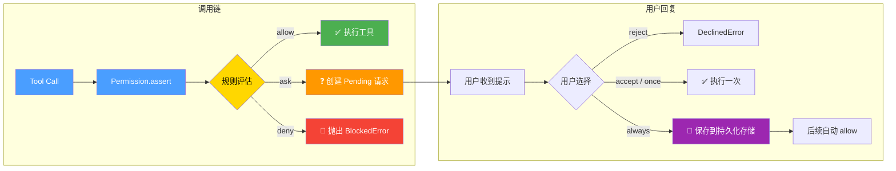
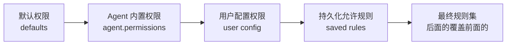

# 第 9 章：权限与安全

> **上一章**我们了解了插件系统如何通过 Hooks 扩展 Opencode 的各个层面。本章将聚焦安全领域——权限系统，它是 Agent 执行工具前的"安检站"，决定每个操作是直接放行、询问用户还是直接拒绝。

## 9.1 为什么需要权限系统

AI 编程助手能够执行 Shell 命令、读写文件、访问网络——这些能力如果不受约束，无异于将一把万能钥匙交给一个可能犯错或产生幻觉的 LLM。权限系统是 Opencode 的安全护栏，它在"让 Agent 高效工作"和"防止危险操作"之间取得平衡。

Opencode 的权限系统设计了三层安全模型：

- **allow**（允许）—— 自动放行，无需用户干预
- **ask**（询问）—— 暂停执行，等待用户确认
- **deny**（拒绝）—— 直接拦截，阻止操作



## 9.2 权限规则模型

每条权限规则是一个简单但强大的三元组：

```typescript
// packages/schema/src/permission.ts
export interface Rule extends Schema.Schema.Type<typeof Rule> {}
export const Rule = Schema.Struct({
  action: Schema.String,    // 操作名称，如 "read"、"bash"、"edit"
  resource: Schema.String,  // 资源模式，支持通配符，如 "*.env"、"src/**"
  effect: Effect,           // 效果："allow" | "deny" | "ask"
}).annotate({ identifier: "PermissionV2.Rule" })

export const Ruleset = Schema.Array(Rule).annotate({ identifier: "PermissionV2.Ruleset" })
export type Ruleset = typeof Ruleset.Type

export const Effect = Schema.Literals(["allow", "deny", "ask"])
  .annotate({ identifier: "PermissionV2.Effect" })
```

一个 `Ruleset` 就是一组规则的集合，规则按顺序排列，**后面的规则优先级更高**（后匹配优先）。这种设计让规则叠加变得简单直观。

### 规则示例

```typescript
// 默认规则：大部分操作允许，但敏感操作需要询问
const defaults: PermissionV2.Ruleset = [
  { action: "*", resource: "*", effect: "allow" },           // 默认允许一切
  { action: "question", resource: "*", effect: "deny" },     // 不允许 Agent 主动提问
  { action: "plan_enter", resource: "*", effect: "deny" },   // 不允许进入计划模式
  { action: "read", resource: "*.env", effect: "ask" },      // 读 .env 文件需要询问
  { action: "read", resource: "*.env.*", effect: "ask" },    // 读 .env.* 文件需要询问
  { action: "read", resource: "*.env.example", effect: "allow" }, // 示例文件可以直接读
]
```

## 9.3 核心评估函数

`evaluate` 函数是权限系统的核心引擎，它的职责是：给定一个操作和资源，从规则集中找到匹配的规则。

```typescript
// packages/core/src/permission.ts
export function evaluate(
  action: string,
  resource: string,
  ...rulesets: Permission.Ruleset[]
): Permission.Rule {
  return (
    rulesets
      .flat()                                          // 合并所有规则集
      .findLast((rule) =>                               // 从后往前找最后一个匹配的
        Wildcard.match(action, rule.action) &&
        Wildcard.match(resource, rule.resource)
      ) ?? {
      action,
      resource: "*",
      effect: "ask",  // 默认行为：询问用户
    }
  )
}
```

关键设计细节：

- **`findLast`**：从后往前匹配，所以后面的规则优先级更高。这允许后面的规则覆盖前面的规则。
- **`Wildcard.match`**：支持 glob 风格的通配符匹配，`*` 匹配任意字符。
- **默认值**：如果没有规则匹配，默认效果是 `"ask"`——安全优先，宁可多问，不可放过。

### Wildcard 匹配器

```typescript
// packages/core/src/util/wildcard.ts
export function match(input: string, pattern: string) {
  const normalized = input.replaceAll("\\", "/")
  let escaped = pattern
    .replaceAll("\\", "/")
    .replace(/[.+^${}()|[\]\\]/g, "\\$&")  // 转义正则特殊字符
    .replace(/\*/g, ".*")                   // 将 glob * 转为正则 .*
    .replace(/\?/g, ".")                    // 将 glob ? 转为正则 .

  if (escaped.endsWith(" .*"))
    escaped = escaped.slice(0, -3) + "( .*)?"  // 处理末尾空格+通配符

  return new RegExp("^" + escaped + "$", "s").test(normalized)
}
```

## 9.4 规则合并

`merge` 函数将多个规则集扁平合并为一个数组。它不做去重、不做排序、不做优化——纯粹的扁平化。

```typescript
// packages/core/src/permission.ts
export function merge(...rulesets: Permission.Ruleset[]): Permission.Ruleset {
  return rulesets.flat()
}
```

合并顺序决定了规则的优先级：



```typescript
// 实际合并示例
const defaults = [                        // 第一层：默认规则
  { action: "*", resource: "*", effect: "allow" },
  { action: "question", resource: "*", effect: "deny" },
]
const agentRules = [                      // 第二层：Agent 特定规则
  { action: "question", resource: "*", effect: "allow" },
]
const merged = PermissionV2.merge(defaults, agentRules)
// 结果：question 从 deny 变为 allow
```

## 9.5 权限评估流程

`evaluateInput` 是权限系统内部的核心函数，它串联了 Agent 配置、持久化规则和逐资源评估：

```typescript
const evaluateInput = Effect.fnUntraced(function* (input: AssertInput) {
  // 1. 获取 Agent 配置的规则
  const rules = yield* configured(input.sessionID, input.agent)

  // 2. 检查是否有任何资源被明确拒绝
  if (denied(input, rules)) return { effect: "deny" as const, rules }

  // 3. 合并持久化规则（用户曾选择"always"的规则）
  const all = [...rules, ...(yield* savedRules())]

  // 4. 逐资源评估，取最严格的结果
  const effects = input.resources.map(
    (resource) => evaluate(input.action, resource, all).effect
  )
  const effect: Permission.Effect =
    effects.includes("deny")  ? "deny"  :
    effects.includes("ask")   ? "ask"   :
    "allow"

  return { effect, rules: all }
})
```

评估规则：

| 组合情况 | 结果 | 说明 |
|---------|------|------|
| 全部 allow | allow | 所有资源都允许 |
| 包含 ask | ask | 只要有需要询问的，就暂停 |
| 包含 deny | deny | 只要有一个拒绝，整体拒绝 |

**最严格原则**：`deny > ask > allow`，只要有一个资源被 deny，整个操作就被拒绝。

## 9.6 Assert 的完整流程

`assert` 是权限系统对外暴露的核心接口，它将评估结果转化为具体的行动：

```typescript
const assert = Effect.fn("PermissionV2.assert")((input: AssertInput) =>
  EffectRuntime.uninterruptibleMask((restore) =>
    EffectRuntime.gen(function* () {
      const result = yield* evaluateInput(input)

      // 情况 1：被拒绝
      if (result.effect === "deny") {
        return yield* new BlockedError({
          rules: relevant(input, result.rules),
        })
      }

      // 情况 2：被允许
      if (result.effect === "allow") return

      // 情况 3：需要询问
      const item = yield* create(request(input), input.agent)
      // 等待用户回复（可被中断恢复）
      return yield* restore(Deferred.await(item.deferred)).pipe(
        EffectRuntime.catchTag("PermissionV2.DeclinedError",
          (error) => EffectRuntime.die(error)),
        EffectRuntime.ensuring(
          EffectRuntime.sync(() => {
            pending.delete(item.request.id)
          }),
        ),
      )
    }),
  ),
)
```

三种结果：

| 效果 | 行为 | 对调用者的影响 |
|------|------|--------------|
| **deny** | 抛出 `BlockedError`，附带相关规则信息 | 调用者可以检查哪些规则触发了拒绝 |
| **allow** | 直接返回，无任何副作用 | 工具正常执行 |
| **ask** | 创建 `Pending` 请求，发布 `Asked` 事件，挂起当前 Fiber | 调用者被阻塞，等待用户决策 |

### Ask 接口

`ask` 是 `assert` 的轻量版，它不阻塞，而是返回评估结果：

```typescript
const ask = Effect.fn("PermissionV2.ask")(function* (input: AssertInput) {
  const result = yield* evaluateInput(input)
  const value = request(input)
  if (result.effect === "ask") yield* create(value, input.agent)
  return { id: value.id, effect: result.effect }
})
```

## 9.7 用户回复处理

当用户收到权限请求后，有三种回复方式：

```typescript
export const Reply = Schema.Literals(["once", "always", "reject"])
  .annotate({ identifier: "PermissionV2.Reply" })
```

### reject（拒绝）

拒绝不仅否决当前请求，还会**级联拒绝**同一会话中所有其他待处理的请求：

```typescript
if (input.reply === "reject") {
  // 拒绝当前请求
  yield* Deferred.fail(existing.deferred,
    input.message ? new CorrectedError({ feedback: input.message })
                  : new DeclinedError())
  pending.delete(input.requestID)

  // 级联拒绝同一 session 的其他 pending 请求
  for (const [id, item] of pending) {
    if (item.request.sessionID !== existing.request.sessionID) continue
    yield* events.publish(Event.Replied, {
      sessionID: item.request.sessionID,
      requestID: item.request.id,
      reply: "reject",
    })
    yield* Deferred.fail(item.deferred, new DeclinedError())
    pending.delete(id)
  }
  return
}
```

### once（一次性允许）

只允许这一次，不持久化。下次同样的操作仍需询问。

### always（始终允许）

将规则保存到数据库，后续自动允许：

```typescript
if (input.reply === "always" && existing.request.save?.length) {
  yield* saved.add({
    projectID: location.project.id,
    action: existing.request.action,
    resources: existing.request.save,
  })
}
// 并自动放行同一 session 中匹配的 pending 请求
yield* Deferred.succeed(existing.deferred, undefined)
```

## 9.8 持久化权限

用户选择"always"的规则会被持久化到 SQLite 数据库：

```typescript
// packages/core/src/permission/sql.ts
export const PermissionTable = sqliteTable(
  "permission",
  {
    id: text().$type<PermissionSaved.ID>().primaryKey(),
    project_id: text().$type<ProjectV2.ID>().notNull()
      .references(() => ProjectTable.id, { onDelete: "cascade" }),
    action: text().notNull(),
    resource: text().notNull(),
    ...Timestamps,
  },
  (table) => [
    uniqueIndex("permission_project_action_resource_idx")
      .on(table.project_id, table.action, table.resource),
  ],
)
```

持久化服务提供 CRUD 操作：

```typescript
// packages/core/src/permission/saved.ts
export interface Interface {
  readonly list: (input?: ListInput) => Effect.Effect<ReadonlyArray<Info>>
  readonly add: (input: AddInput) => Effect.Effect<void>
  readonly remove: (id: ID) => Effect.Effect<void>
}
```

持久化规则在评估时被加载为 allow 规则：

```typescript
const savedRules = Effect.fnUntraced(function* () {
  return (yield* saved.list({ projectID: location.project.id })).map(
    (item): Permission.Rule => ({
      action: item.action,
      resource: item.resource,
      effect: "allow",
    }),
  )
})
```

## 9.9 与 Agent 系统的集成

每个 Agent 定义中都包含权限配置。在组件包中，Agent 通过 `PermissionV2.merge` 组合默认权限和自定义权限：

```typescript
// packages/core/src/plugin/agent.ts
const defaults: PermissionV2.Ruleset = [
  { action: "*", resource: "*", effect: "allow" },
  { action: "question", resource: "*", effect: "deny" },
  { action: "plan_enter", resource: "*", effect: "deny" },
  { action: "plan_exit", resource: "*", effect: "deny" },
  { action: "read", resource: "*.env", effect: "ask" },
  { action: "read", resource: "*.env.*", effect: "ask" },
  { action: "read", resource: "*.env.example", effect: "allow" },
]

// build Agent（默认 Agent）
draft.update(AgentV2.defaultID, (item) => {
  item.permissions.push(
    ...PermissionV2.merge(defaults, [
      { action: "question", resource: "*", effect: "allow" },
      { action: "plan_enter", resource: "*", effect: "allow" },
    ]),
  )
})

// plan Agent（计划模式，禁止编辑工具）
draft.update(AgentV2.ID.make("plan"), (item) => {
  item.permissions.push(
    ...PermissionV2.merge(defaults, [
      { action: "question", resource: "*", effect: "allow" },
      { action: "plan_exit", resource: "*", effect: "allow" },
      { action: "edit", resource: "*", effect: "deny" },
      { action: "edit", resource: ".opencode/plans/*.md", effect: "allow" },
    ]),
  )
})

// explore Agent（探索模式，只读）
draft.update(AgentV2.ID.make("explore"), (item) => {
  item.permissions.push(
    ...PermissionV2.merge(defaults, [
      { action: "*", resource: "*", effect: "deny" },
      { action: "grep", resource: "*", effect: "allow" },
      { action: "glob", resource: "*", effect: "allow" },
      { action: "webfetch", resource: "*", effect: "allow" },
      { action: "websearch", resource: "*", effect: "allow" },
      { action: "read", resource: "*", effect: "allow" },
    ]),
  )
})
```

在应用层（opencode 包），权限配置通过 `Permission.fromConfig` 从用户配置中读取：

```typescript
// packages/opencode/src/permission/index.ts
export function fromConfig(permission: ConfigPermissionV1.Info) {
  const ruleset: PermissionV1.Rule[] = []
  for (const [key, value] of Object.entries(permission)) {
    if (typeof value === "string") {
      // 简写形式：{ bash: "allow" } → [{ permission: "bash", pattern: "*", action: "allow" }]
      ruleset.push({ permission: key, action: value, pattern: "*" })
      continue
    }
    // 详细形式：{ bash: { "*": "allow", "rm *": "deny" } }
    ruleset.push(
      ...Object.entries(value).map(
        ([pattern, action]) => ({ permission: key, pattern: expand(pattern), action })
      ),
    )
  }
  return ruleset
}
```

用户配置支持 `~` 和 `$HOME` 路径展开：

```typescript
function expand(pattern: string): string {
  if (pattern.startsWith("~/")) return os.homedir() + pattern.slice(1)
  if (pattern === "~") return os.homedir()
  if (pattern.startsWith("$HOME/")) return os.homedir() + pattern.slice(5)
  if (pattern.startsWith("$HOME")) return os.homedir() + pattern.slice(5)
  return pattern
}
```

## 9.10 与 Tool 系统的集成

权限系统在 Tool Registry 的 `materialize` 阶段与工具系统集成。工具根据权限规则被过滤：

```typescript
// packages/core/src/tool/registry.ts
materialize: Effect.fn("ToolRegistry.materialize")(function* (permissions = []) {
  // ... 合并所有注册的工具 ...

  // 根据权限过滤工具
  for (const [name, registration] of registrations) {
    if (whollyDisabled(permission(registration.tool, name), permissions)) {
      registrations.delete(name)  // 整个工具被禁用
    }
  }

  // 生成 LLM 可理解的工具定义
  return {
    definitions: Array.from(registrations, ([name, registration]) =>
      definition(name, registration.tool)
    ),
    // ...
  }
})

// 判断工具是否被完全禁用
function whollyDisabled(action: string, rules: PermissionV2.Ruleset) {
  const rule = rules.findLast((rule) => Wildcard.match(action, rule.action))
  return rule?.resource === "*" && rule.effect === "deny"
}
```

每个工具可以关联一个权限名称：

```typescript
// 为工具关联自定义权限名
export const withPermission = <Input, Output>(
  tool: Definition<Input, Output>,
  permission: string,
) => {
  const decorated = Object.freeze({}) as Definition<Input, Output>
  runtimes.set(decorated, { ...runtimeOf(tool), permission })
  return decorated
}
```

## 9.11 Policy 系统（策略层）

除了基于规则的权限系统，Opencode 还提供了一个更高层的 `Policy` 系统，用于评估更细粒度的策略：

```typescript
// packages/core/src/policy.ts
export interface Interface {
  readonly load: (statements: Info[]) => EffectRuntime.Effect<void>
  readonly evaluate: (
    action: string,
    resource: string,
    fallback: Effect,
  ) => EffectRuntime.Effect<Effect>
  readonly hasStatements: () => boolean
}

export const Effect = Schema.Literals(["allow", "deny"])
```

Policy 与 Permission 的区别：

| 维度 | Permission | Policy |
|------|-----------|--------|
| 效果 | allow / ask / deny | allow / deny |
| 是否有 ask | ✅ 支持询问用户 | ❌ 只有允许/拒绝 |
| 持久化 | ✅ 支持 always 持久化 | ❌ 无持久化 |
| 使用场景 | 工具调用权限 | 内部策略判断 |

## 9.12 权限服务接口

完整的权限服务接口定义如下：

```typescript
// packages/core/src/permission.ts
export interface Interface {
  // 询问权限（不阻塞，返回评估结果）
  readonly ask: (
    input: AssertInput,
  ) => EffectRuntime.Effect<AskResult, SessionV2.NotFoundError>

  // 断言权限（阻塞等待用户回复）
  readonly assert: (
    input: AssertInput,
  ) => EffectRuntime.Effect<void, Error | SessionV2.NotFoundError>

  // 回复权限请求
  readonly reply: (
    input: ReplyInput,
  ) => EffectRuntime.Effect<void, NotFoundError>

  // 获取单个请求
  readonly get: (id: ID) => EffectRuntime.Effect<Request | undefined>

  // 获取会话的所有请求
  readonly forSession: (
    sessionID: SessionV2.ID,
  ) => EffectRuntime.Effect<ReadonlyArray<Request>>

  // 列出所有待处理的请求
  readonly list: () => EffectRuntime.Effect<ReadonlyArray<Request>>
}
```

## 9.13 安全设计模式

### 默认安全（Safe by Default）

未匹配任何规则时，默认行为是 `ask`——宁可多问一次，不可放过一个危险操作。这遵循了安全设计中的"默认拒绝"原则的变体。

### 最小权限原则

每个 Agent 只拥有完成其任务所需的最小权限：

- **build Agent**：拥有大部分权限，但 Agent 不能主动提问
- **plan Agent**：只能编辑计划文件，不能修改代码
- **explore Agent**：只能读取和搜索，完全禁止修改
- **compaction/title/summary Agent**：全部权限被 deny，只做纯 LLM 推理

### 级联拒绝

当用户拒绝一个请求时，同一会话中所有其他待处理的请求也会被自动拒绝。这避免了用户需要逐个拒绝多个请求。

### 持久化规则可撤销

用户可以通过 `PermissionSaved.remove` 删除之前保存的"always"规则，恢复对某个操作的询问状态。

## 9.14 小结

本章深入剖析了 Opencode 的权限与安全系统：

- **三层效果模型**：`allow` / `ask` / `deny`，覆盖所有权限场景
- **规则驱动**：每条规则由 `action + resource + effect` 三元组构成，支持 glob 通配符
- **后匹配优先**：后面的规则覆盖前面的，使规则叠加直观自然
- **完整流程**：从 Agent 配置 → 规则合并 → 逐资源评估 → 用户回复 → 持久化，环环相扣
- **Agent 集成**：每个 Agent 可以独立配置权限，实现最小权限原则
- **工具过滤**：权限系统在 Tool Registry 的 materialize 阶段过滤被拒绝的工具
- **持久化**：用户选择的"always"规则持久化到 SQLite，后续自动放行
- **安全设计**：默认安全、最小权限、级联拒绝，多层防护

下一章将深入讲解系统上下文（System Context），看看 Opencode 如何构建和管理 LLM 的推理上下文。