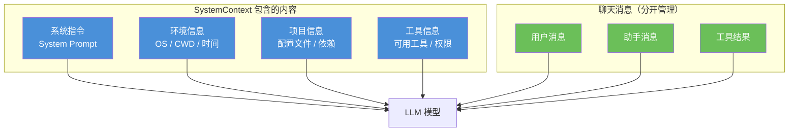
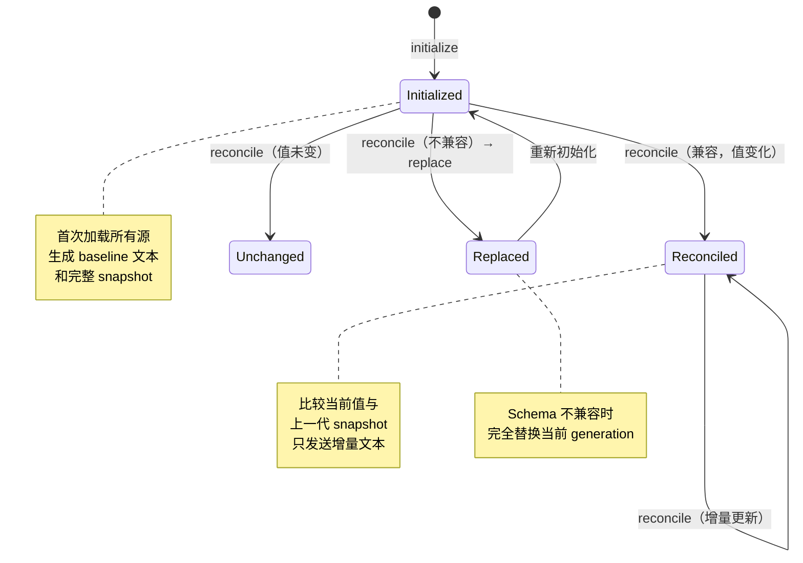
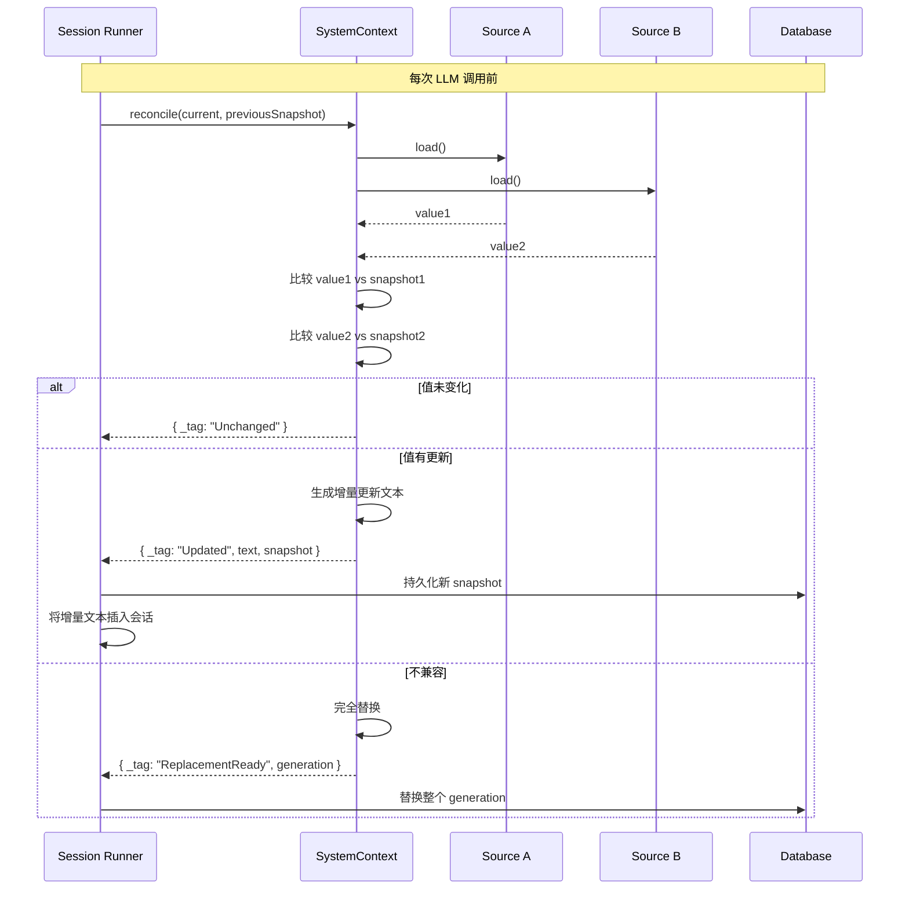
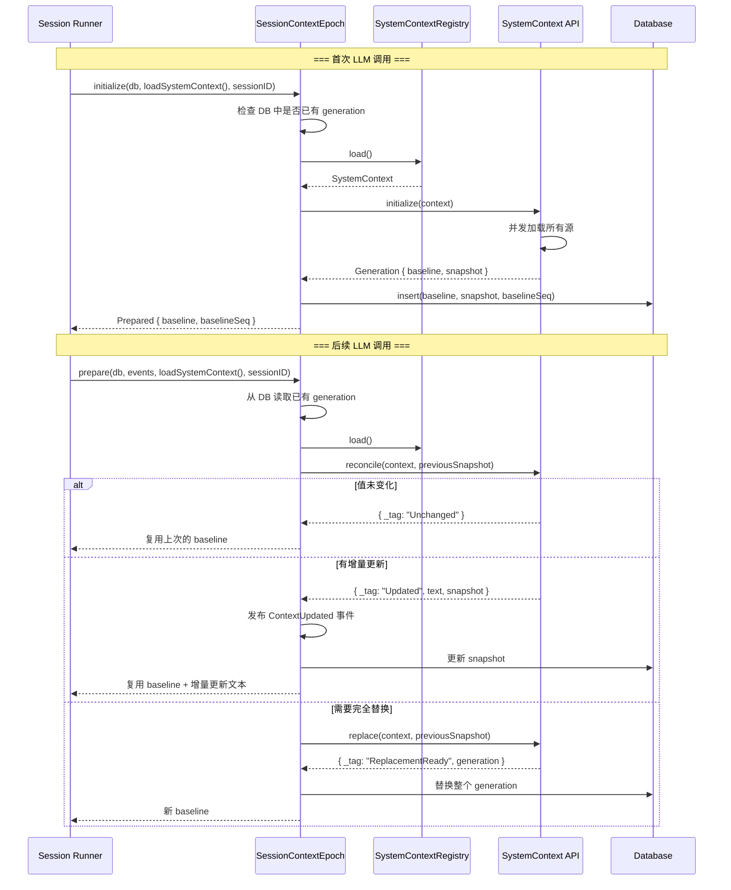

# 第 10 章：系统上下文

> **上一章**我们剖析了权限系统，理解了 allow/ask/deny 三级控制如何保护 Agent 的安全执行。本章将介绍系统上下文（SystemContext）——它是 LLM 推理的"世界观"，包含了环境信息、项目状态和指令，与聊天消息分开管理，支持增量更新。

## 10.1 SystemContext 设计哲学

系统上下文（SystemContext）是 Opencode 中**模型可读的上下文信息**，它与聊天消息分开管理。为什么要做这种分离？因为系统上下文具有独特的生命周期：

- **会话间共享**：系统上下文不依赖于特定会话，而是全局共享的
- **独立刷新**：每个上下文源可以独立刷新，无需重置整个会话
- **增量更新**：值变化时只需发送增量文本，而非重新发送全部内容
- **类型安全**：每个源都有独立的 Schema 定义，编译时即可验证



核心源码位于 `packages/core/src/system-context/` 目录下：

```
packages/core/src/system-context/
├── index.ts       # 核心类型和 API（Source, make, initialize, reconcile, replace）
├── registry.ts    # Registry 注册表（Service 层封装）
└── builtins.ts    # 内置源（环境信息、日期时间等）
```

## 10.2 Source 抽象

`Source<A>` 是 SystemContext 的核心抽象，它定义了一个**独立可刷新的类型化上下文源**。每个源都有自己的值类型、加载逻辑和渲染方式：

```typescript
// packages/core/src/system-context/index.ts
export interface Source<A> {
  readonly key: Key
  readonly codec: Schema.Codec<A, Schema.Json, never, never>
  readonly load: Effect.Effect<A | Unavailable>
  readonly baseline: (current: A) => string
  readonly update: (previous: A, current: A) => string
  readonly removed?: (previous: A) => string
}
```

每个字段的含义：

| 字段 | 类型 | 说明 |
|------|------|------|
| `key` | `Key` | 唯一标识，如 `"core/environment"`、`"core/date"` |
| `codec` | `Schema.Codec` | 序列化/反序列化编解码器，用于持久化 |
| `load` | `Effect<A \| Unavailable>` | 加载当前值，可能失败 |
| `baseline` | `(current: A) => string` | 首次纳入时的渲染文本 |
| `update` | `(prev, curr) => string` | 值变化时的增量渲染文本 |
| `removed` | `(prev) => string` (可选) | 源被移除时的清理文本 |

## 10.3 核心类型

### Key — 命名空间标识

Key 是每个上下文源的唯一标识，采用命名空间格式：

```typescript
// packages/core/src/system-context/index.ts
export const Key = Schema.String.check(
  Schema.isPattern(/^[a-z0-9][a-z0-9._-]*\/[a-z0-9][a-z0-9._/-]*$/)
).pipe(
  Schema.brand("SystemContext.Key"),
)
export type Key = typeof Key.Type
```

Key 的格式要求：
- 由两部分组成：`namespace/name`
- 命名空间部分：小写字母、数字、点、下划线、连字符
- 名称部分：小写字母、数字、点、下划线、连字符、斜杠
- 例如：`"core/environment"`、`"core/date"`、`"plugin/my-plugin/config"`

### Unavailable — 临时不可用标记

当加载上下文源失败时，返回 `unavailable` 标记：

```typescript
// packages/core/src/system-context/index.ts
export const unavailable = Symbol.for("@opencode/SystemContext.Unavailable")
export type Unavailable = typeof unavailable
```

`unavailable` 与从上下文中**移除**一个源有本质区别：
- **unavailable**：临时失败，保留已有的 snapshot，下次刷新时重试
- **移除**：源被永久删除，进入 replacement 流程

### Snapshot — 持久化快照

每个源的值被序列化为 `SourceSnapshot`，所有源的快照组合成 `Snapshot`：

```typescript
// packages/core/src/system-context/index.ts
export const SourceSnapshot = Schema.Struct({
  value: Schema.Json,                                    // 序列化的值
  removed: Schema.optional(Schema.NonEmptyString),       // 移除时的渲染文本（可选）
})
export type SourceSnapshot = typeof SourceSnapshot.Type

export const Snapshot = Schema.Record(Key, SourceSnapshot)
export type Snapshot = Readonly<Record<string, SourceSnapshot>>
```

## 10.4 make — 创建上下文源

`make` 函数是 SystemContext 的核心工厂，它将一个类型化的 `Source<A>` 闭合为不透明（opaque）的 `SystemContext`，隐藏了具体的值类型，使得不同值类型的源可以统一组合：

```typescript
// packages/core/src/system-context/index.ts
export function make<A>(source: Source<A>): SystemContext {
  const decode = Schema.decodeUnknownOption(source.codec)
  const encode = Schema.encodeSync(source.codec)
  const equivalent = Schema.toEquivalence(source.codec)
  return context([
    {
      key: source.key,
      load: source.load.pipe(
        Effect.map((value) => {
          if (isUnavailable(value)) return value
          const snapshot = (): SourceSnapshot => ({
            value: encode(value),
            ...(source.removed ? { removed: requireText(source.key, "removal", source.removed(value)) } : {}),
          })
          return {
            baseline: (): Rendered => ({
              text: requireText(source.key, "baseline", source.baseline(value)),
              snapshot: snapshot(),
            }),
            compare: (previous): Compared =>
              Option.match(decode(previous), {
                onNone: (): Compared => ({ _tag: "Incompatible" }),
                onSome: (decoded): Compared =>
                  equivalent(decoded, value)
                    ? { _tag: "Unchanged" }
                    : {
                        _tag: "Updated",
                        render: () => ({
                          text: requireText(source.key, "update", source.update(decoded, value)),
                          snapshot: snapshot(),
                        }),
                      },
              }),
          }
        }),
      ),
    },
  ])
}
```

`make` 做了三件关键的事情：

1. **编解码闭合**：通过 `Schema.toEquivalence` 获取值的等价性比较函数，通过 `encode`/`decode` 处理序列化
2. **快照构造**：每次加载时，构造一个 `snapshot` 函数，生成包含序列化值的快照
3. **比较逻辑**：生成 `compare` 函数，将当前值与上一代的 snapshot 值比较，返回三种结果之一

### 比较结果类型

```typescript
type Compared =
  | { readonly _tag: "Incompatible" }  // Schema 不兼容，需要完全替换
  | { readonly _tag: "Unchanged" }     // 值未变化
  | { readonly _tag: "Updated"         // 值已更新
    ; readonly render: () => Rendered }
```

### combine — 组合多个源

不同值类型的源通过 `combine` 组合在一起：

```typescript
// packages/core/src/system-context/index.ts
export function combine(values: ReadonlyArray<SystemContext>): SystemContext {
  const sources = values.flatMap((value) => value[ContextTypeId])
  assertUniqueKeys(sources)  // 检查重复 key
  return context(sources)
}
```

组合时自动检查重复 key，如果发现重复则抛出 `DuplicateKeyError`。

## 10.5 生命周期管理

SystemContext 的生命周期包含三个阶段：**初始化（initialize）→ 增量更新（reconcile）→ 完全替换（replace）**。



### initialize — 首次初始化

```typescript
// packages/core/src/system-context/index.ts
export function initialize(value: SystemContext): Effect.Effect<Generation, InitializationBlocked> {
  return observe(value).pipe(
    Effect.flatMap((entries) => {
      const unavailable = entries.flatMap(
        (entry) => entry._tag === "Unavailable" ? [entry.key] : []
      )
      if (unavailable.length > 0) return new InitializationBlocked({ keys: unavailable })
      return Effect.succeed(initializeObservation(entries))
    }),
  )
}
```

`initialize` 的流程：

1. **并发观察**：通过 `observe` 并发加载所有源（`concurrency: "unbounded"`）
2. **检查不可用**：如果有任何源返回 `unavailable`，抛出 `InitializationBlocked` 错误
3. **生成 Generation**：所有源成功加载后，生成包含 `baseline` 文本和 `snapshot` 的 `Generation`

```typescript
export interface Generation {
  readonly baseline: string    // 所有源的 baseline 文本拼接
  readonly snapshot: Snapshot  // 所有源的序列化快照
}
```

### reconcile — 增量更新

```typescript
// packages/core/src/system-context/index.ts
export function reconcile(
  value: SystemContext,
  previous: Snapshot,
): Effect.Effect<ReconcileResult> {
  return observe(value).pipe(
    Effect.map((entries): ReconcileResult => {
      const result = reconcileObservation(entries, previous)
      if (result._tag === "Unchanged" || result._tag === "Updated") return result
      return replaceObservation(entries, previous)
    }),
  )
}
```

`reconcile` 的逻辑：

1. 对每个源，将当前值与上一代 snapshot 中的值比较
2. 如果发现**不兼容**（Schema 变化），触发 `replaceObservation`
3. 如果值**未变化**，保留上一代的 snapshot
4. 如果值**已更新**，调用源的 `update` 生成增量文本
5. 如果某个源被**移除**且没有 `removed` 文本，触发 `replaceObservation`
6. 如果有任何更新，返回 `{ _tag: "Updated", text, snapshot }`；否则返回 `{ _tag: "Unchanged" }`



### replace — 完全替换

当 Schema 不兼容时，需要完全替换当前的 generation：

```typescript
// packages/core/src/system-context/index.ts
export function replace(
  value: SystemContext,
  previous: Snapshot,
): Effect.Effect<ReplacementResult> {
  return observe(value).pipe(
    Effect.map((entries) => replaceObservation(entries, previous)),
  )
}

function replaceObservation(
  entries: ReadonlyArray<Entry>,
  previous: Snapshot,
): ReplacementResult {
  if (entries.some(
    (entry) => entry._tag === "Unavailable" && getSnapshot(previous, entry.key) !== undefined,
  )) return { _tag: "ReplacementBlocked" }
  return { _tag: "ReplacementReady", generation: initializeObservation(entries) }
}
```

替换的策略：
- 如果当前有源不可用，但上一代 snapshot 中存在该源，则阻塞替换（`ReplacementBlocked`）
- 否则，执行完整的重新初始化，生成全新的 `Generation`

## 10.6 Registry 注册表

Registry 是 SystemContext 的 Service 层封装，提供注册和加载的标准化接口：

```typescript
// packages/core/src/system-context/registry.ts
export interface Interface {
  readonly register: (entry: Entry) => Effect.Effect<void, never, Scope.Scope>
  readonly load: () => Effect.Effect<SystemContext.SystemContext>
}

export interface Entry {
  readonly key: SystemContext.Key
  readonly load: Effect.Effect<SystemContext.SystemContext>
}
```

Registry 的核心实现：

```typescript
// packages/core/src/system-context/registry.ts
const layer = Layer.effect(
  Service,
  Effect.gen(function* () {
    const entries = yield* Ref.make<ReadonlyArray<Entry>>([])

    return Service.of({
      register: Effect.fn("SystemContextRegistry.register")(function* (entry) {
        yield* Effect.acquireRelease(
          Ref.modify(entries, (current) => {
            if (current.some((item) => item.key === entry.key)) return [false, current]
            return [true, [...current, entry]]
          }).pipe(
            Effect.flatMap((added) =>
              added ? Effect.void : Effect.die(`Duplicate system context entry key: ${entry.key}`),
            ),
            Effect.as(entry),
          ),
          (entry) => Ref.update(entries, (current) => current.filter((item) => item !== entry)),
        )
      }),
      load: Effect.fn("SystemContextRegistry.load")(function* () {
        const current = (yield* Ref.get(entries)).toSorted(
          (a, b) => (a.key < b.key ? -1 : a.key > b.key ? 1 : 0),
        )
        return SystemContext.combine(
          yield* Effect.forEach(current, (entry) => entry.load, { concurrency: "unbounded" }),
        )
      }),
    })
  }),
)
```

Registry 的设计要点：

| 特性 | 说明 |
|------|------|
| **防止重复 key** | 注册时检查 key 是否已存在 |
| **Scope 自动清理** | 使用 `Effect.acquireRelease`，在 Scope 结束时自动注销 |
| **按 key 排序** | 加载时按 key 排序，确保每次生成的顺序一致 |
| **并发加载** | 所有源并行加载，提高效率 |

## 10.7 内置源

Opencode 提供了两个内置源，通过 `SystemContextBuiltIns.node` 注册：

```typescript
// packages/core/src/system-context/builtins.ts
const builtIns = Layer.effectDiscard(
  Effect.gen(function* () {
    const location = yield* Location.Service
    const registry = yield* SystemContextRegistry.Service

    const environment = [
      "<env>",
      `  Working directory: ${location.directory}`,
      `  Workspace root folder: ${location.project.directory}`,
      `  Is directory a git repo: ${location.vcs?.type === "git" ? "yes" : "no"}`,
      `  Platform: ${process.platform}`,
      "</env>",
    ].join("\n")

    const context = SystemContext.combine([
      SystemContext.make({
        key: SystemContext.Key.make("core/environment"),
        codec: Schema.toCodecJson(Schema.String),
        load: Effect.succeed(environment),
        baseline: (environment) =>
          ["Here is some useful information about the environment you are running in:", environment].join("\n"),
        update: (_previous, environment) =>
          ["The environment you are running in is now:", environment].join("\n"),
      }),
      SystemContext.make({
        key: SystemContext.Key.make("core/date"),
        codec: Schema.toCodecJson(Schema.String),
        load: DateTime.nowAsDate.pipe(Effect.map((date) => date.toDateString())),
        baseline: (date) => `Today's date: ${date}`,
        update: (_previous, date) => `Today's date is now: ${date}`,
      }),
    ])

    yield* registry.register({
      key: SystemContext.Key.make("core/builtins"),
      load: Effect.succeed(context),
    })
  }),
)
```

### core/environment 源

环境源提供当前工作目录和平台信息，baseline 渲染效果：

```
Here is some useful information about the environment you are running in:
<env>
  Working directory: /Users/jiayouzhang/code/my-project
  Workspace root folder: /Users/jiayouzhang/code/my-project
  Is directory a git repo: yes
  Platform: darwin
</env>
```

当用户切换工作区时，update 渲染：

```
The environment you are running in is now:
<env>
  Working directory: /Users/jiayouzhang/code/another-project
  ...
</env>
```

### core/date 源

日期源提供当前日期，baseline 渲染效果：

```
Today's date: Sat Aug 08 2026
```

随着时间推移，update 渲染：

```
Today's date is now: Sun Aug 09 2026
```

## 10.8 在 Session Runner 中的使用

### SessionContextEpoch

SystemContext 与 Session Runner 的集成通过 `SessionContextEpoch` 模块完成，位于 `packages/core/src/session/context-epoch.ts`：

```typescript
// packages/core/src/session/context-epoch.ts
export function initialize(
  db: DatabaseService,
  context: Effect.Effect<SystemContext.SystemContext>,
  sessionID: SessionSchema.ID,
): Effect.Effect<Prepared | undefined, SystemContext.InitializationBlocked> {
  return initializeOnce(db, context, sessionID)
}

export function prepare(
  db: DatabaseService,
  events: EventV2.Interface,
  context: Effect.Effect<SystemContext.SystemContext>,
  sessionID: SessionSchema.ID,
): Effect.Effect<Prepared, SystemContext.InitializationBlocked | ContextSnapshotDecodeError> {
  return prepareOnce(db, events, context, sessionID)
}
```

### 首次调用 vs 后续调用



### prepareOnce 的完整逻辑

```typescript
// packages/core/src/session/context-epoch.ts
const prepareOnce = Effect.fnUntraced(function* (
  db, events, context, sessionID,
) {
  // 1. 并发加载：获取当前上下文、DB 中存储的 generation、最新压缩事件
  const [value, stored, compaction] = yield* Effect.all(
    [context, find(db, sessionID), SessionHistory.latestCompaction(db, sessionID)],
    { concurrency: "unbounded" },
  )

  // 2. 如果没有存储的 generation，执行首次初始化
  if (!stored) {
    const generation = yield* SystemContext.initialize(value)
    const baselineSeq = yield* insert(db, sessionID, generation)
    return { baseline: generation.baseline, baselineSeq }
  }

  // 3. 解码存储的 snapshot
  const snapshot = yield* Schema.decodeUnknownEffect(
    SystemContext.Snapshot,
  )(stored.snapshot).pipe(
    Effect.mapError((error) => new ContextSnapshotDecodeError({ sessionID, details: String(error) })),
  )

  // 4. 检查是否发生了压缩，决定使用 reconcile 还是 replace
  const replacementSeq =
    compaction !== undefined && compaction.seq > stored.baseline_seq
      ? compaction.seq
      : undefined

  const result = replacementSeq
    ? yield* SystemContext.replace(value, snapshot)
    : yield* SystemContext.reconcile(value, snapshot)

  // 5. 根据结果决定后续操作
  if (result._tag === "Unchanged" || result._tag === "ReplacementBlocked") {
    return { baseline: stored.baseline, baselineSeq: stored.baseline_seq }
  }
  if (result._tag === "ReplacementReady") {
    const baselineSeq = replacementSeq ?? (yield* EventV2.latestSequence(db, sessionID))
    yield* replace(db, sessionID, baselineSeq, result.generation)
    return { baseline: result.generation.baseline, baselineSeq }
  }
  // 6. Updated：发布 ContextUpdated 事件 + 更新 snapshot
  yield* events.publish(SessionEvent.ContextUpdated, { ... }, {
    commit: () => advance(db, sessionID, result.snapshot).pipe(Effect.orDie),
  })
  return { baseline: stored.baseline, baselineSeq: stored.baseline_seq }
})
```

### 在 Session Runner 中的调用链

在 `runTurn`（单轮 LLM 调用）中，SystemContext 的初始化发生在最开始：

```typescript
// packages/core/src/session/runner/llm.ts
const runTurnAttempt = Effect.fn("SessionRunner.runTurn")(function* (
  sessionID, promotion, step, recoverOverflow?
) {
  // 1. 加载 Session
  const session = yield* getSession(sessionID)

  // 2. 选择 Agent
  const agent = yield* agents.select(session.agent)

  // 3. 初始化 System Context
  const initialized = yield* SessionContextEpoch.initialize(
    db, loadSystemContext(agent), session.id,
  )

  // ...

  // 后续调用使用 prepare
  const system = initialized ?? (yield* SessionContextEpoch.prepare(...))

  // 构建 LLM 请求时传入 system prompt
  const request = LLM.request({
    model,
    system: [agent.info?.system, system.baseline].map(SystemPart.make),
    // ...
  })
})
```

`loadSystemContext` 函数负责从 Registry 中加载所有已注册的源，并合并 Agent 的 skill guidance 和 reference guidance：

```typescript
// 大致流程
const loadSystemContext = (agent) =>
  Effect.gen(function* () {
    const registry = yield* SystemContextRegistry.Service
    const base = yield* registry.load()  // 加载所有注册的源

    // 合并 skill guidance 和 reference guidance
    return SystemContext.combine([
      base,
      ...(agent.skills?.map((skill) => skill.systemContext) ?? []),
      ...(agent.references?.map((ref) => ref.systemContext) ?? []),
    ])
  })
```

## 10.9 小结

本章深入介绍了 Opencode 的 SystemContext 系统：

- **设计哲学**：系统上下文是模型可读的上下文信息，与聊天消息分开管理，具有独立刷新和增量更新的能力
- **Source 抽象**：每个源是一个独立可刷新的类型化上下文单元，通过 `key`、`codec`、`load`、`baseline`、`update`、`removed` 定义
- **make 核心实现**：将类型化的 `Source<A>` 闭合为不透明的 `SystemContext`，通过 Schema 编解码和等价性比较实现类型安全
- **生命周期管理**：`initialize`（首次初始化）→ `reconcile`（增量更新）→ `replace`（完全替换）的三阶段生命周期
- **Registry 注册表**：Service 层封装，提供注册（带 Scope 自动清理）和加载（按 key 排序、并发执行）的标准化接口
- **内置源**：`core/environment`（工作目录、平台信息）和 `core/date`（当前日期）
- **Session Runner 集成**：通过 `SessionContextEpoch` 模块，在每次 LLM 调用前加载或刷新系统上下文，支持增量更新和压缩后的完全替换

SystemContext 的设计使得 Opencode 能够在多轮对话中高效地管理模型上下文，避免重复发送不变的信息，同时在环境变化时及时通知模型，从而在 token 效率和上下文准确性之间取得最佳平衡。

下一章将深入讲解 MCP 集成，看看 Opencode 如何通过 Model Context Protocol 连接外部工具和服务。