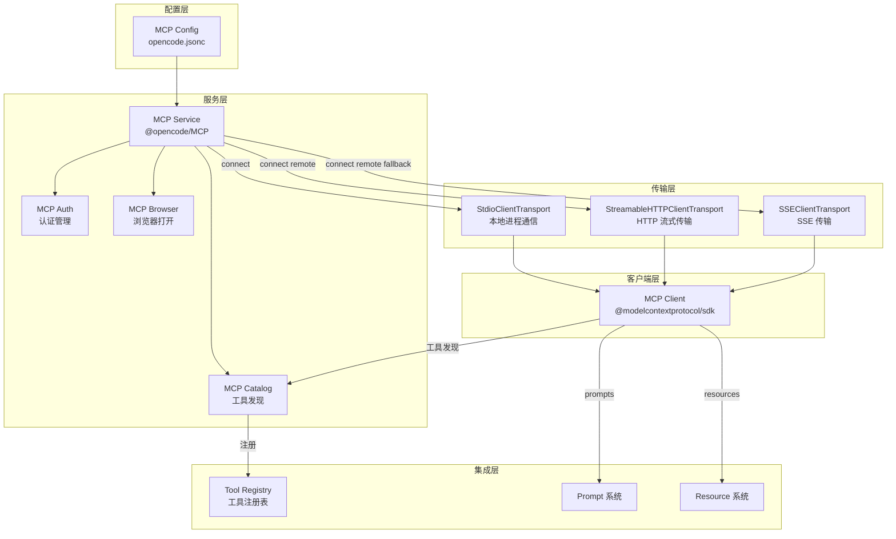
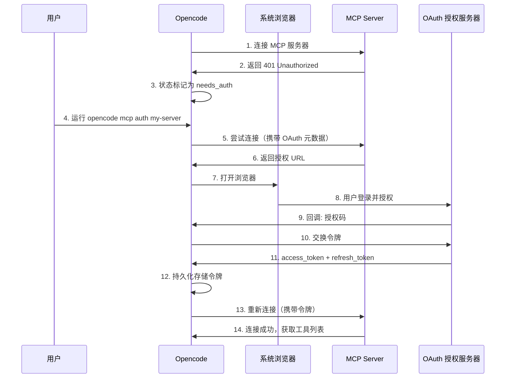

# 第 11 章：MCP 集成

> **上一章**我们学习了系统上下文如何通过 Source 抽象和增量更新高效管理 LLM 的推理上下文。本章将介绍 MCP（Model Context Protocol）集成——它是 Opencode 连接外部工具和服务的标准化通道，让 Agent 的能力不再局限于内置工具。

## 11.1 MCP 概述

MCP（Model Context Protocol）是一个开放标准协议，由 Anthropic 提出，旨在为 LLM 应用提供标准化的工具和数据源交互接口。你可以把 MCP 想象成"AI 应用的 USB-C 接口"——它定义了一套统一的协议，让任何 LLM 应用都能通过标准方式连接外部工具、数据源和服务。

在 Opencode 中，MCP 集成是工具系统的核心扩展机制。通过 MCP，Opencode 可以：

- 连接本地 MCP 服务器（如数据库查询器、文件系统工具）
- 连接远程 MCP 服务器（通过 HTTP/SSE 协议）
- 自动发现并注册工具到 Tool Registry
- 支持完整的 OAuth 认证流程
- 动态管理 MCP 服务器生命周期

## 11.2 MCP 集成架构

Opencode 的 MCP 集成架构遵循分层设计，从配置到底层传输协议，再到工具注册，层层递进：



### 核心组件

| 组件 | 文件 | 职责 |
|------|------|------|
| `MCP Service` | `mcp/index.ts` | 核心服务，管理 MCP 客户端生命周期 |
| `McpAuth` | `mcp/auth.ts` | OAuth 令牌持久化存储和管理 |
| `McpOAuthProvider` | `mcp/oauth-provider.ts` | OAuth 认证流程实现 |
| `McpCatalog` | `mcp/catalog.ts` | 工具发现、转换和分页查询 |
| `McpBrowser` | `mcp/browser.ts` | 打开浏览器进行 OAuth 授权 |

## 11.3 MCP 配置格式

MCP 服务器通过 `opencode.jsonc` 配置文件定义。支持两种类型的 MCP 服务器：本地（stdio）和远程（remote）：

```typescript
// packages/opencode/src/mcp/index.ts
// 配置文件中的 MCP 配置项
{
  "mcp": {
    // 本地 MCP 服务器——通过子进程启动
    "my-local-server": {
      "type": "local",
      "command": ["node", "server.js"],      // 启动命令
      "cwd": "./mcp-servers",                 // 工作目录（可选）
      "environment": {                         // 环境变量（可选）
        "API_KEY": "xxx"
      },
      "timeout": 30000,                       // 超时时间（可选）
      "enabled": true                         // 是否启用（可选）
    },

    // 远程 MCP 服务器——通过 HTTP 连接
    "my-remote-server": {
      "type": "remote",
      "url": "https://mcp.example.com",
      "headers": {                            // HTTP 请求头（可选）
        "Authorization": "Bearer token"
      },
      "timeout": 30000,
      "enabled": true,
      "oauth": {                              // OAuth 配置（可选）
        "clientId": "xxx",
        "clientSecret": "xxx",
        "scope": "read write",
        "callbackPort": 19876
      }
    },

    // 禁用某个 MCP 服务器
    "disabled-server": {
      "type": "local",
      "command": ["node", "server.js"],
      "enabled": false
    }
  }
}
```

## 11.4 MCP 客户端创建

Opencode 在连接每个 MCP 服务器时，会创建一个 MCP SDK 客户端实例。客户端创建时声明了 Opencode 支持的能力集：

```typescript
// packages/opencode/src/mcp/index.ts
const DEFAULT_TIMEOUT = 30_000
const CLIENT_OPTIONS = {
  capabilities: {
    roots: {},        // 支持文件根目录能力
    // sampling: {},  // 采样能力（预留）
    // elicitation: {}, // 启发能力（预留）
    // tasks: {},     // 任务能力（预留）
  },
}

function createClient(directory: string) {
  const client = new Client(
    { name: "opencode", version: InstallationVersion },
    CLIENT_OPTIONS,
  )
  // 设置 ListRoots 请求处理器，告知 MCP 服务器当前工作目录
  client.setRequestHandler(ListRootsRequestSchema, () =>
    Promise.resolve({ roots: [{ uri: pathToFileURL(directory).href }] }),
  )
  return client
}
```

这里有几个值得注意的设计点：

- `roots` 能力告诉 MCP 服务器 Opencode 的工作目录，这样 MCP 服务器就能知道文件操作的上下文
- 其他能力（如 `sampling`、`tasks`）虽然 MCP 协议支持，但 Opencode 目前尚未实现，源码中通过注释关联了对应的 GitHub Issue
- `setRequestHandler(ListRootsRequestSchema, ...)` 注册了一个请求处理器，当 MCP 服务器查询根目录时，Opencode 返回当前工作目录的 `file://` URL

## 11.5 三种传输协议

MCP 协议支持多种传输方式，Opencode 实现了全部三种：

### 11.5.1 StdioClientTransport（本地进程通信）

用于连接本地 MCP 服务器。Opencode 启动一个子进程，通过标准输入/输出与 MCP 服务器通信：

```typescript
// packages/opencode/src/mcp/index.ts
const connectLocal = Effect.fn("MCP.connectLocal")(function* (
  key: string,
  mcp: ConfigMCPV1.Info & { type: "local" },
) {
  const [cmd, ...args] = mcp.command
  const baseDir = yield* InstanceState.directory
  const cwd = mcp.cwd ? path.resolve(baseDir, mcp.cwd) : baseDir
  const transport = new StdioClientTransport({
    stderr: "pipe",           // 将 stderr 通过管道捕获
    command: cmd,             // 可执行文件路径
    args,                     // 命令行参数
    cwd,                      // 工作目录
    env: {                    // 环境变量（合并进程环境 + 自定义环境变量）
      ...process.env,
      ...(cmd === "opencode" ? { BUN_BE_BUN: "1" } : {}),
      ...mcp.environment,
    },
  })

  const connectTimeout = mcp.timeout ?? DEFAULT_TIMEOUT
  return yield* connectTransport(transport, connectTimeout).pipe(
    Effect.map((client) => ({
      client,
      status: { status: "connected" },
    })),
    Effect.catch((error) => {
      const msg = error instanceof Error ? error.message : String(error)
      return Effect.succeed({
        client: undefined,
        status: { status: "failed", error: msg },
      })
    }),
  )
})
```

一个有趣的细节：当 MCP 命令是 `opencode` 自身时，Opencode 会设置 `BUN_BE_BUN: "1"` 环境变量。这是为了在同一进程中运行 Opencode 作为 MCP 服务器时的特殊处理。

### 11.5.2 StreamableHTTPClientTransport（HTTP 流式传输）

用于连接远程 MCP 服务器，支持 HTTP 流式响应。这是 Opencode 连接远程 MCP 时的首选传输方式：

```typescript
// packages/opencode/src/mcp/index.ts
const transports = [
  {
    name: "StreamableHTTP",
    transport: new StreamableHTTPClientTransport(url, {
      authProvider,                                    // OAuth 认证提供者
      requestInit: mcp.headers ? { headers: mcp.headers } : undefined,
    }),
  },
  // ...
]
```

### 11.5.3 SSEClientTransport（SSE 传输）

Server-Sent Events 传输，作为 StreamableHTTP 的备选方案。如果 MCP 服务器不支持 StreamableHTTP，Opencode 会自动降级尝试 SSE：

```typescript
// packages/opencode/src/mcp/index.ts
const transports = [
  {
    name: "StreamableHTTP",
    transport: new StreamableHTTPClientTransport(url, { authProvider, requestInit }),
  },
  {
    name: "SSE",
    transport: new SSEClientTransport(url, { authProvider, requestInit }),
  },
]

// 先尝试 StreamableHTTP，失败后尝试 SSE
for (const { name, transport } of transports) {
  const result = yield* connectTransport(transport, connectTimeout).pipe(
    Effect.map((client) => ({ client, transportName: name })),
    Effect.catch((error) => {
      // 处理错误...
    }),
  )
  if (result) return { client: result.client, status: { status: "connected" } }
  // 如果是认证错误，停止尝试其他传输
  if (lastStatus?.status === "needs_auth" || lastStatus?.status === "needs_client_registration") break
}
```

### 11.5.4 连接传输的通用函数

无论哪种传输方式，最终都通过 `connectTransport` 函数完成连接。这个函数使用 Effect-TS 的 `acquireUseRelease` 模式确保资源安全：

```typescript
// packages/opencode/src/mcp/index.ts
const connectTransport = Effect.fn("MCP.connectTransport")(function* (
  transport: Transport,
  timeout: number,
) {
  const directory = yield* InstanceState.directory
  return yield* Effect.acquireUseRelease(
    Effect.succeed(transport),
    (t) =>
      Effect.tryPromise({
        try: () => {
          const client = createClient(directory)
          return withTimeout(client.connect(t), timeout).then(() => client)
        },
        catch: (e) => (e instanceof Error ? e : new Error(String(e))),
      }),
    (t, exit) =>
      Exit.isFailure(exit)
        ? Effect.tryPromise(() => t.close()).pipe(Effect.ignore)
        : Effect.void,
  )
})
```

这个函数的语义是：
1. **acquire**：获取传输对象
2. **use**：创建客户端并连接，如果失败则自动关闭传输
3. **release**：如果连接成功，调用者拥有客户端；如果连接失败，自动清理传输资源

`withTimeout` 确保连接不会无限期阻塞，默认超时时间为 30 秒。

## 11.6 MCP 状态管理

每个 MCP 服务器都有一个状态，Opencode 通过联合类型（Union Schema）精确描述所有可能的状态：

```typescript
// packages/opencode/src/mcp/index.ts
const StatusConnected = Schema.Struct({ status: Schema.Literal("connected") })
const StatusDisabled = Schema.Struct({ status: Schema.Literal("disabled") })
const StatusFailed = Schema.Struct({ status: Schema.Literal("failed"), error: Schema.String })
const StatusNeedsAuth = Schema.Struct({ status: Schema.Literal("needs_auth") })
const StatusNeedsClientRegistration = Schema.Struct({
  status: Schema.Literal("needs_client_registration"),
  error: Schema.String,
})

export const Status = Schema.Union([
  StatusConnected,
  StatusDisabled,
  StatusFailed,
  StatusNeedsAuth,
  StatusNeedsClientRegistration,
]).annotate({ identifier: "MCPStatus", discriminator: "status" })
```

| 状态 | 含义 |
|------|------|
| `connected` | 已成功连接，工具可用 |
| `disabled` | 配置中 `enabled: false`，跳过连接 |
| `failed` | 连接失败，包含错误信息 |
| `needs_auth` | 需要用户完成 OAuth 认证 |
| `needs_client_registration` | 服务器需要预注册的 clientId，不支持动态注册 |

状态通过 `status` 字段作为鉴别器（discriminator），这使得 Opencode 可以在不解码整个 Schema 的情况下，快速判断 MCP 服务器的状态类型。

## 11.7 MCP Service 接口

MCP 系统通过 `Service` 模式对外暴露统一接口，所有方法都返回 `Effect`，确保纯函数式错误处理和资源管理：

```typescript
// packages/opencode/src/mcp/index.ts
export interface Interface {
  // 状态查询
  readonly status: () => Effect.Effect<Record<string, Status>>
  readonly clients: () => Effect.Effect<Record<string, MCPClient>>
  readonly instructions: () => Effect.Effect<ServerInstructions[]>

  // 工具和资源
  readonly tools: () => Effect.Effect<Record<string, McpTool>>
  readonly prompts: () => Effect.Effect<Record<string, PromptInfo & { client: string }>>
  readonly resources: (clientName?: string) => Effect.Effect<Record<string, ResourceInfo & { client: string }>>
  readonly resourceTemplates: (clientName?: string) => Effect.Effect<Record<string, ResourceTemplateInfo & { client: string }>>

  // 生命周期管理
  readonly add: (name: string, mcp: ConfigMCPV1.Info) => Effect.Effect<{ status: Record<string, Status> | Status }>
  readonly connect: (name: string) => Effect.Effect<void, NotFoundError>
  readonly disconnect: (name: string) => Effect.Effect<void, NotFoundError>

  // Prompt 和 Resource 操作
  readonly getPrompt: (clientName: string, name: string, args?: Record<string, string>) => Effect.Effect<...>
  readonly readResource: (clientName: string, resourceUri: string) => Effect.Effect<...>

  // OAuth 认证
  readonly startAuth: (mcpName: string) => Effect.Effect<{ authorizationUrl: string; oauthState: string }, NotFoundError>
  readonly authenticate: (mcpName: string, onAuthorization?: (url: string) => void) => Effect.Effect<Status, NotFoundError>
  readonly finishAuth: (mcpName: string, authorizationCode: string) => Effect.Effect<Status, NotFoundError>
  readonly removeAuth: (mcpName: string) => Effect.Effect<void>

  // OAuth 状态查询
  readonly supportsOAuth: (mcpName: string) => Effect.Effect<boolean, NotFoundError>
  readonly hasStoredTokens: (mcpName: string) => Effect.Effect<boolean>
  readonly getAuthStatus: (mcpName: string) => Effect.Effect<AuthStatus>
}

export class Service extends Context.Service<Service, Interface>()("@opencode/MCP") {}
```

接口设计上可以观察到几个模式：

- **分层职责**：状态查询、生命周期管理、OAuth 认证三个层次清晰分离
- **类型安全**：所有方法都有精确的 Effect 类型签名，包括错误类型
- **统一资源访问**：prompts、resources、tools 都返回以 client 名为 key 的记录

## 11.8 内部状态管理

MCP 服务内部维护一个 `State` 结构，记录了所有 MCP 服务器的运行时信息：

```typescript
// packages/opencode/src/mcp/index.ts
interface State {
  config: Record<string, ConfigMCPV1.Info>    // 运行时配置（动态添加的 MCP）
  status: Record<string, Status>              // 每个服务器的当前状态
  clients: Record<string, MCPClient>          // 活跃的 MCP 客户端实例
  defs: Record<string, MCPToolDef[]>          // 缓存的工具定义
  instructions: Record<string, string>         // 服务器指令
}
```

这个状态通过 `InstanceState.make` 创建，它会在配置变更时自动重建。状态初始化时会遍历配置中的所有 MCP 服务器，并行创建连接：

```typescript
// packages/opencode/src/mcp/index.ts
const state = yield* InstanceState.make<State>(
  Effect.fn("MCP.state")(function* () {
    const cfg = yield* cfgSvc.get()
    const bridge = yield* EffectBridge.make()
    const config = cfg.mcp ?? {}
    const s: State = { config: {}, status: {}, clients: {}, defs: {}, instructions: {} }

    // 并行连接所有 MCP 服务器
    yield* Effect.forEach(
      Object.entries(config),
      ([key, mcp]) =>
        Effect.gen(function* () {
          if (!isMcpConfigured(mcp)) return
          if (mcp.enabled === false) {
            s.status[key] = { status: "disabled" }
            return
          }
          const result = yield* create(key, mcp)
          s.status[key] = result.status
          if (result.mcpClient) {
            s.clients[key] = result.mcpClient
            s.defs[key] = result.defs!
            if (result.instructions) s.instructions[key] = result.instructions
            watch(s, key, result.mcpClient, bridge, mcp.timeout)
          }
        }),
      { concurrency: "unbounded" },  // 无限制并发
    )

    // 注册清理函数
    yield* Effect.addFinalizer(() =>
      Effect.gen(function* () {
        // 关闭所有客户端，清理子进程
        for (const [name, client] of Object.entries(s.clients)) {
          if (client.transport instanceof StdioClientTransport) {
            const pid = client.transport.pid
            // 杀死所有子进程
            const pids = yield* descendants(pid)
            for (const dpid of pids) process.kill(dpid, "SIGTERM")
          }
          yield* Effect.tryPromise(() => client.close()).pipe(Effect.ignore)
        }
      }),
    )

    return s
  }),
)
```

`concurrency: "unbounded"` 意味着所有 MCP 服务器会并行连接，这在大规模 MCP 配置时能显著提升启动速度。`addFinalizer` 注册了实例销毁时的清理逻辑，确保子进程被正确终止。

## 11.9 连接生命周期与 Watch 机制

每个 MCP 客户端连接后，Opencode 会注册多个事件监听器，实现自动状态管理和工具热更新：

```typescript
// packages/opencode/src/mcp/index.ts
function watch(s: State, name: string, client: MCPClient, bridge: EffectBridge.Shape, timeout?: number) {
  // 1. 连接关闭处理
  client.onclose = () => {
    if (s.clients[name] !== client) return
    delete s.clients[name]
    delete s.defs[name]
    delete s.instructions[name]
    s.status[name] = { status: "failed", error: "Connection closed" }
    bridge.fork(
      Effect.logWarning("MCP connection closed", { server: name }).pipe(
        Effect.andThen(events.publish(ToolsChanged, { server: name })),
        Effect.ignore,
      ),
    )
  }

  // 2. 日志消息处理
  client.setNotificationHandler(LoggingMessageNotificationSchema, (notification) =>
    bridge.promise(serverLog(name, notification.params)),
  )

  // 3. 工具列表变更通知
  if (!client.getServerCapabilities()?.tools) return
  client.setNotificationHandler(ToolListChangedNotificationSchema, async () => {
    if (s.clients[name] !== client || s.status[name]?.status !== "connected") return

    // 重新获取工具列表
    const listed = await bridge.promise(McpCatalog.defs(client, timeout))
    if (!listed) return
    if (s.clients[name] !== client || s.status[name]?.status !== "connected") return

    s.defs[name] = listed
    // 发布工具变更事件，通知 Tool Registry 更新
    await bridge.promise(events.publish(ToolsChanged, { server: name }).pipe(Effect.ignore))
  })
}
```

这里的 `EffectBridge` 是一个关键组件——它允许在 SDK 的回调（非 Effect 上下文）中安全地执行 Effect 操作。

### 日志级别映射

MCP 服务器的日志消息被映射到 Opencode 的日志系统：

```typescript
function serverLog(name: string, params: LoggingMessageNotification["params"]) {
  const fields = { server: name, logger: params.logger, level: params.level, data: params.data }
  switch (params.level) {
    case "debug":
      return Effect.logDebug("MCP server log", fields)
    case "info":
    case "notice":
      return Effect.logInfo("MCP server log", fields)
    case "warning":
      return Effect.logWarning("MCP server log", fields)
    case "error":
    case "critical":
    case "alert":
    case "emergency":
      return Effect.logError("MCP server log", fields)
  }
}
```

## 11.10 MCP 工具发现与注册

### 11.10.1 工具发现

连接成功后，Opencode 通过 `McpCatalog.defs` 获取 MCP 服务器的工具列表，支持分页查询：

```typescript
// packages/opencode/src/mcp/catalog.ts
const MAX_LIST_PAGES = 1_000

export async function paginate<T, R extends { nextCursor?: string }>(
  list: (cursor?: string) => Promise<R>,
  items: (result: R) => T[],
) {
  const result: T[] = []
  const cursors = new Set<string>()
  let cursor: string | undefined

  for (let page = 0; page < MAX_LIST_PAGES; page++) {
    const page = await list(cursor)
    result.push(...items(page))
    if (page.nextCursor === undefined) return result
    if (cursors.has(page.nextCursor))
      throw new Error(`MCP list returned duplicate cursor: ${page.nextCursor}`)
    cursors.add(page.nextCursor)
    cursor = page.nextCursor
  }

  throw new Error(`MCP list exceeded ${MAX_LIST_PAGES} pages`)
}
```

分页查询包含防循环保护：检测到重复的 cursor 或超过最大页数时会抛出错误。

### 11.10.2 工具转换

MCP 的工具定义通过 `convertTool` 转换为 Opencode 内部使用的 `Tool` 类型：

```typescript
// packages/opencode/src/mcp/catalog.ts
export function convertTool(mcpTool: MCPToolDef, client: Client, timeout?: number): Tool {
  const inputSchema: JSONSchema7 = {
    ...(mcpTool.inputSchema as JSONSchema7),
    type: "object",
    properties: (mcpTool.inputSchema.properties ?? {}) as JSONSchema7["properties"],
    additionalProperties: false,
  }

  return dynamicTool({
    description: mcpTool.description ?? "",
    inputSchema: jsonSchema(inputSchema),
    execute: async (args: unknown, options) => {
      const result = await client.callTool(
        {
          name: mcpTool.name,
          arguments: (args || {}) as Record<string, unknown>,
        },
        CallToolResultSchema,
        {
          resetTimeoutOnProgress: true,
          signal: options.abortSignal,
          timeout,
          onprogress: () => {},  // 启用超时重置
        },
      )
      if (result.isError)
        throw new Error(
          result.content
            .flatMap((item) => (item.type === "text" ? [item.text] : []))
            .filter((text) => text.trim())
            .join("\n\n") || "MCP tool returned an error",
        )
      // 处理结构化输出
      if (result.content.length > 0 || result.structuredContent === undefined || result.structuredContent === null)
        return result
      return {
        ...result,
        content: [{ type: "text", text: JSON.stringify(result.structuredContent) }],
      }
    },
  })
}
```

### 11.10.3 工具名称生成

MCP 工具的名称使用 `clientName_toolName` 格式，确保全局唯一：

```typescript
// packages/opencode/src/mcp/catalog.ts
export const sanitize = (value: string) => value.replace(/[^a-zA-Z0-9_-]/g, "_")

export const toolName = (clientName: string, name: string) =>
  sanitize(clientName) + "_" + sanitize(name)
```

例如，`my-db-server` 上的 `query` 工具会变成 `my_db_server_query`。

### 11.10.4 工具注册到 Tool Registry

MCP 工具通过 `MCP.tools()` 接口暴露，最终注册到核心 Tool Registry，与内置工具统一管理：

```typescript
// packages/opencode/src/mcp/index.ts
const tools = Effect.fn("MCP.tools")(function* () {
  const result: Record<string, McpTool> = {}
  const s = yield* InstanceState.get(state)
  const cfg = yield* cfgSvc.get()
  const config = cfg.mcp ?? {}
  const defaultTimeout = cfg.experimental?.mcp_timeout

  for (const [clientName, client] of Object.entries(s.clients)) {
    if (s.status[clientName]?.status !== "connected") continue
    const mcpConfig = config[clientName]
    const listed = s.defs[clientName]
    if (!listed) {
      yield* Effect.logWarning("missing cached tools for connected server", { clientName })
      continue
    }
    const timeout = requestTimeout(s, clientName, mcpConfig, defaultTimeout)
    for (const def of listed) {
      result[McpCatalog.toolName(clientName, def.name)] = { def, client, timeout }
    }
  }
  return result
})
```

### 11.10.5 输出 Schema 兼容性处理

MCP 协议中工具定义包含 `outputSchema`，但某些服务器可能返回不合规的 Schema 引用。Opencode 通过 `TolerantListToolsResultSchema` 优雅降级：

```typescript
// packages/opencode/src/mcp/catalog.ts
const TolerantListToolsResultSchema = ListToolsResultSchema.extend({
  tools: ToolSchema.omit({ outputSchema: true }).array(),
})

function listTools(client: Client, timeout: number) {
  return Effect.tryPromise({
    try: () =>
      paginate(
        async (cursor) => {
          const params = cursor === undefined ? undefined : { cursor }
          try {
            return await client.listTools(params, { timeout })
          } catch (error) {
            if (!(error instanceof Error) || !isOutputSchemaValidationError(error)) throw error
            // 降级：忽略 outputSchema
            return client.request(
              { method: "tools/list", params },
              TolerantListToolsResultSchema,
              { timeout },
            )
          }
        },
        (result) => result.tools,
      ),
    catch: (error) => (error instanceof Error ? error : new Error(String(error))),
  })
}

function isOutputSchemaValidationError(error: Error) {
  return /can't resolve reference|resolves to more than one schema|outputSchema|schema.*reference|reference.*schema/i.test(
    error.message,
  )
}
```

## 11.11 OAuth 认证流程

MCP 集成支持完整的 OAuth 2.0 认证流程，包括动态客户端注册、授权码流程、令牌持久化和令牌刷新。

### 11.11.1 整体流程



### 11.11.2 OAuth 提供者

`McpOAuthProvider` 实现了 MCP SDK 的 `OAuthClientProvider` 接口，封装了所有 OAuth 交互逻辑：

```typescript
// packages/opencode/src/mcp/oauth-provider.ts
export class McpOAuthProvider implements OAuthClientProvider {
  constructor(
    protected mcpName: string,
    protected serverUrl: string,
    protected config: McpOAuthConfig,
    private callbacks: McpOAuthCallbacks,
    protected auth: McpAuth.Interface,
  ) {}

  get redirectUrl(): string {
    if (this.config.redirectUri) return this.config.redirectUri
    const port = this.config.callbackPort ?? OAUTH_CALLBACK_PORT
    return `http://127.0.0.1:${port}${OAUTH_CALLBACK_PATH}`
  }

  get clientMetadata(): OAuthClientMetadata {
    return {
      redirect_uris: [this.redirectUrl],
      client_name: "OpenCode",
      client_uri: "https://opencode.ai",
      grant_types: ["authorization_code", "refresh_token"],
      response_types: ["code"],
      token_endpoint_auth_method: this.config.clientSecret ? "client_secret_post" : "none",
      ...(this.config.scope ? { scope: this.config.scope } : {}),
    }
  }
  // ...
}
```

关键方法：

- `clientInformation()`：返回客户端信息，支持动态注册和预注册两种模式
- `saveClientInformation()`：持久化动态注册的客户端信息
- `tokens()` / `saveTokens()`：令牌的读取和持久化
- `redirectToAuthorization()`：重定向到授权页面
- `saveCodeVerifier()` / `codeVerifier()`：PKCE 流程的 code verifier 管理
- `saveState()` / `state()`：CSRF 防护的 state 参数管理
- `invalidateCredentials()`：凭据失效处理

### 11.11.3 认证流程实现

`startAuth` 方法启动认证流程：

```typescript
// packages/opencode/src/mcp/index.ts
const startAuth = Effect.fn("MCP.startAuth")(function* (mcpName: string) {
  const mcpConfig = yield* requireMcpConfig(mcpName)
  // 验证是远程服务器且 OAuth 已启用
  if (mcpConfig.type !== "remote") throw new Error(`MCP server ${mcpName} is not a remote server`)
  if (mcpConfig.oauth === false) throw new Error(`MCP server ${mcpName} has OAuth explicitly disabled`)

  // 启动回调服务器
  const oauthConfig = typeof mcpConfig.oauth === "object" ? mcpConfig.oauth : undefined
  const effectiveRedirectUri =
    oauthConfig?.redirectUri ??
    (oauthConfig?.callbackPort ? `http://127.0.0.1:${oauthConfig.callbackPort}${OAUTH_CALLBACK_PATH}` : undefined)
  yield* Effect.promise(() => McpOAuthCallback.ensureRunning(effectiveRedirectUri))

  // 生成 OAuth state（CSRF 防护）
  const oauthState = Array.from(crypto.getRandomValues(new Uint8Array(32)))
    .map((b) => b.toString(16).padStart(2, "0"))
    .join("")
  yield* auth.updateOAuthState(mcpName, oauthState)

  // 创建 OAuth 提供者并尝试连接
  const authProvider = new McpOAuthPendingProvider(mcpName, mcpConfig.url, { ... }, { onRedirect }, auth)
  const transport = new StreamableHTTPClientTransport(url, { authProvider, ... })

  return yield* Effect.tryPromise({
    try: () => {
      const client = createClient(directory)
      return client.connect(transport).then(async () => {
        await authProvider.commit()
        return { authorizationUrl: "", oauthState, client }
      })
    },
    catch: (error) => error,
  }).pipe(
    Effect.catch((error) => {
      if (error instanceof UnauthorizedError && capturedUrl) {
        // 需要授权——保存传输对象供后续 finishAuth 使用
        pendingOAuthTransports.set(mcpName, { transport, provider: authProvider })
        return Effect.succeed({ authorizationUrl: capturedUrl.toString(), oauthState })
      }
      return Effect.die(error)
    }),
  )
})
```

`authenticate` 方法完成完整的认证流程：

```typescript
// packages/opencode/src/mcp/index.ts
const authenticate = Effect.fn("MCP.authenticate")(function* (
  mcpName: string,
  onAuthorization?: (authorizationUrl: string) => void,
) {
  const result = yield* startAuth(mcpName)
  if (!result.authorizationUrl) {
    // 无需授权——直接连接成功（已有有效令牌）
    const client = "client" in result ? result.client : undefined
    // ... 存储客户端和工具列表
    return yield* storeClient(s, mcpName, client, listed, ...)
  }

  // 需要授权——打开浏览器让用户授权
  const callbackPromise = McpOAuthCallback.waitForCallback(result.oauthState, mcpName)
  onAuthorization?.(result.authorizationUrl)
  yield* browser.open(result.authorizationUrl).pipe(
    Effect.catch(() => events.publish(BrowserOpenFailed, { mcpName, url: result.authorizationUrl })),
  )

  // 等待回调
  const code = yield* Effect.promise(() => callbackPromise)

  // CSRF 防护：验证 state 匹配
  const storedState = yield* auth.getOAuthState(mcpName)
  if (storedState !== result.oauthState) {
    yield* auth.clearOAuthState(mcpName)
    throw new Error("OAuth state mismatch - potential CSRF attack")
  }

  return yield* finishAuth(mcpName, code)
})
```

### 11.11.4 认证令牌持久化

认证数据通过 `McpAuth` 服务持久化到本地文件 `mcp-auth.json`：

```typescript
// packages/opencode/src/mcp/auth.ts
const filepath = path.join(Global.Path.data, "mcp-auth.json")

// 令牌结构
export const Tokens = Schema.Struct({
  accessToken: Schema.mutableKey(Schema.String),
  refreshToken: Schema.mutableKey(Schema.optional(Schema.String)),
  expiresAt: Schema.mutableKey(Schema.optional(Schema.Number)),
  scope: Schema.mutableKey(Schema.optional(Schema.String)),
})

// 客户端信息
export const ClientInfo = Schema.Struct({
  clientId: Schema.mutableKey(Schema.String),
  clientSecret: Schema.mutableKey(Schema.optional(Schema.String)),
  clientIdIssuedAt: Schema.mutableKey(Schema.optional(Schema.Number)),
  clientSecretExpiresAt: Schema.mutableKey(Schema.optional(Schema.Number)),
})

// 完整的认证条目
export const Entry = Schema.Struct({
  tokens: Schema.mutableKey(Schema.optional(Tokens)),
  clientInfo: Schema.mutableKey(Schema.optional(ClientInfo)),
  codeVerifier: Schema.mutableKey(Schema.optional(Schema.String)),
  oauthState: Schema.mutableKey(Schema.optional(Schema.String)),
  serverUrl: Schema.mutableKey(Schema.optional(Schema.String)),
})
```

认证数据通过 `getForUrl` 方法验证令牌是否与当前服务器 URL 匹配，确保服务器地址变更后不会使用旧令牌：

```typescript
const getForUrl = Effect.fn("McpAuth.getForUrl")(function* (mcpName: string, serverUrl: string) {
  const entry = yield* get(mcpName)
  if (!entry) return undefined
  if (!entry.serverUrl) return undefined
  if (entry.serverUrl !== serverUrl) return undefined
  return entry
})
```

### 11.11.5 McpOAuthPendingProvider

`McpOAuthPendingProvider` 是 `McpOAuthProvider` 的子类，用于"待定"认证状态——在用户完成授权前，令牌和客户端信息暂存在内存中，待授权完成后通过 `commit()` 方法持久化：

```typescript
// packages/opencode/src/mcp/oauth-provider.ts
export class McpOAuthPendingProvider extends McpOAuthProvider {
  private pendingClientInfo?: OAuthClientInformationFull
  private pendingTokens?: OAuthTokens

  override async clientInformation(): Promise<OAuthClientInformation | undefined> {
    if (!this.config.clientId) return this.pendingClientInfo
    return { client_id: this.config.clientId, client_secret: this.config.clientSecret }
  }

  override async saveClientInformation(info: OAuthClientInformationFull): Promise<void> {
    this.pendingClientInfo = info  // 暂存内存
  }

  override async saveTokens(tokens: OAuthTokens): Promise<void> {
    this.pendingTokens = tokens  // 暂存内存
  }

  async commit(): Promise<void> {
    if (!this.pendingTokens) return
    // 持久化到磁盘
    await Effect.runPromise(this.auth.set(this.mcpName, { ... }, this.serverUrl))
  }
}
```

## 11.12 MCP 资源管理

MCP 服务器可以暴露三类资源：Prompts、Resources 和 Resource Templates。Opencode 通过 `McpCatalog.fetch` 统一获取：

```typescript
// packages/opencode/src/mcp/catalog.ts
export function fetch<T extends { name: string }>(
  clientName: string,
  client: Client,
  list: (client: Client) => Promise<T[]>,
  label: string,
  key?: (item: T) => string,
) {
  return Effect.tryPromise({
    try: () => list(client),
    catch: (error) => error,
  }).pipe(
    Effect.tapError((error) =>
      Effect.logWarning(`failed to get ${label}`, { clientName, error: error.message }),
    ),
    Effect.map((items) => {
      const sanitizedClient = sanitize(clientName)
      const resourceClient = clientName.replaceAll("%", "%25").replaceAll(":", "%3A")
      return Object.fromEntries(
        items.map((item) => [
          key ? resourceClient + ":" + key(item) : sanitizedClient + ":" + sanitize(item.name),
          { ...item, client: clientName },
        ]),
      )
    }),
    Effect.orElseSucceed(() => undefined),
  )
}
```

资源键的编码规则：对于 Resources 使用 `clientName:uri` 格式（其中 `:` 和 `%` 被转义），对于 Prompts 使用 `clientName:promptName` 格式。

### 资源收集

`collectFromConnected` 是一个通用函数，遍历所有已连接的 MCP 服务器，收集指定类型的资源：

```typescript
// packages/opencode/src/mcp/index.ts
function collectFromConnected<T extends { name: string }>(
  s: State,
  listFn: (c: Client, timeout?: number) => Promise<T[]>,
  label: string,
  key?: (item: T) => string,
  targetClientName?: string,
) {
  return Effect.gen(function* () {
    const cfg = yield* cfgSvc.get()
    return yield* Effect.forEach(
      Object.entries(s.clients).filter(
        ([name]) => s.status[name]?.status === "connected" && (!targetClientName || name === targetClientName),
      ),
      ([clientName, client]) =>
        McpCatalog.fetch(
          clientName,
          client,
          (c) => listFn(c, requestTimeout(s, clientName, cfg.mcp?.[clientName], cfg.experimental?.mcp_timeout)),
          label,
          key,
        ).pipe(Effect.map((items) => Object.entries(items ?? {}))),
      { concurrency: "unbounded" },
    ).pipe(Effect.map((results) => Object.fromEntries(results.flat())))
  })
}
```

## 11.13 子进程管理

当 MCP 服务器是本地进程时，Opencode 需要管理子进程的生命周期。`descendants` 函数递归查找所有子进程：

```typescript
// packages/opencode/src/mcp/index.ts
const descendants = Effect.fnUntraced(
  function* (pid: number) {
    if (process.platform === "win32") return [] as number[]
    const pids: number[] = []
    const queue = [pid]
    for (let index = 0; index < queue.length; index++) {
      const current = queue[index]
      const handle = yield* spawner.spawn(
        ChildProcess.make("pgrep", ["-P", String(current)], { stdin: "ignore" }),
      )
      const text = yield* Stream.mkString(Stream.decodeText(handle.stdout))
      yield* handle.exitCode
      for (const tok of text.split("\n")) {
        const cpid = parseInt(tok, 10)
        if (!isNaN(cpid) && !pids.includes(cpid)) {
          pids.push(cpid)
          queue.push(cpid)
        }
      }
    }
    return pids
  },
  Effect.scoped,
  Effect.catch(() => Effect.succeed([] as number[])),
)
```

这个函数通过 `pgrep -P <pid>` 递归查找子进程，确保在清理时能杀死完整的进程树。

## 11.14 超时控制

MCP 的超时时间有一个优先级链：

```typescript
// 1. 每个 MCP 服务器配置的超时时间
mcp.timeout

// 2. 全局默认超时
const DEFAULT_TIMEOUT = 30_000

// 3. 实验性配置中的全局 MCP 超时
cfg.experimental?.mcp_timeout

// 优先级：mcp.timeout > experimental.mcp_timeout > DEFAULT_TIMEOUT
function requestTimeout(s, name, configured, fallback?) {
  const staticTimeout = configured && isMcpConfigured(configured) ? configured.timeout : undefined
  return s.config[name]?.timeout ?? staticTimeout ?? fallback
}
```

## 11.15 小结

本章详细介绍了 Opencode 的 MCP 集成实现：

- **MCP 协议**：开放标准协议，让 LLM 应用通过标准化接口与外部工具交互
- **三种传输协议**：Stdio（本地进程）、StreamableHTTP（HTTP 流式）、SSE（Server-Sent Events）
- **状态管理**：五种状态（connected、disabled、failed、needs_auth、needs_client_registration）
- **工具发现**：自动发现 MCP 服务器工具，支持分页查询和 Schema 兼容性降级
- **工具注册**：MCP 工具自动注册到核心 Tool Registry，与内置工具统一管理
- **OAuth 认证**：完整的 OAuth 2.0 认证流程，支持动态客户端注册、PKCE、令牌刷新
- **资源管理**：支持 Prompts、Resources、Resource Templates 三类资源
- **生命周期管理**：自动连接、断开重连、子进程清理

下一章将深入讲解配置与会话管理，看看 Opencode 如何加载多层级配置、持久化会话状态并通过事件溯源实现状态回放。