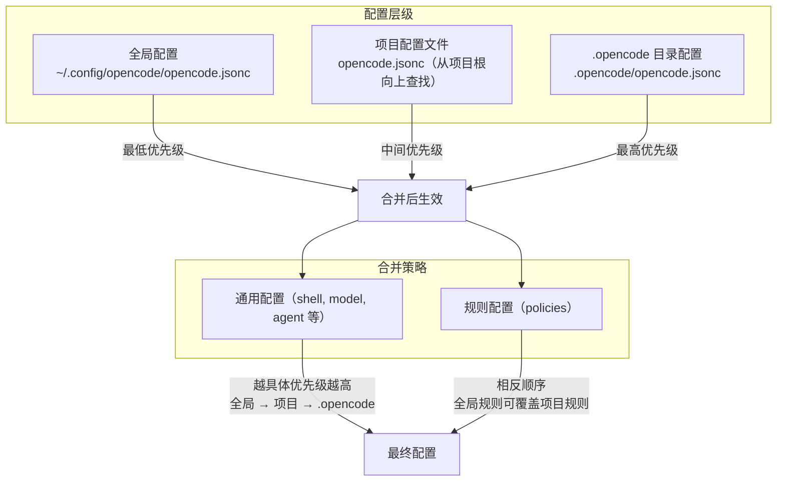
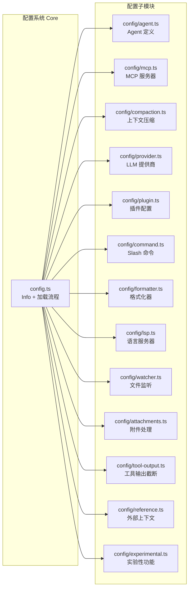
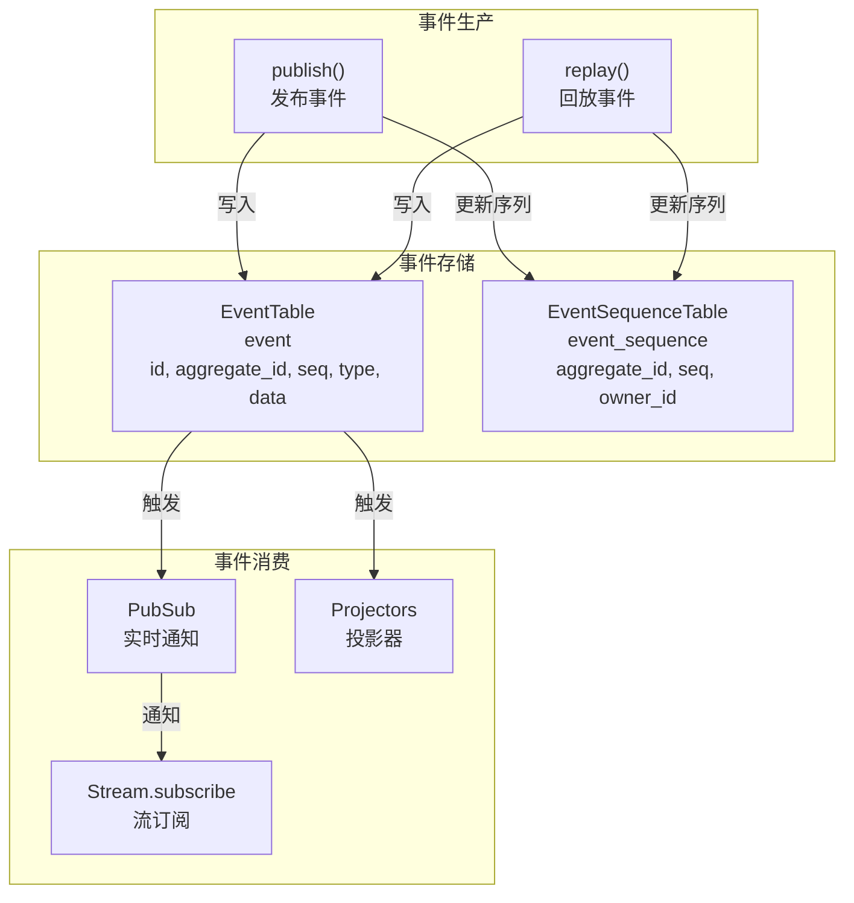
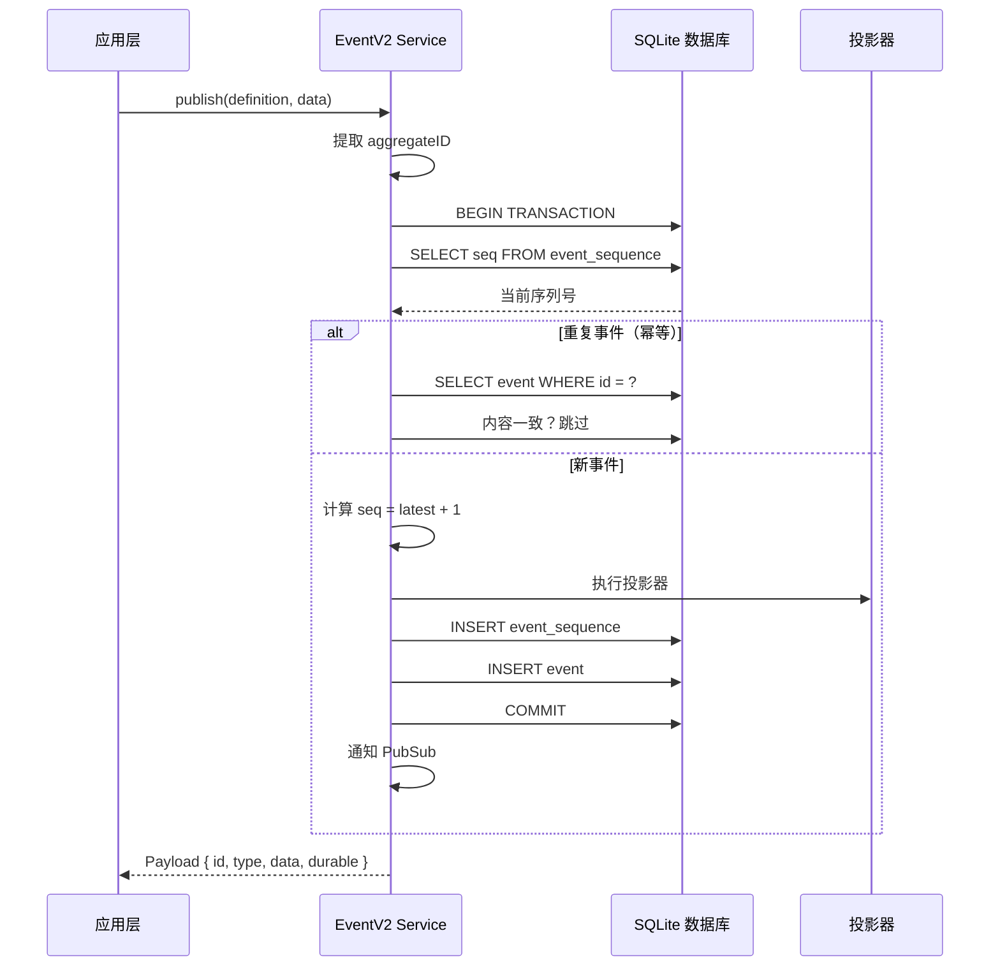
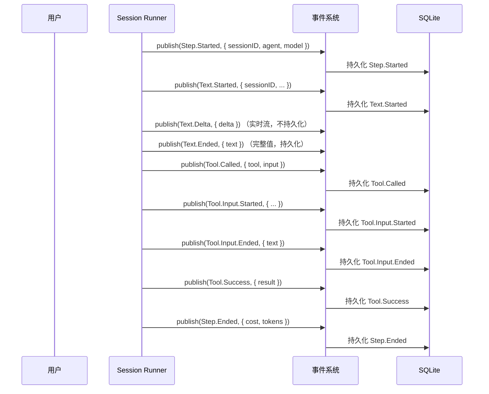
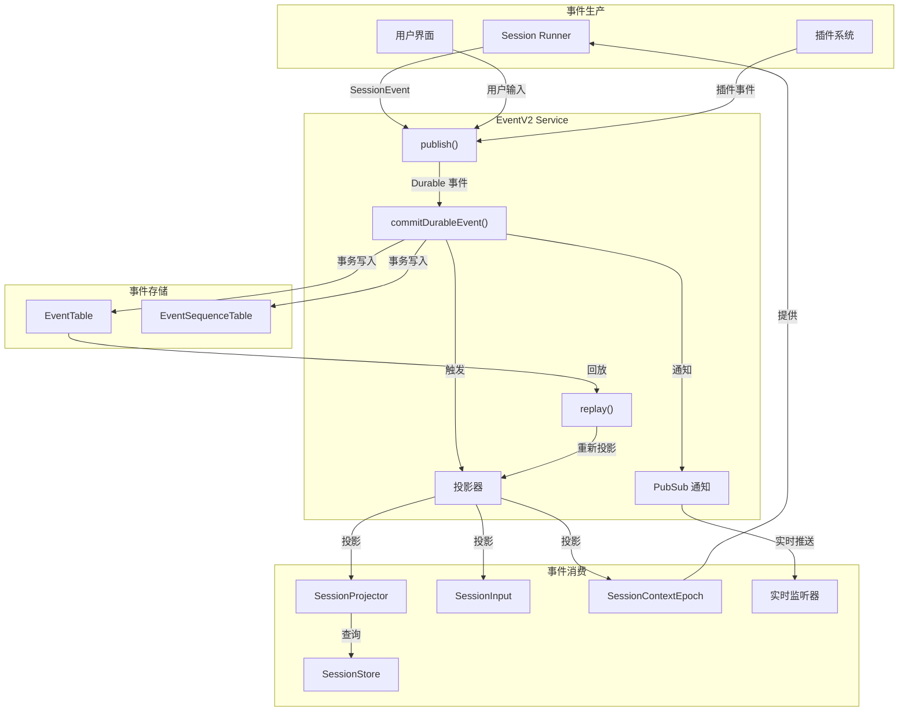

# 第 12 章：配置与会话管理

> **上一章**我们了解了 MCP 如何通过三种传输协议连接外部工具。本章将回到 Opencode 自身的基础设施——配置系统和会话管理，它们是整个系统的"地基"，决定了 Opencode 如何加载用户设置、如何持久化会话状态、如何通过事件溯源实现状态回放。

## 12.1 概述

配置系统和会话管理是 Opencode 的两大基础支撑。配置系统负责从多个层级（全局、项目、本地）加载和合并配置，提供统一的配置视图；事件系统基于 Durable Event Sourcing 模式提供事件持久化、投影和回放能力；会话管理则围绕事件系统构建，负责会话的创建、持久化和生命周期管理。

本章将深入这三个紧密相关的子系统。

## 12.2 配置系统架构

Opencode 的配置系统采用**层级合并**设计：全局配置 → 项目配置 → `.opencode` 目录配置，越具体的层级优先级越高。



### 配置存储位置

配置系统支持两种结构：

- **配置文件**：`opencode.json` 或 `opencode.jsonc`（支持注释和尾逗号）
- **配置目录**：`.opencode/` 目录，可包含 `opencode.jsonc` 和补充文件

### 配置文件发现

从当前工作目录开始向上查找，直到项目根目录：

```typescript
// packages/core/src/config.ts
const discovered = yield* fs.up({
  targets: [".opencode", ...names.toReversed()],
  start: location.directory,
  stop: location.project.directory,
})
```

## 12.3 配置信息模型

配置信息模型通过 Effect-TS Schema 定义，所有字段都是可选的（`pipe(Schema.optional)`），确保部分配置也能正常工作：

```typescript
// packages/core/src/config.ts
export class Info extends Schema.Class<Info>("Config.Info")({
  $schema: Schema.optional(Schema.String),
  shell: Schema.String.pipe(Schema.optional),
  model: Schema.String.pipe(Schema.optional),
  default_agent: Schema.String.pipe(Schema.optional),
  autoupdate: Schema.Union([Schema.Boolean, Schema.Literal("notify")]).pipe(Schema.optional),
  share: Schema.Literals(["manual", "auto", "disabled"]).pipe(Schema.optional),
  username: Schema.String.pipe(Schema.optional),
  permissions: Permission.Ruleset.pipe(Schema.optional),
  agents: Schema.Record(Schema.String, ConfigAgent.Info).pipe(Schema.optional),
  snapshots: Schema.Boolean.pipe(Schema.optional),
  watcher: ConfigWatcher.Info.pipe(Schema.optional),
  formatter: ConfigFormatter.Info.pipe(Schema.optional),
  lsp: ConfigLSP.Info.pipe(Schema.optional),
  attachments: ConfigAttachments.Info.pipe(Schema.optional),
  tool_output: ConfigToolOutput.Info.pipe(Schema.optional),
  mcp: ConfigMCP.Info.pipe(Schema.optional),
  compaction: ConfigCompaction.Info.pipe(Schema.optional),
  skills: Schema.String.pipe(Schema.Array, Schema.optional),
  commands: Schema.Record(Schema.String, ConfigCommand.Info).pipe(Schema.optional),
  instructions: Schema.String.pipe(Schema.Array, Schema.optional),
  references: ConfigReference.Info.pipe(Schema.optional),
  plugins: ConfigPlugin.Plugins.pipe(Schema.optional),
  experimental: ConfigExperimental.Experimental.pipe(Schema.optional),
  providers: Schema.Record(Schema.String, ConfigProvider.Info).pipe(Schema.optional),
}) {}
```

## 12.4 配置加载流程

配置加载的核心实现在 `config.ts` 的 `layer` 中：

```typescript
// packages/core/src/config.ts
const layer = Layer.effect(
  Service,
  Effect.gen(function* () {
    const fs = yield* FSUtil.Service
    const global = yield* Global.Service
    const location = yield* Location.Service
    const policy = yield* Policy.Service
    const names = ["opencode.json", "opencode.jsonc"]

    // 1. 加载全局配置目录
    const globalDirectory = AbsolutePath.make(global.config)

    // 2. 向上查找配置文件
    const discovered = yield* fs.up({
      targets: [".opencode", ...names.toReversed()],
      start: location.directory,
      stop: location.project.directory,
    })

    // 3. 分离目录配置和文件配置
    const directories = [globalDirectory, ...discovered.filter(isDir).map(toAbsolute)]
    const directPaths = discovered.filter(isFile).toReversed()

    // 4. 加载所有配置
    const supplementary = yield* Effect.forEach(directories, loadDirectory)
    const direct = yield* Effect.forEach(directPaths, loadFile)

    // 5. 合并：通用配置按顺序叠加
    //    全局配置 → 项目文件 → .opencode 文件（越具体优先级越高）
    const configs = [...supplementary[0], ...direct, ...supplementary.slice(1).flat()]

    // 6. 规则配置相反顺序：全局规则可覆盖项目规则
    yield* policy.load(
      configs.filter(isDocument).toReversed().flatMap((c) => c.info.experimental?.policies ?? []),
    )
  }),
)
```

### 加载流程说明

1. **发现配置**：从 `location.directory` 开始，向上查找 `.opencode` 目录和 `opencode.jsonc` 文件，直到 `location.project.directory`
2. **加载文件**：使用 `jsonc-parser` 解析 JSONC 格式，支持注释和尾逗号
3. **Schema 解码**：使用 Effect-TS Schema 解码，并支持从 V1 格式迁移（`ConfigMigrateV1`）
4. **策略合并**：通用配置正向叠加，规则配置反向叠加

### 配置条目类型

```typescript
// packages/core/src/config.ts
export class Document extends Schema.Class<Document>("Config.Document")({
  type: Schema.Literal("document"),
  path: Schema.String.pipe(Schema.optional),
  info: Info,
}) {}

export class Directory extends Schema.Class<Directory>("Config.Directory")({
  type: Schema.Literal("directory"),
  path: AbsolutePath,
}) {}

export type Entry = Document | Directory
```

`Document` 代表一个配置文件及其解析后的 `Info`；`Directory` 代表一个配置目录。

### Latest 函数

```typescript
// packages/core/src/config.ts
export function latest<K extends keyof Info>(entries: readonly Entry[], key: K): Info[K] | undefined {
  return entries
    .filter((entry): entry is Document => entry.type === "document")
    .findLast((entry) => entry.info[key] !== undefined)?.info[key]
}
```

`latest` 函数通过 `findLast` 实现"越具体优先级越高"的语义——从 Document 数组中查找最后一个包含该键的配置项。

## 12.5 配置子模块

配置系统由多个子模块组成，每个子模块负责一个配置领域：

### 配置子模块一览



### Agent 配置

```typescript
// packages/core/src/config/agent.ts
export class Info extends Schema.Class<Info>("ConfigV2.Agent")({
  model: Schema.String.pipe(Schema.optional),
  variant: Schema.String.pipe(Schema.optional),
  request: ConfigProvider.Request.pipe(Schema.optional),
  system: Schema.String.pipe(Schema.optional),
  description: Schema.String.pipe(Schema.optional),
  mode: Schema.Literals(["subagent", "primary", "all"]).pipe(Schema.optional),
  hidden: Schema.Boolean.pipe(Schema.optional),
  color: Color.pipe(Schema.optional),
  steps: PositiveInt.pipe(Schema.optional),
  disabled: Schema.Boolean.pipe(Schema.optional),
  permissions: Permission.Ruleset.pipe(Schema.optional),
}) {}
```

每个 Agent 可以配置独立的模型、系统提示词、执行步数、权限规则和显示颜色。

### MCP 配置

```typescript
// packages/core/src/config/mcp.ts
export class Info extends Schema.Class<Info>("ConfigV2.MCP")({
  timeout: Timeout.pipe(Schema.optional),
  servers: Schema.Record(Schema.String, Server).pipe(Schema.optional),
}) {}

// MCP 服务器类型
export const Server = Schema.Union([Local, Remote]).pipe(Schema.toTaggedUnion("type"))

// 本地 MCP 服务器
export class Local extends Schema.Class<Local>("ConfigV2.MCP.Local")({
  type: Schema.Literal("local"),
  command: Schema.String.pipe(Schema.Array),
  cwd: Schema.String.pipe(Schema.optional),
  environment: Schema.Record(Schema.String, Schema.String).pipe(Schema.optional),
  disabled: Schema.Boolean.pipe(Schema.optional),
  timeout: Timeout.pipe(Schema.optional),
}) {}

// 远程 MCP 服务器
export class Remote extends Schema.Class<Remote>("ConfigV2.MCP.Remote")({
  type: Schema.Literal("remote"),
  url: Schema.String,
  headers: Schema.Record(Schema.String, Schema.String).pipe(Schema.optional),
  oauth: Schema.Union([OAuth, Schema.Literal(false)]).pipe(Schema.optional),
  disabled: Schema.Boolean.pipe(Schema.optional),
  timeout: Timeout.pipe(Schema.optional),
}) {}
```

MCP 配置支持本地（通过命令启动）和远程（通过 URL 连接）两种服务器类型，远程服务器可选 OAuth 认证。

### 上下文压缩配置

```typescript
// packages/core/src/config/compaction.ts
export class Info extends Schema.Class<Info>("ConfigV2.Compaction")({
  auto: Schema.Boolean.pipe(Schema.optional),
  prune: Schema.Boolean.pipe(Schema.optional),
  keep: Keep.pipe(Schema.optional),
  buffer: NonNegativeInt.pipe(Schema.optional),
}) {}
```

控制是否自动压缩上下文、压缩后保留的 token 数量、触发压缩的缓冲区大小等。

### Provider 配置

```typescript
// packages/core/src/config/provider.ts
export class Info extends Schema.Class<Info>("ConfigV2.Provider")({
  name: Schema.String.pipe(Schema.optional),
  env: Schema.String.pipe(Schema.Array, Schema.optional),
  api: ProviderV2.Api.pipe(Schema.optional),
  request: Request.pipe(Schema.optional),
  models: Schema.Record(Schema.String, Model).pipe(Schema.optional),
}) {}
```

Provider 配置允许用户自定义 LLM 提供商，包括 API 端点、认证方式、模型定义和定价信息。

## 12.6 事件系统架构

事件系统基于 **Durable Event Sourcing** 模式，提供事件持久化、投影（Projection）和回放能力。它是 Opencode 中所有状态变化的唯一数据源。



### 事件定义

事件通过 `Event.define` 定义，使用 Effect-TS Schema 描述事件数据结构：

```typescript
// packages/schema/src/event.ts
export function define<const Type extends string, const Fields>(
  input: {
    readonly type: Type
    readonly durable?: { readonly version: number; readonly aggregate: string }
    readonly schema: Fields
  },
) {
  const data = Schema.Struct(input.schema)
  return Schema.Struct({
    id: ID,
    type: Schema.Literal(input.type),
    durable: optional(Schema.Struct({ aggregateID: Schema.String, seq: Schema.Int, version: Schema.Int })),
    location: optional(Location.Ref),
    data,
  }).pipe(statics(() => ({
    type: input.type,
    ...(input.durable ? { durable: input.durable } : {}),
    data,
  })))
}
```

### 事件类型定义

```typescript
// packages/schema/src/event.ts
export interface Definition<Type extends string = string, DataSchema = any> {
  readonly type: Type
  readonly durable?: { readonly version: number; readonly aggregate: string }
  readonly data: DataSchema
}

export type Payload<D extends Definition = Definition> = {
  readonly id: ID
  readonly type: D["type"]
  readonly data: Data<D>
  readonly durable?: { readonly aggregateID: string; readonly seq: number; readonly version: number }
  readonly location?: Location.Ref
  readonly metadata?: Record<string, unknown>
}
```

### Durable 事件

Durable 事件是持久化到数据库的事件，具有 `aggregate`（聚合根）和 `version`（版本）属性。每个 durable 事件通过 `aggregateID` 分组，保证顺序一致性。

```typescript
// Durable 事件存储
export const Durable = Event.durable([
  ...SessionV1.Event.Definitions.filter((d) => d.durable !== undefined),
  ...SessionEvent.DurableDefinitions,
])
```

## 12.7 事件服务接口

事件服务提供了完整的事件管理能力：

```typescript
// packages/core/src/event.ts
export interface Interface {
  readonly publish: <D extends Definition>(definition: D, data: Data<D>, options?: PublishOptions) =>
    Effect.Effect<Payload<D>>
  readonly subscribe: <D extends Definition>(definition: D) => Stream.Stream<Payload<D>>
  readonly all: () => Stream.Stream<Payload>
  readonly durable: (input: { readonly aggregateID: string; readonly after?: number }) => Stream.Stream<Payload>
  readonly listen: (listener: Subscriber) => Effect.Effect<Unsubscribe>
  readonly project: <D extends Definition>(definition: D, projector: Subscriber<D>) => Effect.Effect<void>
  readonly replay: (event: SerializedEvent, options?: PublishOptions) => Effect.Effect<void>
  readonly replayAll: (events: SerializedEvent[], options?: PublishOptions) => Effect.Effect<string | undefined>
  readonly remove: (aggregateID: string) => Effect.Effect<void>
  readonly claim: (aggregateID: string, ownerID: string) => Effect.Effect<void>
}
```

### 核心方法说明

| 方法 | 说明 |
|------|------|
| `publish` | 发布事件，Durable 事件写入数据库并触发投影器 |
| `subscribe` | 按类型订阅实时事件流 |
| `all` | 订阅所有事件的实时流 |
| `durable` | 读取聚合的持久化事件（历史+实时） |
| `project` | 注册投影器，在事件持久化时同步执行 |
| `replay` | 回放单个事件到聚合 |
| `remove` | 删除聚合的所有事件 |
| `claim` | 声明聚合的所有权 |

## 12.8 事件持久化

### 数据库表结构

```typescript
// packages/core/src/event/sql.ts
// 事件序列表：追踪每个聚合的最新序列号
export const EventSequenceTable = sqliteTable("event_sequence", {
  aggregate_id: text().notNull().primaryKey(),
  seq: integer().notNull(),
  owner_id: text(),
})

// 事件表：存储所有事件
export const EventTable = sqliteTable(
  "event",
  {
    id: text().$type<EventV2.ID>().primaryKey(),
    aggregate_id: text().notNull().references(() => EventSequenceTable.aggregate_id),
    seq: integer().notNull(),
    type: text().notNull(),
    data: text({ mode: "json" }).$type<Record<string, unknown>>().notNull(),
  },
  (table) => [
    uniqueIndex("event_aggregate_seq_idx").on(table.aggregate_id, table.seq),
    index("event_aggregate_type_seq_idx").on(table.aggregate_id, table.type, table.seq),
  ],
)
```

### 提交 Durable 事件

`commitDurableEvent` 是事件持久化的核心函数，在数据库事务中执行：

```typescript
// packages/core/src/event.ts
function commitDurableEvent(definition, event, input?, commit?) {
  return Effect.gen(function* () {
    const durable = definition?.durable
    if (durable) {
      // 1. 从事件数据中提取 aggregateID
      const aggregateID = event.data[durable.aggregate]

      // 2. 在数据库事务中执行
      return yield* db.transaction(() =>
        Effect.gen(function* () {
          // 3. 读取当前序列号
          const latest = row?.seq ?? -1

          // 4. 检查重复事件（幂等性保证）
          if (input && input.seq <= latest) {
            // 如果事件已存在且内容一致，视为幂等
            if (isDeepStrictEqual(stored.data, encoded)) return
            // 如果内容不一致，视为冲突
            yield* Effect.die(new InvalidDurableEventError({...}))
          }

          // 5. 计算新序列号
          const seq = input?.seq ?? latest + 1

          // 6. 执行投影器（在同一事务中）
          for (const projector of list) yield* projector(committed)

          // 7. 执行 commit hook
          if (commit) yield* commit(seq)

          // 8. 写入 EventSequenceTable
          yield* db.insert(EventSequenceTable).values([...]).onConflictDoUpdate({...}).run()

          // 9. 写入 EventTable
          yield* db.insert(EventTable).values([{ id, aggregate_id, seq, type, data }]).run()
        })
      )
    }
  })
}
```

### 持久化流程



## 12.9 会话事件

会话事件是事件系统的核心消费者，使用 `SessionEvent` 记录会话的完整生命周期。所有会话事件通过 `sessionID` 作为聚合根进行分组。

### 事件类型一览

```typescript
// packages/schema/src/session-event.ts
// 会话生命周期
export const AgentSwitched    // 切换 Agent
export const ModelSwitched    // 切换模型
export const Moved            // 会话移动
export const Prompted         // 提示词已提升
export const PromptAdmitted   // 提示词已准入
export const ContextUpdated   // 系统上下文更新
export const Synthetic        // 合成消息

// Shell 执行
export namespace Shell {
  export const Started        // Shell 命令开始
  export const Ended          // Shell 命令结束
}

// Step（回合）
export namespace Step {
  export const Started        // 回合开始
  export const Ended          // 回合结束（含消耗统计）
  export const Failed         // 回合失败
}

// 文本生成
export namespace Text {
  export const Started        // 文本开始
  export const Delta          // 文本增量（实时流）
  export const Ended          // 文本结束（完整值）
}

// 推理
export namespace Reasoning {
  export const Started        // 推理开始
  export const Delta          // 推理增量（实时流）
  export const Ended          // 推理结束
}

// 工具调用
export namespace Tool {
  export namespace Input {
    export const Started      // 工具输入开始
    export const Delta        // 工具输入增量（实时流）
    export const Ended        // 工具输入结束
  }
  export const Called         // 工具被调用
  export const Progress       // 工具执行进度
  export const Success        // 工具执行成功
  export const Failed         // 工具执行失败
}

// 上下文压缩
export namespace Compaction {
  export const Started        // 压缩开始
  export const Delta          // 压缩增量（实时流）
  export const Ended          // 压缩结束
}

// 重试 & 回退
export const Retried          // 重试事件
export namespace RevertEvent {
  export const Staged         // 回退暂存
  export const Cleared        // 回退清除
  export const Committed      // 回退提交
}
```

### 事件流时序



注意：`Delta` 类型的事件（如 `Text.Delta`、`Reasoning.Delta`、`Tool.Input.Delta`）不声明 `durable` 属性，仅为实时流使用，不会持久化到数据库。只有 `Started` 和 `Ended` 事件是持久化的。

## 12.10 会话持久化

### 数据库表结构

会话使用 SQLite 数据库持久化，核心表包括：

```typescript
// packages/core/src/session/sql.ts
// 会话元数据
export const SessionTable = sqliteTable("session", {
  id: text().$type<SessionSchema.ID>().primaryKey(),
  project_id: text().notNull(),
  workspace_id: text(),
  parent_id: text(),
  slug: text().notNull(),
  directory: text().notNull(),
  path: text(),
  title: text().notNull(),
  version: text().notNull(),
  share_url: text(),
  cost: real().notNull().default(0),
  tokens_input: integer().notNull().default(0),
  tokens_output: integer().notNull().default(0),
  tokens_reasoning: integer().notNull().default(0),
  tokens_cache_read: integer().notNull().default(0),
  tokens_cache_write: integer().notNull().default(0),
  revert: text({ mode: "json" }),
  permission: text({ mode: "json" }),
  agent: text(),
  model: text({ mode: "json" }),
  time_created: integer(),
  time_updated: integer(),
  time_compacting: integer(),
  time_archived: integer(),
})

// 会话消息（V2 新格式）
export const SessionMessageTable = sqliteTable("session_message", {
  id: text().$type<SessionMessage.ID>().primaryKey(),
  session_id: text().notNull(),
  type: text().$type<SessionMessage.Type>().notNull(),
  seq: integer().notNull(),
  data: text({ mode: "json" }).notNull(),
})

// 会话输入队列
export const SessionInputTable = sqliteTable("session_input", {
  id: text().$type<SessionMessage.ID>().primaryKey(),
  session_id: text().notNull(),
  prompt: text({ mode: "json" }).notNull(),
  delivery: text().notNull(),
  admitted_seq: integer().notNull(),
  promoted_seq: integer(),
  time_created: integer(),
})

// 系统上下文快照
export const SessionContextEpochTable = sqliteTable("session_context_epoch", {
  session_id: text().primaryKey(),
  baseline: text().notNull(),
  snapshot: text({ mode: "json" }).notNull(),
  baseline_seq: integer().notNull(),
})
```

### 表关系

```mermaid
erDiagram
    session ||--o{ session_message : "has"
    session ||--o{ session_input : "queues"
    session ||--|| session_context_epoch : "snapshot"
    session ||--o{ message : "has (legacy)"
    session ||--o{ part : "has (legacy)"
    session ||--o{ todo : "has"
    event_sequence ||--o{ event : "sequences"

    session {
        string id PK
        string project_id FK
        string title
        real cost
        text model
    }

    session_message {
        string id PK
        string session_id FK
        string type
        int seq
        json data
    }

    session_input {
        string id PK
        string session_id FK
        json prompt
        string delivery
        int admitted_seq
        int promoted_seq
    }

    session_context_epoch {
        string session_id PK FK
        text baseline
        json snapshot
        int baseline_seq
    }

    event_sequence {
        string aggregate_id PK
        int seq
    }

    event {
        string id PK
        string aggregate_id FK
        int seq
        string type
        json data
    }
```

### 会话投影器

会话投影器（`SessionProjector`）将事件流投影到关系型数据库，使得会话数据可以通过 SQL 高效查询：

```typescript
// packages/core/src/session/projector.ts
const layer = Layer.effectDiscard(
  Effect.gen(function* () {
    const events = yield* EventV2.Service
    const { db } = yield* Database.Service

    // 会话创建 → 写入 SessionTable
    yield* events.project(SessionV1.Event.Created, (event) =>
      db.insert(SessionTable).values(sessionRow(event.data.info)).onConflictDoNothing().run(),
    )

    // 会话更新 → 更新 SessionTable
    yield* events.project(SessionV1.Event.Updated, (event) =>
      db.update(SessionTable).set(sessionRow(event.data.info)).where(eq(SessionTable.id, event.data.sessionID)).run(),
    )

    // Agent 切换 → 更新 agent 字段 + 投影消息
    yield* events.project(SessionEvent.AgentSwitched, (event) =>
      db.update(SessionTable).set({ agent: event.data.agent }).where(eq(...)).run(),
    )

    // 所有 Step/Text/Tool/Reasoning/Shell 事件 → 投影到 session_message
    yield* events.project(SessionEvent.Step.Started, (event) => run(db, event))
    yield* events.project(SessionEvent.Text.Ended, (event) => run(db, event))
    yield* events.project(SessionEvent.Tool.Called, (event) => run(db, event))
    yield* events.project(SessionEvent.Tool.Success, (event) => run(db, event))
    // ... 20+ 事件投影器
  }),
)
```

### 上下文快照（Context Epoch）

`SessionContextEpoch` 管理系统上下文的快照，确保在会话恢复时系统提示词保持一致性：

```typescript
// packages/core/src/session/context-epoch.ts
// 初始化：首次创建会话上下文快照
const initialize = Effect.fnUntraced(function* (db, context, sessionID) {
  if (yield* exists(db, sessionID)) return
  const generation = yield* context.pipe(Effect.flatMap(SystemContext.initialize))
  const baselineSeq = yield* insert(db, sessionID, generation)
  return { baseline: generation.baseline, baselineSeq }
})

// 准备：恢复或更新上下文快照
const prepareOnce = Effect.fnUntraced(function* (db, events, context, sessionID) {
  const [value, stored, compaction] = yield* Effect.all(
    [context, find(db, sessionID), SessionHistory.latestCompaction(db, sessionID)],
    { concurrency: "unbounded" },
  )
  // 根据系统上下文变化模式（Unchanged / ReplacementReady / UpdateReady）决定策略
  const result = yield* SystemContext.reconcile(value, snapshot)
  if (result._tag === "Unchanged") return { baseline: stored.baseline, baselineSeq }
  if (result._tag === "ReplacementReady") {
    // 替换快照
    yield* replace(db, sessionID, baselineSeq, result.generation)
  }
  // 发布 ContextUpdated 事件（增量更新）
  yield* events.publish(SessionEvent.ContextUpdated, { ... })
})
```

### 会话输入队列

`SessionInput` 管理用户输入的准入和提升（promotion）流程，支持两种投递方式：

- **steer**：引导消息，在当前回合执行前插入
- **queue**：队列消息，在当前回合完成后执行

```typescript
// packages/core/src/session/input.ts
// 准入：将输入写入队列
export const admit = Effect.fn("SessionInput.admit")(function* (db, events, input) {
  const timestamp = yield* DateTime.now
  return yield* events.publish(SessionEvent.PromptAdmitted, {
    messageID: input.id, sessionID: input.sessionID,
    timestamp, prompt: input.prompt, delivery: input.delivery,
  })
})

// 提升 steer 消息到会话历史
export const promoteSteers = Effect.fn("SessionInput.promoteSteers")(function* (db, events, sessionID, cutoff) {
  const rows = yield* db.select().from(SessionInputTable)
    .where(and(eq(sessionID), isNull(promoted_seq), eq("steer"), lte(admitted_seq, cutoff)))
    .orderBy(asc(admitted_seq)).all()
  return yield* publishAll(db, events, sessionID, rows)
})

// 提升下一个队列消息
export const promoteNextQueued = Effect.fn("SessionInput.promoteNextQueued")(function* (db, events, sessionID) {
  const row = yield* db.select().from(SessionInputTable)
    .where(and(eq(sessionID), isNull(promoted_seq), eq("queue")))
    .orderBy(asc(admitted_seq)).limit(1).get()
  return row === undefined ? false : publishOne(db, events, sessionID, row)
})
```

## 12.11 完整事件流架构



## 12.12 小结

本章介绍了 Opencode 的配置系统和事件驱动的会话管理：

- **配置层级**：全局配置 → 项目配置 → `.opencode` 目录配置，逐层叠加
- **配置信息模型**：通过 Effect-TS Schema 定义，所有字段可选，天然支持部分配置
- **配置子模块**：Agent、MCP、Compaction、Provider、Plugin 等 13 个配置领域
- **事件系统**：基于 Durable Event Sourcing 模式，提供事件持久化、投影和回放
- **Durable 事件**：通过 aggregate/seq/version 保证事件顺序和幂等性
- **会话事件**：28 种事件类型覆盖会话完整生命周期（Step/Text/Tool/Reasoning/Shell）
- **会话持久化**：SQLite 存储，核心表包括 session、session_message、session_input、session_context_epoch
- **会话投影器**：将事件流投影到关系型数据库，支持高效 SQL 查询
- **上下文快照**：系统上下文一致性管理，支持初始化、替换和增量更新
- **输入队列**：steer/queue 两种投递方式，支持引导消息和队列消息

下一章将从理论走向实践，带你从零搭建一个最小但完整的 Coding Agent，将前 12 章的核心概念融会贯通为可运行的代码。